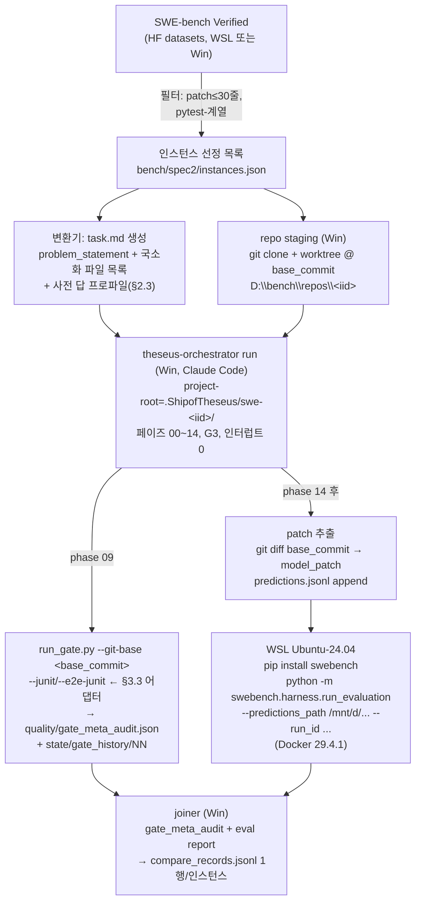

# Spec 2 — 외부 벤치마크(SWE-bench) controlled 비교 harness 설계

- 날짜: 2026-07-05
- 상태: 설계 확정 대기 (사용자 리뷰 전)
- 상위 근거: [검증 커널 설계 §11.5(b)](2026-07-04-verification-kernel-design.md) — *"성공 측정 = 지시 질량 감소 + 외부 점수. (b) 커널 도입 전/후 외부 벤치 점수의 controlled 비교"* + §12 WP8(dogfood — 외부 벤치 controlled 비교)
- feasibility 근거(전부 실파일 판독, 추측 0):
  - `skills/theseus-orchestrator/SKILL.md` (HARD-RULE 금지 d — 사전 박힌 답 = 질의 답안 자동 매핑 허용)
  - `skills/theseus-harness/phases/01-intent.md` §k (intent-criteria 저작), `04-clarify.md` (유일 인터럽트 + Q-D1~D9 + Q-D-DELIVERABLE-MODE), `08-implement.md` (solid-contract 저작 + criteria backing 보충), `09-quality-gates.md` (run_gate 의무 호출)
  - `skills/theseus-harness/conventions/deliverable-hurdle-supremacy.md` §5 (Integration mode = 기존 repo patch — 저장소 내 유일한 brownfield 명시 지점)
  - `skills/theseus-harness/scoring/run_gate.py` (CLI seam 전수: `--git-base` / `--code-root` / `--junit` / `--e2e-junit` / `--coverage` / 선언 아티팩트 override 3종)
  - `skills/theseus-harness/pipeline.manifest.json` (grade별 활성 페이즈·checks·stop_policy)
  - `skills/theseus-harness/checks/{scoring.correctness,scoring.coverage,scoring.e2e,cold.isolation}.json` (absence/applicability 의미론)

## 0. 한 줄 요약

**SWE-bench Verified 소형 슬라이스를 theseus-harness(Windows) 로 풀어 patch 를 만들고, run_gate 커널 verdict 를 기록한 뒤, WSL Docker 의 공식 swebench evaluator(숨은 FAIL_TO_PASS 테스트)로 채점해, "커널이 PASS 라 한 것"과 "외부가 PASS 라 한 것"의 상관을 값으로 만든다.** 판정: **조건부 적합** — 하네스 코드 무수정으로 태울 수 있으나(어댑터 계층만 추가), G3 고정 + 소형 인스턴스 필터 + 과제당 수 시간 비용이라는 조건 하에서다. 조건이 깨지면(대형 repo 심층 comprehension, G4+, N>20) 비현실 — 그 경우의 대안은 §2.6.

---

## 1. 목적 — 무엇을 재는가

검증 커널(B1~B4)은 지금까지 **내부 정합**만 실증했다: 커널이 실 submission 을 게이팅한다(B1d 발화 리허설), 지시 질량이 순감했다(B3). 남은 성공 지표 (b) 는 **외부 인과**다 — 커널이 있는 하네스가 *숨은 외부 심판* 앞에서 더 잘하는가, 그리고 **커널 verdict 가 외부 pass/fail 의 예측자인가**.

과제당 산출되는 최소 단위 = **비교 레코드 1행**:

```json
{
  "instance_id": "astropy__astropy-12907",
  "arm": "K",
  "kernel": {
    "verdict": "pass",
    "checks": {"scoring.correctness": "PASS", "scoring.scope_fit": "PASS",
               "scoring.solid": "PASS", "scoring.e2e": "PASS",
               "scoring.coverage": "NA", "cold.isolation": "NA",
               "quality.deep_module": "FAIL", "...": "..."},
    "intent_fidelity": 1.0,
    "gate_history_dir": "state/gate_history/03"
  },
  "external": {"resolved": false, "f2p_pass": "2/5", "p2p_pass": "31/31"},
  "cost": {"wall_clock_s": 14520, "phase_count": 13, "sprint_iterations": 2}
}
```

관심 셀은 `kernel.verdict == "pass" && external.resolved == false` — **커널의 맹점 실측**. SWE-bench 의 FAIL_TO_PASS/PASS_TO_PASS 테스트는 해 생성 시점에 은닉되므로, 커널의 내부 정합 측정과 외부 진실이 구조적으로 독립이다. 이 독립성이 본 벤치 선택의 핵심 이유다 — 테스트가 보이는 벤치(Exercism류)는 하네스가 그 테스트를 intent-criteria backing 으로 흡수해 상관이 동어반복이 된다.

---

## 2. Feasibility 판정 — 실파일 근거

### 2.1 brownfield 수용성: 조건부 적합

SWE-bench 인스턴스 = `{repo, base_commit, problem_statement, hints, (은닉) test_patch/FAIL_TO_PASS/PASS_TO_PASS}` — "대형 기존 repo 의 이슈를 고쳐 patch 를 내라". 하네스가 이것을 태울 수 있는가에 대한 근거:

**수용 가능 근거 (실파일):**

| # | 근거 | 위치 | 의미 |
|---|---|---|---|
| 1 | `Q-D-DELIVERABLE-MODE = 2` — *"Integration mode (기존 repo 에 patch — H1 만 의무, H4-H5 면제)"* | `deliverable-hurdle-supremacy.md` §5 | 결과물 허들(supremacy gate)이 brownfield 모드를 명시적으로 정의. bench-outputs(H4)·측정값(H5) 허들이 면제되므로 "5개 산출물 emit" 류 greenfield 의무가 patch 작업을 막지 않는다 |
| 2 | `run_gate.py --git-base` | run_gate.py:735 | scope_fit/intent_fidelity 의 diff 기준을 `base_commit` 으로 지정 가능 — patch 작업의 "터치한 파일" 측정이 바로 된다 |
| 3 | `--code-root` ≠ `--submission` 분리 | run_gate.py:734 | quality.* 3종(deep_module/dry/define_errors)의 스캔 범위를 전체 repo 가 아닌 *변경 모듈 디렉터리* 로 좁힐 수 있다 (django 2.9M LOC 전체 스캔 회피) |
| 4 | `--junit` 재사용 seam + `--e2e-junit`/`--coverage` passthrough | run_gate.py:736-738 | run_gate 는 `python -m pytest` 를 하드코딩하지만(:98-107), junit 재사용 seam 으로 **repo 고유 테스트 러너**(django `runtests.py` 등)의 결과를 junit XML 로 변환해 주입 가능 — 러너 수정 0 |
| 5 | 선언 아티팩트 3종 override (`--intent-criteria`/`--plan-todos`/`--solid-contract`) + 관례 경로 | run_gate.py:739-741 | 커널 발화에 필요한 선언 아티팩트가 페이즈 01/06/08 의 *기존 저작 의무* 로 이미 생산된다 (§2.4) |
| 6 | 페이즈 04 "사전 박힌 답" 허용 | orchestrator SKILL.md HARD-RULE 금지 d | *"사전 답은 질의 답안 자동 매핑일 뿐 페이즈 자체는 진행"* — 인스턴스별 배치 run 에서 인터뷰 인터럽트를 0 으로 만들 수 있는 공식 경로 |
| 7 | plan 8 항목 의무(파일 경로 ≥5, TODO DAG, 인터페이스 ≥3 등) | orchestrator 9.a | greenfield 전용이 아니다 — 기존 repo 의 *수정 대상 파일 경로*·수정 인터페이스로 충족 가능 |

**마찰 지점 (정직하게):**

| # | 마찰 | 위치 | 심각도 | 대응 |
|---|---|---|---|---|
| a | 하네스 본문 전반이 standalone 지향 — 페이즈 00 naming, 마인드맵 A 등급, `scripts/build.sh` 4종 의무, `config.toml` 정책, universe philosophy distinct(7 catalog) 등이 "이슈 하나 고치기"엔 과잉 | phases/00·01·04 §stack, 9.ccc | 중 | 과잉이지 차단이 아니다 — 산출물은 나온다(빈약하더라도). 비용으로 흡수. G3 고정으로 페이즈 07/11 비활성 |
| b | `quality.deep_module`: 모듈 수 = 1 이면 automatic fail | 08-implement.md, checks/quality.deep_module.json | 중 | 단일 파일 patch 인스턴스에서 구조적 FAIL 가능. **커널을 조작하지 않는다** — verdict 원본 유지 + 비교 레코드에 per-check 기록, 분석 층위에서 분리(§4.3). code-root 를 "터치된 모듈의 디렉터리" 로 잡으면 대개 모듈 ≥2 |
| c | `scoring.e2e`: `e2e_total > 0` 의무 + absence FAIL | checks/scoring.e2e.json | 중 | 어댑터가 이슈 재현 테스트(하네스가 08-β 에서 스스로 작성)의 junit 을 `--e2e-junit` 으로 매핑. 재해석("issue-level acceptance = e2e")을 §7 에 정직 고지 |
| d | `scoring.coverage`: applicability `fe_side_exists == 1` | checks/scoring.coverage.json | 저 | 순수 BE patch 는 producer 가 `fe_side_exists=0` emit → 증거로 입증된 NA(비게이팅). 결손 아님 |
| e | 대형 repo cold comprehension — 페이즈 02/03 이 repo 전체를 읽을 수 없음 | 03-independent-comprehension.md | 중 | 입력 변환기가 problem_statement + 이슈 인접 파일 목록(BM25/grep localization)을 task.md 에 동봉 — comprehension 범위를 이슈 국소로 계약. 이는 SWE-bench 에이전트 표준 관행 |
| f | multiverse impl fan-out (G3 폭 3) 이 대형 repo 워킹카피 3벌 요구 | 08-implement.md Step A | 저 | `git worktree` 3벌 — 디스크 수 GB 수준, 자동화 가능 |
| g | Windows 에서 repo 테스트 실행(env hell — 구버전 django/sympy 의 의존성) | — | **고** | §3.3 테스트 실행 어댑터: swebench 가 빌드하는 인스턴스 Docker 이미지를 WSL 에서 exec 백엔드로 재사용(은닉 test_patch 미적용 상태). 평가와 동일 env 에서 하네스 내부 테스트 루프가 돈다 |

**종합 판정: 조건부 적합.** 하네스는 SWE-bench 를 태울 수 있다 — 코드/스킬 수정 없이, (i) 인스턴스→task.md 변환기, (ii) 페이즈 04 사전 답 프로파일, (iii) run_gate 인자 프로파일, (iv) 테스트 실행 어댑터의 **어댑터 4종만 추가**해서. 단 조건: G3 고정, 소형-patch 인스턴스 필터, 과제당 수 시간 예산 수용. 이 조건이 무너지는 지점(G4+ 필요 판단, 대형 다파일 patch, N 대량)에서는 비현실이며 §2.6 대안으로 내려간다.

### 2.2 비용·스케일 — 정직 추정 (실측치 저장소에 없음)

G3 run 구조로부터의 추정(manifest 기준): 활성 페이즈 13, plan universe 3 + 토너먼트 ≥2 라운드 + dacapo rerun ≥1, impl universe 3 × 5 sub-phase TDD, sprint loop ≤3 — 서브에이전트 호출 수십 회.

| 항목 | 추정 | 근거 성격 |
|---|---|---|
| 과제 1건 wall-clock (G3, 소형 인스턴스) | **3~8 시간** | 구조 계산 + 이 저장소 cold session 회차 경험칙. **실측 아님** |
| 과제 1건 토큰 | 5~20M (API 환산 ≈ $30~150) | 자릿수 추정. **실측 아님** |
| django급 repo comprehension 가산 | +30~100% | 국소화 계약(§2.1-e)이 지키는 전제 하 |
| WSL swebench eval 1건 | 이미지 빌드 10~30분(최초) + 테스트 수 분 | swebench harness 공식 구조 (Docker 3계층: base/env/instance) |
| eval 디스크 | 인스턴스 10건 기준 20~50GB 여유 필요 | swebench 문서가 Lite 300건 전체에 120GB 권고 — 비례 축소 |

**저장소 어디에도 과제당 실측 비용이 없다.** 따라서 스모크런(§5)의 1차 산출물이 바로 이 실측이며, WP-S1 이후의 모든 수치는 스모크런 실측으로 갱신할 의무가 있다 (manifest stop_policy `_note` 의 "리허설/벤치 run 마다 관측 분포로 재추정" 원칙과 동일한 규율).

### 2.3 자동화 가능성 — 인터럽트 0 배치

페이즈 04 는 유일한 인터럽트이지만, orchestrator HARD-RULE 금지 d 가 "사전 박힌 답"을 **질의 답안 자동 매핑**으로 공식 허용한다(페이즈 산출물 `04-questions/answers.md` 는 여전히 생산). 인스턴스별 driver prompt 에 다음 사전 답 프로파일을 동봉한다:

```
Q-G1 = G3 (비용 통제 — 전 인스턴스 고정, arm 간 동일)
Q-D-DELIVERABLE-MODE = 2 (Integration mode — 기존 repo patch)
Q-D8 (verification command) = "python -m pytest <repro-test-path> -q" (하네스가 08-β 에서 저작하는 이슈 재현 테스트)
Q-D9 (runtime prereq) = 4 (외부 의존 없음 — 테스트 실행은 §3.3 어댑터 경유)
Q-D-AUDIENCE = 2 (external-reviewer)
Q-D1~D7 = default 자율값 (전 인스턴스 동일 — controlled 변수)
```

### 2.4 커널-verdict 포착 지점 — 선언 아티팩트의 출처와 원리적 결손

run_gate 발화에는 선언 아티팩트 3종이 필요하다. 셋 다 **기존 페이즈 저작 의무**로 생산되며, SWE-bench 라고 특별한 경로가 필요 없다:

| 아티팩트 | 저작 페이즈 (실파일 근거) | SWE-bench 에서의 원료 |
|---|---|---|
| `intent/01-intent-criteria.json` | 페이즈 01 §k (required ≥1, 판정 필드 금지) + 페이즈 04 동결 + 페이즈 08-ε test backing 보충 | problem_statement 의 관찰 가능 결과("X 가 Y 를 반환해야") → criterion. backing kind=test 는 하네스 자신이 작성한 재현 테스트 id |
| `plan/06-plan-todos.json` | 페이즈 06 TODO DAG (9.a-3) | 수정 대상 파일/모듈 계획 — scope_fit 의 "인가된 파일" 집합 |
| `impl/08-solid-contract.json` | 페이즈 08-δ (참 claim 만 — 거짓은 producer 재검사에서 실 FAIL) | 변경 모듈에 대한 DIP/SRP claim |

**원리적 결손 차원 전수 (cold.isolation 유형 분석):**

| 체크 | brownfield/SWE-bench 에서의 상태 | 성격 |
|---|---|---|
| `cold.isolation` | dispatch 로그 부재 → `dispatch_log_present=0` → **증거로 입증된 NA** | 기존 dogfood 와 동일한 원리적 결손 — 벤치가 새로 만들지 않음 |
| `scoring.coverage` | 순수 BE patch → `fe_side_exists=0` → NA | applicability 설계가 의도한 경로 |
| `scoring.fe_be_parity` | 동일 — NA | 동일 |
| `scoring.e2e` | e2e 스위트 부재 — 어댑터가 재현 테스트 junit 을 `--e2e-junit` 매핑 | **재해석** (원리적 결손을 어댑터가 메움). 미매핑 시 구조적 FAIL — §7 고지 |
| `quality.deep_module` | 단일 파일 patch 시 module=1 automatic fail 가능 | **도메인 불일치형 결손** — 커널 무수정 원칙에 따라 FAIL 을 그대로 기록, 분석 층위 분리(§4.3) |
| `quality.dry`/`define_errors` | code-root 를 변경 모듈 디렉터리로 잡으면 *레거시 코드* 위반이 하네스 탓으로 계상될 수 있음 | 오염형 결손 — per-check 기록 + §7 고지 |
| `sprint.regression` | gate_history 가 인스턴스별 project-root 에 쌓이므로 정상 동작 | 결손 없음 |
| `plan.dacapo_threshold`/`tournament_independence` | 하네스 내부 아티팩트 — 벤치 무관 정상 | 결손 없음 |

핵심: **커널 verdict 는 조작하지 않는다** (manifest checks 맵 수정 = 비교 자체의 무효화). 결손·오염은 verdict 를 바꾸는 게 아니라 비교 레코드의 per-check 필드와 분석 층위에서 다룬다.

### 2.5 왜 SWE-bench 인가 — 은닉성

커널의 T1 위협(self-rating 순환성)의 외부판이 "하네스가 자기가 만든 테스트로 자기를 채점"이다. SWE-bench 의 FAIL_TO_PASS 는 해 생성 시점에 은닉 — 커널 verdict(내부 정합)와 외부 resolved(진실)가 구조적으로 독립이므로 상관이 **정보**가 된다. 테스트 공개형 벤치에선 이 독립성이 사라진다.

### 2.6 대안 (조건 붕괴 시 fallback)

1. **SWE-bench Verified 초소형 필터** (본 설계의 기본값): gold patch ≤ 30줄 · 단일~2파일 · pytest 계열 repo 만. 은닉성 유지 + 비용 최소.
2. **Aider polyglot / Exercism 스타일**: 과제당 비용 1/10 이하, 하네스 standalone 모드에 자연 적합. **그러나 테스트가 공개라 은닉성 상실** — 커널-외부 상관이 약해진다(외부 심판이 하네스 내부 루프에 흡수됨). 파이프라인 리허설·비용 캘리브레이션 용도로만 가치.
3. **자작 은닉 테스트 미니벤치**: 소형 과제 10~20개 + 은닉 채점 테스트를 이 저장소가 직접 관리. 은닉성은 지키지만 "외부" 공신력이 없다(자기 벤치 자기 채점의 메타 순환). 최후 fallback.

**권고: 1 을 기본, 2 를 스모크런 전 파이프라인 예행(선택), 3 은 채택 안 함.**

---

## 3. 아키텍처

### 3.1 데이터 흐름



디렉터리 (제안, 실행 단계에서 확정):

```
bench/spec2/
  instances.json            # 선정 인스턴스 + 필터 근거
  tasks/<iid>/task.md       # 하네스 입력 (변환기 산출)
  predictions.jsonl         # {instance_id, model_name_or_path, model_patch}
  eval/<run_id>/            # WSL eval report 사본
  compare_records.jsonl     # 최종 비교 레코드
  runs/<arm>/<iid>/         # 각 run 의 .ShipofTheseus/ project-root 스냅샷(또는 심링크)
```

### 3.2 Windows ↔ WSL 경계

경계를 넘는 아티팩트는 **파일 2종뿐**이다:

- **in → WSL**: `predictions.jsonl` (patch 텍스트). WSL 은 `/mnt/d/work-github/ShipofTheseus/bench/spec2/predictions.jsonl` 로 읽는다.
- **out ← WSL**: eval report 디렉터리(`report.json` + per-instance 로그). WSL 이 `/mnt/d/...` 아래로 직접 쓰거나 사본 복사.

**repo 워킹카피는 경계를 넘지 않는다** — swebench eval 은 자체 Docker 이미지 안에서 base_commit 을 재현하고 model_patch 를 적용하므로, Windows 쪽 checkout 을 WSL 이 읽을 필요가 없다. `/mnt/` 크로스 파일시스템 I/O 저속 문제는 predictions/report 소형 파일에만 걸려 무시 가능. Docker 이미지·컨테이너는 전부 WSL ext4 에 상주.

호출 방향: Windows Claude Code 세션이 `wsl -d Ubuntu-24.04 -- bash -lc "..."` 로 eval 을 구동(현 환경 실측: `wsl docker ...` 가용). eval 은 인스턴스 10건에 수십 분~수 시간이므로 background 실행.

### 3.3 테스트 실행 어댑터 (마찰 g 의 해소 — 본 설계의 유일한 신규 인프라)

하네스 내부 루프(08 regression_check, 09 run_gate junit)는 repo 의 테스트를 실행해야 하는데, 구버전 django/sympy 의 의존성을 Windows 에 직접 세우는 것은 env hell 이다. 해소:

1. swebench 가 빌드하는 **인스턴스 Docker 이미지** (`sweb.eval.x86_64.<iid>`) 를 eval 전에 미리 빌드해 두고,
2. 하네스의 verification command 를 `wsl docker run --rm -v <patch>:... sweb.eval.x86_64.<iid> <repo 고유 test cmd>` wrapper 스크립트로 계약한다 (Q-D8 답에 이 wrapper 를 사전 답으로 박음),
3. wrapper 가 컨테이너 안에서 현재 워킹카피 diff 를 적용 → repo 고유 러너 실행 → junit XML 변환 → Windows 쪽 경로로 반환,
4. run_gate 는 `--junit <반환 junit>` (재사용 seam) + `--e2e-junit <재현 테스트 junit>` 으로 소비.

이 어댑터의 결정적 성질: **하네스가 개발 중 보는 테스트 env == 외부 채점 env** (은닉 test_patch 만 없음). env 차이로 인한 가짜 불일치(로컬 GREEN, eval RED)가 구조적으로 제거된다.

### 3.4 kernel-verdict 포착

- 페이즈 09 의 기존 의무 호출(`run_gate.py --phase-upto 09`)이 그대로 발화 — 벤치 전용 호출 없음. 인자 프로파일만 어댑터가 공급: `--git-base <base_commit>`, `--code-root <터치 모듈 디렉터리>`, `--junit/--e2e-junit <§3.3 산출>`.
- 포착물 = `quality/gate_meta_audit.json` (verdict + failed/na/advisory/deferred + per-check value) + `state/gate_history/<NN>/evidence/*.json` (producer 원증거). joiner 는 **마지막 gate_history** (= 최종 submission 에 대한 verdict) 를 짝짓기에 쓰고, 중간 이력은 부가 분석용(몇 번 만에 pass 에 도달했나)으로 보존.

---

## 4. Controlled 비교 설계

### 4.1 두 arm — "커널 도입 전" baseline 의 정의

| arm | 정의 | 성격 |
|---|---|---|
| **K (kernel)** | 현 HEAD 스킬 트리 (B1~B4 후 — phase 09 = run_gate/meta_audit 게이팅) | 처치군 |
| **B (baseline)** | **ablation**: 현 HEAD 에서 phase 09 의 run_gate 의무 호출 지시만 제거한 스킬 트리 사본 — 옛 경로(prose 정적 게이트 + self-score 종합 판정)로 회귀 | 대조군 (권고) |
| (참고) B′ | pre-kernel git commit (main, design/verification-kernel 분기 전) 스킬 트리 | 혼입 큼 — B1~B4 는 커널 외에도 self_lint 다이어트·stop_policy 재설계·viewer 동결을 포함하므로 "커널만의 효과"가 아니다 |

**권고: B(ablation) 를 주 비교로.** B′ 는 "kernel-era 하네스 vs pre-kernel-era 하네스" 라는 더 넓은 질문에만 참고로 답한다. ablation 사본은 벤치 실행 시점에 스킬 디렉터리 사본 1벌 + phase 09 문서의 run_gate 절 제거로 만들며, 그 diff 를 비교 레코드에 fingerprint 로 박아 재현 가능하게 한다.

**양 arm 모두에서 verdict 는 기록한다**: arm K 는 게이팅으로(행동에 영향), arm B 는 run 종료 후 **shadow 측정** 1회(행동에 영향 0 — 사후 run_gate 실행). 이로써 (i) arm 간 외부 점수 비교와 (ii) verdict↔외부 상관(양 arm 합산 표본)을 한 슬라이스에서 같이 얻는다.

### 4.2 통제 변수

동일: 인스턴스 집합 · 모델/버전 · driver prompt 골격 · 사전 답 프로파일 · grade(G3) · budget cap · §3.3 테스트 env. 비통제(정직 고지): LLM run-to-run 비결정 — 과제당 1 run 이므로 분산 미측정, 표본 차원에서만 흡수.

### 4.3 계산 — 무엇을 값으로 만드나

**(1) verdict ↔ 외부 상관 (합산 표본, 1차 목적):**

- 2×2 표: `kernel.verdict ∈ {pass, fail}` × `external.resolved ∈ {T, F}` (crash=exit 2 는 별도 행으로 정직 보고, 표본 제외 아님).
- 일치율, **kernel-PASS precision** = P(resolved | pass), kernel-FAIL NPV, phi 계수.
- 층위 분리(§2.4 결손 대응): verdict 원본 외에 **core 서브셋 재계산** — `scoring.correctness/scope_fit/solid/e2e` 만의 conjunction 을 레코드의 checks 필드에서 사후 도출해 같은 표를 하나 더. quality.* 의 도메인 불일치(deep_module=1모듈 fail 등)가 상관을 희석하는지 분리 관측. **커널 자체는 두 층 어느 쪽도 위해 수정하지 않는다.**
- 연속 신호: `intent_fidelity`·correctness value 와 resolved 의 point-biserial.

**(2) arm 간 외부 점수 (§11.5(b) 본체):**

- resolved rate: K vs B. 같은 인스턴스 짝 → **McNemar 정확검정** + 불일치 쌍 나열(N 이 작아 셀 단위 서사가 통계보다 정보량 큼).
- 부가: 도달 비용(wall-clock/sprint 수) 차 — 커널이 점수를 올리지 못해도 같은 점수를 더 싸게/비싸게 만드는지.

**(3) 셀 서사 (수치 부속 의무):** kernel-PASS ∧ external-FAIL 각 건에 대해 — 어떤 은닉 테스트가 깨졌고, 커널의 어느 체크가 그것을 원리적으로 볼 수 없었는지 1건 1문단. 이것이 다음 CheckSpec 후보의 원료다.

### 4.4 검정력 정직 고지

N=10/arm 은 확증 불가 규모다 — McNemar 가 잡는 것은 큰 효과뿐. 본 슬라이스의 산출은 **(i) 파이프라인 실증 (ii) 효과의 방향과 자릿수 (iii) 맹점 셀 서사**이지 인과 확증이 아니다. 확증은 N≥50/arm 별도 예산 결정 사안.

---

## 5. 최소 스모크런 — 첫 실행 게이트

목표: **1~2 과제로 파이프라인 전 구간이 실제로 돌고, 비교 레코드 ≥ 1행이 생산됨을 확인.** 이것을 통과하기 전 어떤 슬라이스 실행도 없다.

| 단계 | 내용 | 성공 기준 | 예상 소요 |
|---|---|---|---|
| S-1 | WSL: venv + `pip install swebench` + docker 동작 확인. **gold patch 를 predictions 로 넣어 eval 1건** — 하네스 무관하게 eval 경로 자체 검증 (기대: resolved=true) | report.json 에 resolved=true 1건 | 0.5일 (이미지 빌드 포함) |
| S-2 | 인스턴스 2건 선정 (Verified, gold ≤30줄, 단일 파일, pytest 계열) + 변환기 v0 로 task.md 2벌 + §3.3 wrapper 1벌 | task.md 가 하네스 입력 형식 충족, wrapper 가 junit 반환 | 0.5일 |
| S-3 | 하네스 full run 1건 (arm K, G3, 인터럽트 0) → patch + gate_meta_audit.json | run 완주 (HARD-RULE 8 의무 산출물) + verdict non-null + model_patch non-empty. **wall-clock/페이즈별 시간 실측 기록** | 3~8h |
| S-4 | WSL eval → joiner → compare_records.jsonl 1행 | 레코드에 kernel/external 필드 모두 non-null | 0.5일 |
| S-5 | (선택) 2건째로 반복 — 재현성 1회 확인 | 동일 | 3~8h |

스모크런 총계: **약 2~3 calendar 일, run 2건 ≈ $60~300 API 환산(추정 — S-3 이 실측으로 대체).**

스모크런의 명시적 산출: (a) 비교 레코드 1~2행, (b) **과제당 실측 비용** (§2.2 추정치의 갱신), (c) 마찰 지점 §2.1-a~g 중 실제로 문제가 된 것의 목록 — WP-S1 진입 gate 는 (a)+(b) 존재.

---

## 6. 롤아웃 WP + 비용 추정

| WP | 내용 | 규모 | 예상 비용/시간 (자릿수 추정 — S 실측으로 갱신 의무) |
|---|---|---|---|
| **WP-S0** | 스모크런 (§5) | 과제 1~2 | 2~3일, $60~300 |
| **WP-S1** | arm K 슬라이스: N=10 (스모크 2건 포함 가능) | 10 run | wall-clock 30~80h — Claude Code 세션 2~3 병렬 시 1~1.5주. $300~1,500 |
| **WP-S2** | arm B(ablation) 동일 10 인스턴스 + 사후 shadow run_gate | 10 run + 10 shadow | WP-S1 동액. shadow 측정은 건당 수 분(무시) |
| **WP-S3** | joiner 완성 + §4.3 계산 + 셀 서사 + 보고서 (`docs/design/…-spec2-report.md`) | 분석 | 1~2일, LLM 비용 미미 |
| 합계 | | 20 run + 분석 | **약 3~4주 calendar (병렬 2 가정), $700~3,000 자릿수** |

의존: S0 → {S1, S2 병렬 가능(인스턴스별 독립)} → S3. S0 실측 비용이 추정 상단($150/run)을 넘으면 N=10 → N=6 축소 결정을 S3 전에 내린다 (표본보다 완주가 우선 — 미완주 슬라이스는 0 정보).

---

## 7. 정직 고지

1. **표본·적합성 한계**: N=10/arm + "소형 patch·pytest 계열" 필터 — 결과는 SWE-bench 전체가 아니라 *그 필터 안*의 효과다. 필터는 비용 강제이지 은폐가 아니므로 instances.json 에 필터 규칙과 탈락 목록을 박는다.
2. **baseline 의 정의 자체가 선택**: ablation(B) 은 "커널 호출만 제거" 이지 "커널 이전의 하네스" 가 아니다. B′(pre-kernel commit) 과의 차이를 §4.1 에 명시했고, 주장 가능한 명제는 "현 하네스에서 커널 게이팅의 한계 기여" 로 한정된다.
3. **e2e 재해석**: `scoring.e2e` 에 이슈 재현 테스트를 매핑한 것은 CheckSpec 의 원 의도(별도 e2e 스위트)의 재해석이다. 매핑 없이는 구조적 FAIL 이라 verdict 가 무정보가 되기에 택했다 — 레코드에 `e2e_source: "repro-test"` 를 박아 구분 가능하게 한다.
4. **self-authored test 순환성**: intent-criteria 의 test backing 은 하네스 자신이 작성한 재현 테스트다 — 커널의 correctness 는 "자기 이해 기준의 정합" 이며, 그 이해가 틀렸는지가 바로 외부 은닉 테스트가 재는 것이다. 이 순환은 결함이 아니라 본 벤치의 측정 대상이다.
5. **quality.\* 레거시 오염 / deep_module 도메인 불일치**: brownfield 에서 이 체크들의 FAIL 은 하네스 산출물 품질과 무관할 수 있다 — verdict 원본과 core 서브셋 두 층으로 분리 보고(§4.3), 커널 무수정.
6. **비용 수치는 전부 자릿수 추정**: 저장소에 과제당 실측이 없다. 스모크런 실측 전의 §2.2/§6 수치로 예산 확약 금지.
7. **run-to-run 분산 미측정**: 과제당 1 run — 개별 인스턴스 결과의 재현성은 주장하지 않는다.
8. **cold.isolation NA**: dispatch 로그 부재로 이 벤치에서도 NA — 커널의 격리 차원은 본 비교에 기여하지 않는다(기존 §7.4 정직 고지의 연장).
