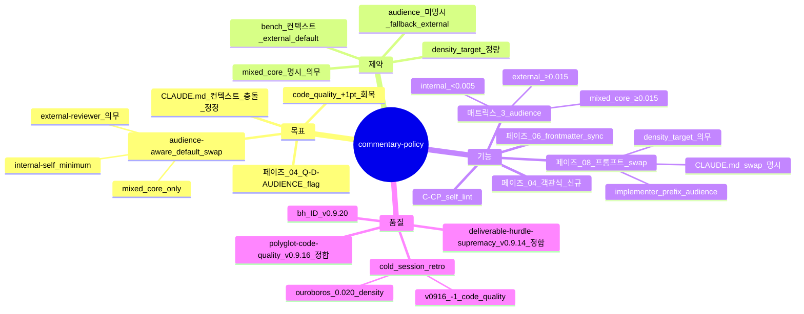

# Commentary Policy — audience-aware 주석 정책 (sprint-14 / v0.9.20)

## 한 줄 요약

**페이즈 04 의 1-bit flag `Q-D-AUDIENCE` = `internal-self | external-reviewer` 가 페이즈 08 implementation 의 주석 density 를 swap.** v0.9.13 까지 default = *주석 minimum* (CLAUDE.md 기본 + 본 하네스 internal-self 가정) → cold session 의 *외부 reviewer 가 cold read* 하는 작업 (bench / handoff / prod review) 에서 code_quality −1 회귀. 본 컨벤션이 audience flag 를 명시 페이즈 04 답안으로 박아 *컨텍스트 충돌* 자동 swap.

## 1. 결손 진단

cold session synthetic_mine_throughput_004 :
- 1,415 LOC / inline comment 1 줄
- ouroboros (1 위) : metrics.py 모듈 docstring 28 줄 + 모든 dataclass field 인라인 주석
- → code_quality 9/10 vs 10/10 (−1)

본 conversation 의 시스템 프롬프트 :

```
- Default to writing no comments. Only add one when the WHY is non-obvious...
- Don't explain WHAT the code does, since well-named identifiers already do that.
```

→ *internal-self* 컨텍스트의 룰. mine sim 같은 *external reviewer cold read* 작업에는 정반대. Theseus 하네스가 컨텍스트 충돌을 인지 안 함 → 모든 작업이 internal-self default 적용.

cold session retro :

| 회차 | 주석 / LOC | code_quality 점수 |
|---|:-:|:-:|
| v0915_cold01 | 0.001 | 9/10 |
| v0916_cold | 0.0007 | 9/10 |
| ouroboros (참고) | 0.020 | 10/10 |

→ +1pt 회복 가능. 본 컨벤션 도입 후 default 가 audience-aware 로 swap.

## 2. 운영 룰

### A. 페이즈 04 신규 객관식 — Q-D-AUDIENCE

```
질의 (Q-D-AUDIENCE):
이 작업의 산출물을 *cold read* 할 청중은?

자동 추정 :
- bench / handoff / prod review / 외부 evaluator 매칭 → 옵션 2 (external-reviewer)
- internal refactor / throwaway / spike / dev-only → 옵션 1 (internal-self)
- 미상 → 옵션 2 (external-reviewer 안전 default)

선택지:
1. internal-self — 나(또는 같은 컨텍스트 팀) 만 읽음. 주석 minimum.
2. external-reviewer (default) — 외부 reviewer 가 0 컨텍스트 cold read. docstring + why-comment 의무.
3. mixed — 코어는 external, dev script 는 internal.
```

답을 [`intent/04-audience.md`](../phases/04-clarify.md) 신규 산출물 + `intent/04-autonomy.md` 의 Q-D 카탈로그에 추가. 답이 *external-reviewer* OR *mixed* 면 페이즈 08 implementation defaults swap.

### B. 페이즈 08 default 매트릭스 — audience-aware

| audience | 모듈 docstring | 함수 docstring | dataclass field 주석 | inline why-comment | comment density (target) |
|---|:-:|:-:|:-:|:-:|:-:|
| **internal-self** | optional | non-trivial only | optional | rare (WHY only) | < 0.005 / LOC |
| **external-reviewer** (default) | **의무 ≥ 5 줄** | **의무 ≥ 1 줄** | **의무** | **non-trivial 결정 모두** | **≥ 0.015 / LOC** |
| mixed | core 모듈만 external | core 만 의무 | core 만 의무 | core 만 의무 | core ≥ 0.015 |

### C. plan 본문 의무 후크

페이즈 06 plan/06-plan.md 의 contract 에 audience 명시 (frontmatter sync) :

```yaml
---
audience: external-reviewer
comment_density_target: 0.015
docstring_obligation: module + function + dataclass
---
```

implementer 서브에이전트가 본 frontmatter 를 *프롬프트 prefix* 로 받음 → CLAUDE.md "Default to writing no comments" 룰을 audience 별로 swap.

### D. self_lint 룰 신규 — C-CP

```
C-CP:
  검증: intent/04-audience.md + impl/08-impl-log.md + 코드 (standalone 시)
  PASS 조건:
    - intent/04-audience.md 존재 + audience ∈ {internal-self, external-reviewer, mixed}
    - audience = external-reviewer 시 :
        - 코드 모듈 ≥ 50% 가 docstring (≥ 5 줄)
        - 함수 ≥ 80% 가 docstring (≥ 1 줄)
        - comment density ≥ 0.010 / LOC (target 0.015 의 67%)
    - audience = internal-self 시 :
        - 강제 검증 없음 (CLAUDE.md default 보존)
    - audience = mixed 시 :
        - core 모듈 list 에 external 룰 적용
  fail 조건:
    - audience 미명시 (frontmatter 누락)
    - external-reviewer 인데 comment density < 0.005 (target 의 33% 미달)
  bench scope: 페이즈 04 산출물 + 페이즈 06 frontmatter + 페이즈 08 코드
```

### E. CLAUDE.md 룰과 의 *명시적 우선순위*

본 컨벤션 = 사용자 instructions 차원. CLAUDE.md "Default to writing no comments" 보다 *지역적 우선*.

```
우선순위 (v0.9.20 명시) :
1. 페이즈 04 의 Q-D-AUDIENCE 답 (지역 instructions)
2. 본 컨벤션 의 audience-aware default 매트릭스
3. CLAUDE.md global default (no comments)
```

페이즈 08 implementer 프롬프트에 :

> "본 작업의 audience = `<external-reviewer | internal-self | mixed>`. CLAUDE.md 의 'no comments' default 는 internal-self 컨텍스트 룰이며, 본 작업의 audience 가 external-reviewer 면 swap — 모듈 docstring ≥ 5 줄, 함수 docstring ≥ 1 줄, dataclass field 주석 의무, why-comment density ≥ 0.015 / LOC."

## 3. 자기 검증 (메타)



## 4. 호환성

- v0.9.14 [`deliverable-hurdle-supremacy.md`](deliverable-hurdle-supremacy.md) — Layer 3 결과물 허들 supremacy. audience = external-reviewer 시 standalone 코드 의무 + 본 컨벤션의 docstring 의무 동시 발현.
- v0.9.16 [`polyglot-code-quality.md`](polyglot-code-quality.md) — 9 언어 표준 도구 측정 + 본 컨벤션 comment density 차원 신규 (언어 무관 메트릭 6번째)
- CLAUDE.md (사용자 글로벌) — 본 컨벤션이 *지역 instructions* 우선순위로 명시 swap

## 5. 본 컨벤션이 *케이스 종속이 아닌* 이유

a- 1-bit flag (audience) = 모든 작업에 보편. 도메인 무관.
b- comment density target = 정량 generic.
c- internal-self default 도 보존 — 본 컨벤션은 *swap 메커니즘* 만 추가. throwaway / spike 작업의 default 그대로.

## 6. 안티 패턴

a- audience 미명시 인 채로 페이즈 08 진행 → CLAUDE.md default (no comments) 적용 → external-reviewer 가 cold read 못함. C-CP fail.
b- audience = external-reviewer 인데 implementer 가 CLAUDE.md "no comments" 룰 우선 적용 — 우선순위 1 위반.
c- mixed 인데 core 모듈 list 미명시 — 자동 fallback external (안전).
d- density target 정량 무시하고 *주석 1줄 추가* 로 PASS 표방 — C-CP 정량 검증 우회.
e- 모든 작업에 external-reviewer 강제 → throwaway / spike 의 boilerplate 폭발. audience 명시가 *컨텍스트 sensitivity* 확보.

## 7. 적용 페이즈

- 페이즈 04 (사용자 질의) — *home* (Q-D-AUDIENCE 객관식)
- 페이즈 06 (plan) — frontmatter sync (audience + density target)
- 페이즈 08 (impl) — implementer 프롬프트 prefix swap
- 페이즈 09 (게이트) — C-CP 검증 위치
- 페이즈 14 (handoff) — audience frontmatter 종합

## 8. 도입 배경 (sprint-14 / v0.9.20)

본 사용자 진단 (2026-05-05) — synthetic_mine_throughput_004 code_quality −1 분석 :

> 1,415 LOC, comment_lines = 0 (loc_counter 결과). ouroboros metrics.py 모듈 docstring 28줄 + 모든 dataclass field 에 인라인 주석. 내 코드는 docstring 만 있고 왜 (why) 주석이 0.
>
> 근본원인: 내가 이 conversation 에서 받은 시스템 프롬프트에 명시적으로 "Default to writing no comments" 라고 지시됨. 하지만 mine sim 같은 외부 reviewer-driven 작업에서는 정반대 — 모든 non-trivial 결정에 왜 주석이 필요. Theseus 하네스가 이 컨텍스트 충돌을 인지하지 못함.
>
> 레슨: Phase 04 stack 옆에 commentary policy sub-phase. "이 산출물은 외부 reviewer 가 cold read 할 것인가? Yes → 모든 non-trivial 결정에 # why 주석. No → 기본 (주석 0)". 이 한 줄이 phase 06 plan 의 contract 에 박히면, phase 08 에서 자동으로 ouroboros-tier 주석 밀도 나옴.

사용자 의도 = *컨텍스트 충돌 명시 swap*. 본 컨벤션 = 1 줄 flag 가 8 페이즈 hour 의 주석 density 결정.
