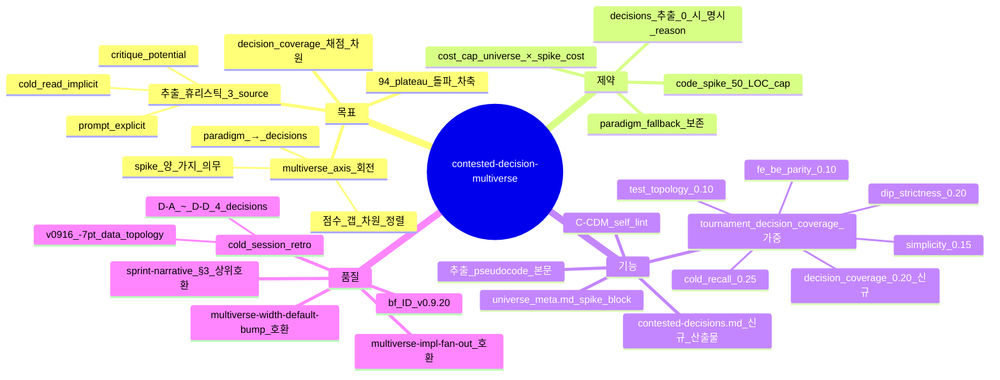

# Contested-Decision Multiverse — tournament axis 재정의 (sprint-14 / v0.9.20)

## 한 줄 요약

**페이즈 06 multiverse universe 의 분기 axis = `prompt + cold-read + critique` 에서 추출한 *contested decisions* (도메인-specific 모델링/엔지니어링 결정점) — paradigm/architecture axis 가 아니다.** v0.9.13 [`plan-tree.md`](plan-tree.md) 의 5 시드 (domain-first / adapter-first / minimal / tdd / strict-layering) + 6 분기 axis (process/data/sync/centralized/dynamic/push) 가 *coding paradigm* 차원만 분기 → cold session 의 *점수에 영향 주는 결정* (예: shared-vs-independent resource / proxy-vs-measured util / warmup 정책 / route 분리) 은 어느 universe 에서도 다뤄지지 않음. 본 컨벤션이 *contested decisions extractor* 를 phase 06 sub-procedure 로 박아 multiverse axis 를 *결정점 차원* 으로 회전.

## 1. 결손 진단

cold session 회차의 universe 분포 (v0914_cold01 ~ v0916_cold) :

| 회차 | universe 폭 | axis 차원 | 점수 갭 (외부) |
|---|:-:|---|:-:|
| v01_cold | 3 | architecture (domain / adapter / monolithic) | n/a |
| v091_cold01 | 3 | architecture | n/a |
| v0913_cold01 | 3 | architecture (코드 0) | n/a |
| v0914_cold01 | 4 | architecture | n/a |
| v0915_cold01 | 5 | sprint-05-b axis 카탈로그 | -1 (94 vs 93 self) |
| v0916_cold (synthetic_mine_throughput_004) | 5 | tournament.md = paradigm | **-7 (90 vs 97)** |

→ universe 는 *paradigm* 차원에서 분기, 점수 갭은 *modelling decision* 차원에서 발생. axis-갭 차원 직교 → multiverse spread 가 점수 spread 로 *전이 안 됨*.

**v0916 의 contested decisions (점수 갭 차원)** :
- D-A: shared physical road vs independent direction (data_topology −3)
- D-B: directly instrumented vs reconstructed utilisation (sim correctness −1)
- D-C: warmup=0 + grace 0 vs warmup=60 + grace 60 (conceptual −1)
- D-D: loaded-leg route ≠ empty-leg route vs single shared route (results interp −1)

5 universe 중 어느 것도 D-A~D-D 양 가지 모두 prototype 안 함.

## 2. 운영 룰 — Contested-Decisions Extraction + Code Spike

### A. 추출 휴리스틱 (벤치마크 무관)

```python
def extract_contested_decisions(prompt, cold_read, critique) -> list[Decision]:
  decisions = []

  # a- 명시적 분기 — prompt 의 hedge 표현
  for line in prompt.lines():
    if any(p in line.lower() for p in [
      "you may use x or y",
      "may use a different",
      "if appropriate",
      "either ... or ...",
      "alternatively"
    ]):
      decisions.append(Decision(source='prompt', kind='explicit', line=line))

  # b- 암묵적 분기 — cold-read 의 자신없는 줄
  for line in cold_read.lines():
    if any(p in line.lower() for p in [
      "i'm not sure",
      "could be ... or ...",
      "may need", "tentatively",
      "assuming", "approximation",
      "approximated", "simplified"
    ]):
      decisions.append(Decision(source='cold_read', kind='implicit', line=line))

  # c- 잠재 분기 — critique 의 stress-test ⚠
  for row in critique.stress_test_rows:
    if row.severity in ('warning', 'critical', '⚠', '⚡'):
      decisions.append(Decision(source='critique', kind='potential', line=row.text))

  return dedupe(decisions)
```

추출 결과는 [`plan/contested-decisions.md`](plan-tree.md) (phase 06 sub-output 신규) 에 frontmatter + 표 :

```markdown
| ID | source | kind | decision | branch_a | branch_b | impact_dim |
|---|---|---|---|---|---|---|
| D-A | prompt | explicit | "may simplify ramp as one or two lanes" | shared lane | independent | data_topology |
| D-B | cold_read | implicit | "directly measure or reconstruct util" | direct | reconstruct | sim_correctness |
| D-C | critique | potential | "warmup horizon ⚠" | warmup=0 | warmup=60 | conceptual |
```

### B. Universe Axis = Contested Decisions × Code Spike

```yaml
multiverse_axis_priority:
  1. contested_decisions  # ← v0.9.20 default (본 컨벤션)
  2. domain_paradigm      # ← v0.9.13 fallback (decisions 추출 0 시)
  3. mixed_axis           # ← contested ≥ width 미달 시 paradigm 보충
```

폭 W (G3=5/G4=7/G5=9, [`multiverse-width-default-bump.md`](multiverse-width-default-bump.md) bc) :
- contested ≥ W → 상위 W decisions 의 *branch_a/branch_b* 양 가지를 universe 로 spike
- contested < W → 모든 decisions + domain_paradigm 시드로 보충

### C. Code Spike Constraint (50 LOC 미만)

각 universe 의 `meta.md` 본문에 :

```markdown
## Code Spike (≤ 50 LOC)

```python
# universe-1 (D-A.shared_lane)
class SharedRoad:
  def __init__(self, env, capacity=1):
    self.lane = simpy.Resource(env, capacity)
  def acquire(self, direction):
    return self.lane.request()
```

```python
# universe-2 (D-A.independent)
class IndependentDirections:
  def __init__(self, env):
    self.up = simpy.Resource(env, 1)
    self.down = simpy.Resource(env, 1)
  def acquire(self, direction):
    return (self.up if direction == 'up' else self.down).request()
```

각 spike = 같은 인터페이스 (acquire) 다른 구현. tournament 의 plan-reviewer 가 spike 를 *읽어서* 채점 (prose 비교 0).

### D. Tournament 채점 갱신 — `decision_coverage` 차원 추가

[`plan-tree.md`](plan-tree.md) §토너먼트 채점 5 차원에 6 차원 추가 :

| 차원 | 의미 | 가중 |
|---|---|---:|
| (기존) cold_recall | 의도 일치 | 0.25 (← 0.30) |
| (기존) dip_strictness | DIP | 0.20 (← 0.25) |
| (기존) simplicity | 모듈 수 | 0.15 (← 0.20) |
| (기존) test_topology | 테스트 모양 | 0.10 (← 0.15) |
| (기존) fe_be_parity | FE/BE 패리티 | 0.10 (변경 없음) |
| **decision_coverage** | contested decisions 양 가지 prototype + tradeoff 본문 | **0.20** (신규) |

decision_coverage < 0.6 인 universe 즉시 탈락 — *spike 없으면 paradigm 분기 묶음에 불과*.

### E. self_lint 룰 신규 — C-CDM

```
C-CDM:
  검증: plan/contested-decisions.md + plan/candidates/universe-N/meta.md
  PASS 조건:
    - plan/contested-decisions.md 존재 + 표 ≥ 1 row (decisions 0 면 *명시 빈 표 + reason*)
    - decisions ≥ width 시 universe-N axis 가 contested decisions
    - 각 universe meta.md 에 code spike 코드 펜스 (≤ 50 LOC) 또는 fallback 명시
    - tournament.md 채점 표에 decision_coverage 차원 row
  fail 조건:
    - decisions ≥ 1 인데 universe axis 가 paradigm 만 (contested 0 매핑)
    - code spike 없는 universe (paradigm-only universe) 가 폭 default 의 50% 초과
  bench scope: 페이즈 06 plan/contested-decisions.md + plan/candidates/
```

## 3. 자기 검증 (메타)



## 4. 호환성

- v0.9.6 [`plan-tree.md`](plan-tree.md) — 5 시드 + 6 분기 axis 가 *fallback* 으로 격하 (decisions 추출 0 시만)
- v0.9.6 §토너먼트 채점 — 5 차원 → 6 차원 (decision_coverage 신규, 가중 재분배)
- v0.9.12 [`multiverse-impl-fan-out.md`](multiverse-impl-fan-out.md) — universe N 모두 실 코드 의무 + 본 컨벤션의 spike 가 *seed* 로 사용
- [`sprint-narrative.md`](sprint-narrative.md) §3 (sprint-37 PR-AF 통합) — 패배 universe 의 *spike 차이집합* 도 우승 본문에 흡수 의무 (decision-axis lesson 포함)
- v0.9.19 [`multiverse-width-default-bump.md`](multiverse-width-default-bump.md) — 폭 default 와 contested decisions 갯수 매칭 룰

## 5. 본 컨벤션이 *케이스 종속이 아닌* 이유

a- 추출 휴리스틱 = 자연어 hedge 표현 + cold-read 자신감 + critique severity. 도메인 무관.
b- code spike 50 LOC 제약 = generic.
c- decision_coverage 채점 차원 = 모든 도메인의 modelling decision 에 적용.

LLM 코딩 / ML / 시스템 설계 / DES / API 설계 — 모든 도메인의 contested decisions 가 본 추출에서 노출됨. mine 의 D-A~D-D 는 *illustration*.

## 6. 안티 패턴

a- decisions 추출 0 인 채로 paradigm-only universe 만 → multiverse 가 *형식적 분기 ceremony*. C-CDM fail.
b- spike 코드 50 LOC 초과 — universe 단계는 *seed* 인데 implementation 까지 진행 = budget 폭발.
c- code spike 가 prose 비교만 (실 코드 0) — multiverse-impl-fan-out 위반 + decision_coverage 0.
d- contested decisions 표가 prompt 만 source — cold_read / critique 의 implicit/potential 분기 누락 (axis 다양성 손실).
e- decision_coverage 차원 가중 0 — 채점 차원 추가만 하고 가중 재분배 안 함 → 채점 미적용.

## 7. 적용 페이즈

- 페이즈 06 (plan-tree) — *home* (contested decisions 추출 + universe axis 회전)
- 페이즈 02 (intent review) — stress-test 표의 ⚠ 마크 source 산출
- 페이즈 03 (cold-read) — 자신없는 줄 source 산출
- 페이즈 05 (critique) — potential 분기 source 산출
- 페이즈 08 (impl) — 우승 universe 의 spike 가 base seed (multiverse-impl-fan-out 호환)
- 페이즈 09 (게이트) — C-CDM 검증 위치

## 8. 도입 배경 (sprint-14 / v0.9.20)

본 사용자 진단 (2026-05-05) — synthetic_mine_throughput_004 7pt 갭 :

> 내 plan/tournament.md 는 5 universe 인데 모두 architecture-level diff (domain-first vs adapter-first vs monolithic vs actor vs analytic). 결정적 design contention — independent vs shared lane, proxy vs measured util, single-route vs leg-specific routing — 은 어느 universe 에서도 다뤄지지 않음.

> 근본원인: AIDE multiverse 의 width 가 coding paradigm 축으로 잡혔는데, 점수에 영향 주는 분기점은 modelling decision 축임.

사용자 의도 = *너비를 옮기라* — 5-universe ceremony 를 architecture → modelling-decision 축으로 ROTATE. 본 컨벤션이 추출 휴리스틱 + spike + 채점 차원으로 ROTATE 를 제도화.
