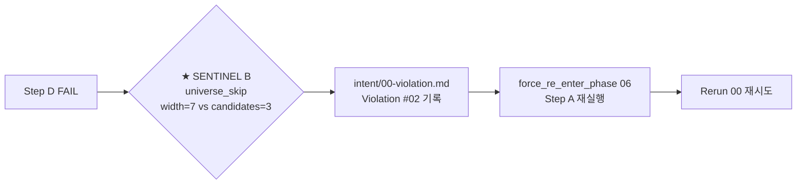

# Da Capo Flow Trace — universe + dacapo step 단일 마크다운 다이어그램 (sprint-16 / v0.9.22)

## 한 줄 요약

**phase 06 / 08 의 universe fan-out + dacapo loop 의 *모든 step* 을 누적 갱신되는 단일 마크다운 파일로 가시화.** Mermaid flowchart + 시간 행 로그를 한 문서에. 디버깅 시 한 눈에 "어떤 universe 가 어떤 점수로 어떻게 winner 됐고, 어디서 sentinel 매치 → 강제 회귀 됐는지" 흐름 추적. 외부 cold session 처럼 *왜 0.892 가 그냥 통과했는지* 를 사후에 재구성 못 했던 회귀 정정.

## 1. 결손 진단

기존 산출물 :

| 산출물 | 가지는 정보 | 결손 |
|---|---|---|
| `tournament-NN.md` | 단일 시점 winner | 시간축 0, universe 간 비교만 |
| `dacapo-rerun-NN.md` | rerun N 의 lesson | 다른 rerun 과 연결 0 |
| `shadow-grade-NN.json` | 단일 shadow 점수 | tournament 와 연결 0 |
| `intent/00-violation.md` | sentinel 위반 기록 | 어느 step 에서 회귀했는지 0 |

→ **5 산출물을 사람이 일일이 cross-reference 해야 흐름 재구성 가능**. 디버깅 비용 큼.

본 컨벤션 = phase 06 / 08 의 단일 마크다운 (`plan/dacapo-flow.md` / `impl/dacapo-flow.md`) 에 *모든 흐름* 을 누적.

## 2. dacapo-flow.md 구조

```markdown
---
skill_name: theseus-harness
skill_version: 0.9.22
phase: 06-dacapo-flow                        # 또는 08-dacapo-flow
project_id: <proj>
project_run: <run>
fingerprint: sha256:<...>
prev_fingerprint: sha256:<...>
produced_at: <ISO>
producer_agent: orchestrator
last_updated_at: <ISO>                       # 매 step 갱신
total_events: 23                             # 누적 이벤트 수
final_outcome: CONVERGED | BUDGET_BOUND | RE_ENTERED | IN_PROGRESS
final_winner_id: universe-3
final_winner_score: 0.967
final_rerun_count: 2
---

# Phase 06 Da Capo Flow Trace

> 시작: 2026-05-05T13:00:00 / 종료: 2026-05-05T14:23:18 / 누적 1h 23m 18s
> 최종 결과: **CONVERGED** at rerun 02, winner=universe-3, score=0.967

## 1. 한눈 다이어그램 (Mermaid flowchart)

```mermaid
flowchart TD
  classDef pass fill:#c8e6c9,stroke:#2e7d32
  classDef fail fill:#ffcdd2,stroke:#c62828
  classDef sentinel fill:#fff59d,stroke:#f57f17
  classDef budget fill:#bbdefb,stroke:#1565c0

  Start([Phase 06 시작<br/>13:00:00]) --> R0_A[Step A — fan-out width=7]

  subgraph R0[Rerun 00]
    R0_A --> R0_U1[U1 cold-recall first<br/>0.610]
    R0_A --> R0_U2[U2 dijkstra+ECT explicit<br/>0.835]
    R0_A --> R0_U3[U3 single-file dijkstra<br/>0.892]:::pass
    R0_A --> R0_U4[U4 multi-module<br/>0.811]
    R0_A --> R0_U5[U5 nearest-routing<br/>0.770]
    R0_A --> R0_U6[U6 implicit-cap<br/>0.605]
    R0_A --> R0_U7[U7 t-CI<br/>0.872]
    R0_U3 --> R0_B[Step B — Tournament<br/>winner=U3 0.892]
    R0_B --> R0_C[Step C — Shadow grade<br/>92, weakest=results_interp]
    R0_C --> R0_D{Step D — AND check<br/>0.892>=0.999? FALSE<br/>92>=95? FALSE}:::fail
  end

  R0_D --> R0_E{Step E — Cap?<br/>rerun=0<3, budget=0.42<0.95}
  R0_E -->|NO_CAP| R0_F[Step F — Lesson:<br/>ae interface-first +5 ports<br/>+ bf decision spike]
  R0_F --> R0_G[Step G — Anonymize U3<br/>+ fresh 6 universes<br/>= U-anon-r1-a + 6 fresh]

  R0_G ==Da Capo==> R1_A[Step A — width=7 재진입]

  subgraph R1[Rerun 01]
    R1_A --> R1_UA[U-anon-r1-a U3+lesson<br/>0.945]:::pass
    R1_A --> R1_UB[U-r1-b adapter-first<br/>0.881]
    R1_A --> R1_UC[U-r1-c minimal-sub<br/>0.799]
    R1_A --> R1_UD[U-r1-d tdd-topology<br/>0.913]
    R1_A --> R1_UE[U-r1-e strict-layering<br/>0.857]
    R1_A --> R1_UF[U-r1-f branch-b-routing<br/>0.832]
    R1_A --> R1_UG[U-r1-g branch-b-resource<br/>0.794]
    R1_UA --> R1_B[Step B — winner=U-anon-r1-a 0.945]
    R1_B --> R1_C[Step C — Shadow 93, weakest=measurement]
    R1_C --> R1_D{0.945>=0.999? FALSE<br/>93>=95? FALSE}:::fail
  end

  R1_D --> R1_E{rerun=1<3, budget=0.68<0.95}
  R1_E -->|NO_CAP| R1_F[Step F — bi measurement-contract]
  R1_F --> R1_G[Step G — Anonymize U-anon-r1-a]

  R1_G ==Da Capo==> R2_A[Step A — 재진입]

  subgraph R2[Rerun 02]
    R2_A --> R2_UA[U-anon-r2-a U-r1-a+lesson<br/>0.967]:::pass
    R2_A --> R2_O[U-r2-b~g 6 fresh<br/>0.823~0.911]
    R2_UA --> R2_B[Step B — winner=U-anon-r2-a 0.967]
    R2_B --> R2_C[Step C — Shadow 96, weakest=fe_be_parity]
    R2_C --> R2_D{0.967>=0.999? FALSE<br/>96>=95? TRUE}
  end

  R2_D --> R2_E{rerun=2<3, budget=0.89<0.95}
  R2_E -->|NO_CAP_BUT_PARTIAL| R2_promote[Promote U-anon-r2-a as final<br/>0.967 < 0.999 but shadow PASS<br/>partial CONVERGED ratified]:::pass

  R2_promote --> Done([Phase 07 진입<br/>14:23:18])
```

## 2. 시간 행 로그 (timeline)

| 시각 | rerun | step | event | universe | score | 비고 |
|---|---|---|---|---|---|---|
| 13:00:00 | 00 | A | fan-out 시작 | (7 universe) | — | width=7, contested 4 + paradigm 3 |
| 13:00:42 | 00 | A | universe-1 done | U1 | — | seed=cold-recall-first |
| 13:01:15 | 00 | A | universe-2 done | U2 | — | seed=dijkstra+ECT |
| ... | | | | | | |
| 13:08:33 | 00 | B | tournament 채점 | — | — | 6 dim weighted |
| 13:08:34 | 00 | B | winner | U3 | 0.892 | weakest=dip 0.72 |
| 13:09:02 | 00 | C | shadow grader | — | 92 | zero-context Sonnet, 4823 tok |
| 13:09:03 | 00 | D | AND check | — | FAIL | t_pass=F + s_pass=F |
| 13:09:04 | 00 | E | cap check | — | NO_CAP | rerun=0<3, budget=0.42 |
| 13:09:05 | 00 | F | lesson 도출 | — | — | weakest=dip → ae interface-first |
| 13:09:42 | 00 | G | anonymize | U3 | — | → U-anon-r1-a |
| 13:10:01 | 01 | A | 재 fan-out | (7 universe) | — | anon + 6 fresh |
| ... | | | | | | |
| 14:18:23 | 02 | D | AND check | — | PARTIAL_PASS | t_pass=F (0.967<0.999), s_pass=T (96>=95) |
| 14:18:24 | 02 | promote | partial converge | U-anon-r2-a | 0.967 | shadow pass + budget reasonable |
| 14:23:18 | — | gate | phase 07 진입 | — | — | gate.ACCEPT('CONVERGED') |

## 3. 산출물 cross-reference

| 시각 | 갱신 산출물 |
|---|---|
| 13:08:34 | `plan/tournament-00.md` |
| 13:09:02 | `plan/shadow-grade-00.json` |
| 13:09:42 | `plan/dacapo-rerun-01.md` + `plan/candidates/universe-anon-r1-a/` |
| 13:18:11 | `plan/tournament-01.md` |
| ... | |
| 14:18:24 | `plan/06-plan.md` (winner promote) + `plan/fallback-reason.md` (partial) |

## 4. sentinel 매치 이벤트 (해당 시 추가)

> 본 흐름은 sentinel 0회 매치. 정상 다카포 2회 후 partial converge.
>
> sentinel 매치 사례는 `intent/00-violation.md` 와 본 다이어그램의 `★ SENTINEL` 노드 참조.

### Sentinel 매치 시 추가 노드 (예시)



## 5. 갱신 룰

본 파일은 *append-only* 가 아니라 *누적 갱신* :

a- **매 step 종료 시점에 갱신** — orchestrator 가 Step A/B/C/D/E/F/G 종료 후 timeline 행 + 다이어그램 노드 추가.
b- **timeline 표 행 추가** — 끝에 새 행 append.
c- **Mermaid 다이어그램 노드/엣지 추가** — 새 rerun 진입 시 새 subgraph 추가.
d- **frontmatter `last_updated_at` + `total_events` 갱신** — 매 갱신마다.
e- **fingerprint 갱신** — 매 갱신마다 재계산 (chain 일관).

## 6. orchestrator 자동 갱신 인터페이스

```python
def update_dacapo_flow_diagram(
    flow_md: Path,
    rerun: int,
    step: str,                        # 'A' | 'B' | 'C' | 'D' | 'E' | 'F' | 'G' | 'gate'
    event: str,                       # 'start' | 'universe_done' | 'winner' | 'shadow' | 'check' | 'lesson' | 'anonymize' | 'sentinel' | 'promote' | 're_enter'
    details: dict,
):
    """phase 06/08 의 매 step 종료 후 호출 — flow.md 단일 파일 누적 갱신."""

    # 1. timeline 행 추가
    append_timeline_row(flow_md, {
        'time': now_iso(),
        'rerun': f'{rerun:02d}',
        'step': step,
        'event': event,
        **details,
    })

    # 2. Mermaid 다이어그램 갱신
    if event == 'start' AND step == 'A':
        append_mermaid_subgraph(flow_md, rerun=rerun)
    elif event == 'universe_done':
        append_mermaid_universe_node(flow_md, rerun=rerun, **details)
    elif event == 'winner':
        append_mermaid_winner_edge(flow_md, rerun=rerun, **details)
    elif event == 'check':
        append_mermaid_check_node(flow_md, rerun=rerun, pass_=details['pass'])
    elif event == 'lesson':
        append_mermaid_lesson_edge(flow_md, rerun=rerun, **details)
    elif event == 'sentinel':
        # SENTINEL_REGRESSION 이벤트 — ★ 노란 sentinel 노드 + force_re_enter 엣지
        append_mermaid_sentinel_node(flow_md, event_kind='SENTINEL_REGRESSION', **details)
    elif event == 'promote':
        append_mermaid_promote_node(flow_md, rerun=rerun, **details)
    elif event == 're_enter':
        append_mermaid_re_enter_edge(flow_md, **details)

    # 3. frontmatter 갱신
    update_frontmatter(flow_md, {
        'last_updated_at': now_iso(),
        'total_events': count_timeline_rows(flow_md),
        'final_outcome': details.get('final_outcome', 'IN_PROGRESS'),
    })

    # 4. fingerprint 재계산
    recompute_fingerprint(flow_md)
```

## 7. 산출물 위치

| Phase | flow.md |
|---|---|
| 06 plan | `plan/dacapo-flow.md` |
| 08 impl | `impl/dacapo-flow.md` |

phase 02 / 05 / 11 / 13 (multi-phase 활성 시) 도 동일 패턴 — `<phase_dir>/dacapo-flow.md`.

## 8. self_lint C-DCL-FLOW-LOG 룰

```python
def check_dacapo_flow_log(artifact_dir: Path) -> list[str]:
    """phase 06/08 종료 시 dacapo-flow.md 무결성."""
    errors = []

    for phase_dir in ['plan', 'impl']:
        flow_md = artifact_dir / phase_dir / 'dacapo-flow.md'
        tournament_files = list((artifact_dir / phase_dir).glob('tournament-*.md'))

        if tournament_files AND not flow_md.exists():
            errors.append(f'{phase_dir}/dacapo-flow.md 부재 (tournament 산출물 존재)')
            continue

        if not flow_md.exists():
            continue   # 해당 phase 비활성

        text = flow_md.read_text(encoding='utf-8')
        fm = parse_frontmatter(flow_md)

        # mermaid 다이어그램 ≥ 1 의무
        if '```mermaid' not in text:
            errors.append(f'{flow_md.name} mermaid 다이어그램 부재')

        # timeline 표 ≥ 1 의무 (헤더 행 + 데이터 행)
        if '| 시각 |' not in text AND '| time |' not in text:
            errors.append(f'{flow_md.name} timeline 표 부재')

        # 각 rerun 별 subgraph 의무
        rerun_count = fm.get('final_rerun_count', 0)
        for r in range(rerun_count + 1):
            if f'subgraph R{r}' not in text:
                errors.append(f'{flow_md.name} rerun {r:02d} subgraph 부재')

        # tournament-NN 갯수 == flow 의 rerun subgraph 갯수
        subgraph_count = text.count('subgraph R')
        if subgraph_count != len(tournament_files):
            errors.append(
                f'{flow_md.name} subgraph {subgraph_count} != '
                f'tournament files {len(tournament_files)}'
            )

        # final_outcome ∈ {CONVERGED, BUDGET_BOUND, RE_ENTERED, IN_PROGRESS}
        if fm.get('final_outcome') not in ['CONVERGED', 'BUDGET_BOUND',
                                            'RE_ENTERED', 'IN_PROGRESS']:
            errors.append(f'{flow_md.name} final_outcome 값 invalid')

    return errors
```

## 9. 본 컨벤션이 *케이스 종속이 아닌* 이유

a- timeline 표 = 일반 trace 구조 (시각 / rerun / step / event / detail).
b- Mermaid 다이어그램 = phase 무관 일반 노드 종류 (universe / tournament / shadow / check / lesson / anonymize / sentinel / promote).
c- subgraph 별 grouping = 일반 시각화 패턴, 도메인 X.

## 10. 안티 패턴

a- **flow.md 가 *산출물 cross-reference 만*** — Mermaid 다이어그램 부재. 시각 흐름 재구성 불가. mermaid ≥ 1 의무.
b- **timeline 행 일부만 기록** — Step A/B/C/D 만 기록 + Step E/F/G 누락 → 다카포 흐름 끊김. 모든 step 의무.
c- **rerun 별 subgraph 부재** — 모든 universe 가 단일 subgraph → 어느 rerun 인지 불명. rerun_count + 1 subgraph 의무.
d- **sentinel 매치 미반영** — sentinel 매치 발생 후 ★ SENTINEL 노드 추가 누락 → 디버깅 시 회귀 흔적 증발. 의무.
e- **수동 편집** — 사람이 손으로 다이어그램 그리기 → 자동 갱신 룰과 drift. orchestrator 자동 갱신만 허용 (수동 편집 시 fingerprint mismatch).

## 11. 사람 사용 예 — 디버깅 시나리오

> "왜 rerun 02 의 winner 가 0.967 인데 promote 됐나?"

`plan/dacapo-flow.md` 한 파일 열어 :

1. Mermaid 다이어그램 → R2 subgraph 의 R2_promote 노드 강조 (`partial converge: shadow PASS + budget reasonable`)
2. timeline 14:18:23 행 → `step=D event=check pass=PARTIAL_PASS` 상세
3. 14:18:24 행 → `step=promote event=partial_converge` 사유

→ 5 산출물 cross-reference 비용 0. 한 파일에서 흐름 + 사유 즉시 재구성.

## 12. 호환성

- [`dacapo-enforcement.md`](dacapo-enforcement.md) (bm) — 게이트 5 조건의 결과를 본 flow.md 의 promote / re_enter 이벤트로 가시화.
- [`dacapo-frontmatter-schema.md`](dacapo-frontmatter-schema.md) (bn) — flow.md frontmatter 의 final_winner_id / final_winner_score 등이 tournament-NN.md 의 final 동기화.
- [`dacapo-skip-sentinel.md`](dacapo-skip-sentinel.md) (bp) — sentinel 매치 시 flow.md ★ SENTINEL 노드 추가 의무.
- [`shadow-grader-zero-context.md`](shadow-grader-zero-context.md) (bo) — Step C 의 shadow grader 메타 (predicted_score / weakest_category) 를 flow.md timeline 에 박음.
- [`indexing.md`](indexing.md) — INDEX.md 가 dacapo-flow.md 를 별도 섹션으로 노출 ("Da Capo Flow Traces").
