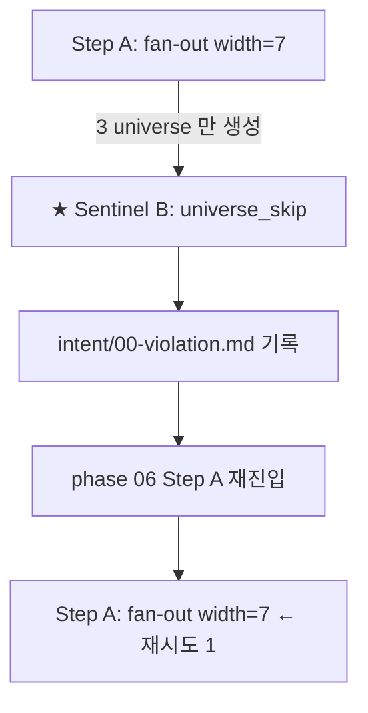

# Da Capo Skip Sentinel — 자동 위반 인식 + 강제 회귀 (sprint-16 / v0.9.22)

## 한 줄 요약

**Da Capo / universe / sprint *skip 패턴* 을 자동 인식해 강제 회귀.** orchestrator 가 phase 종료 시점에 (a) frontmatter sentinel + (b) 로그 패턴 sentinel + (c) 산출물 디렉터리 sentinel 3 종 감지. 패턴 매치 시 `intent/00-violation.md` 기록 + phase 06/08 *재진입* 강제. 사용자 ack 없이 자율 회귀 ([`autonomy.md`](autonomy.md) 페이즈 04 외 인터럽트 0 정합).

## 1. 결손 진단

[`dacapo-enforcement.md`](dacapo-enforcement.md) (bm) 의 게이트 5 조건은 frontmatter 만 검증. 실제 위반 패턴은 :

| 패턴 | 게이트 검출 | 미검출 사례 |
|---|---|---|
| frontmatter 의무 필드 누락 | ✅ | — |
| `dacapo_loop_executed: true` 거짓 박기 | 부분 (cross-validation) | `rerun_count: 1` + dacapo-rerun-01.md 본문 *비어있음* |
| 다카포 skip — winner 점수 미달인데 promote | ✅ | — |
| **universe skip — width=7 인데 universe-1/2/3 만** | ❌ | candidates/ 디렉터리 검사 부재 |
| **sprint skip — sprint-trinity 3 axis × 2 인데 1 axis 만** | ❌ | sprints/ 디렉터리 검사 부재 |
| **로그 skip 흔적 — "Winner clear" / "0회 충분" 같은 자율 판단 흔적** | ❌ | 로그 grep 부재 |

→ 본 컨벤션 = 게이트가 못 잡는 *디렉터리 + 로그 패턴* 검출 layer.

## 2. Sentinel 3종

### Sentinel A — Frontmatter 모순 (게이트 보강)

`threshold` fallback 기본값(0.999)은 레거시 grade 표기 참고값이다 — 정지 판정의 실제 권위는 manifest `stop_policy`(설계 B2 §2.2)이며, 본 sentinel 은 절대값 자체가 아니라 "선언된 threshold 미달 + rerun 0 + fallback 사유 없음"이라는 *frontmatter 자기모순*을 잡는다(threshold 값이 무엇이든 적용되는 정직성 검사).

```python
SENTINEL_A_PATTERNS = [
    # winner 미달 + rerun=0 + fallback 부재 = 다카포 skip
    {
        'name': 'dacapo_skip_winner_below_threshold',
        'condition': lambda fm: (
            fm.get('winner_score', 1.0) < fm.get('threshold', 0.999)
            AND fm.get('rerun_count', 0) == 0
            AND fm.get('fallback_reason', '').strip() == ''
        ),
        'severity': 'critical',
        'action': 'force_re_enter_phase',
    },
    # rerun_count > 0 인데 dacapo-rerun-NN.md 갯수 mismatch
    {
        'name': 'dacapo_rerun_log_count_mismatch',
        'condition': lambda fm, files: (
            fm.get('rerun_count', 0) != len(files['dacapo_rerun'])
        ),
        'severity': 'critical',
        'action': 'force_re_enter_phase',
    },
    # step_d_converged=true 인데 winner_score < threshold (산술 모순)
    {
        'name': 'step_d_converged_false_positive',
        'condition': lambda fm: (
            fm.get('step_d_converged', False) AND
            fm.get('winner_score', 0) < fm.get('threshold', 0.999)
        ),
        'severity': 'critical',
        'action': 'force_re_enter_phase',
    },
]
```

### Sentinel B — 디렉터리 카운트 (universe / sprint skip)

```python
SENTINEL_B_PATTERNS = [
    # multiverse_width != candidates/ 갯수 = universe skip
    {
        'name': 'universe_skip',
        'check': lambda artifact_dir, fm: (
            fm.get('multiverse_width', 0) != count_universe_dirs(artifact_dir)
        ),
        'severity': 'critical',
        'action': 'force_re_enter_phase',
        'evidence_template': 'multiverse_width={width} but candidates/ has {actual}',
    },
    # sprint-trinity 3 axis × ≥ 2 인데 sprint 갯수 < 6
    {
        'name': 'sprint_trinity_skip',
        'check': lambda artifact_dir, fm: (
            fm.get('sprint_trinity_required', False) AND
            count_sprints(artifact_dir) < 6
        ),
        'severity': 'critical',
        'action': 'force_re_enter_phase',
    },
    # phase 08 multiverse — code/universe-N/ 갯수 mismatch
    {
        'name': 'impl_universe_skip',
        'check': lambda artifact_dir, fm: (
            fm.get('multiverse_width', 0) != count_code_universe_dirs(artifact_dir)
        ),
        'severity': 'critical',
        'action': 'force_re_enter_phase',
    },
]
```

### Sentinel C — 로그 패턴 (자율 판단 흔적)

```python
# orchestrator / sub-agent 의 *자연어 로그* 에서 skip 흔적 검출
SENTINEL_C_LOG_PATTERNS = [
    # "Winner clear" / "winner is clear" / "충분히 명확"
    r'(?i)winner\s+(is\s+)?clear',
    r'(?i)winner\s+is\s+sufficient',
    r'(?i)충분히\s*명확',
    r'(?i)명백한\s*우승',

    # "skip dacapo" / "rerun 불필요" / "0회 충분"
    r'(?i)skip(ping)?\s+dacapo',
    r'(?i)dacapo\s+(loop\s+)?(not\s+)?(necessary|needed)',
    r'(?i)rerun\s*(은|이)?\s*불필요',
    r'(?i)0\s*회\s*(로\s*)?충분',
    r'(?i)재경합\s*(이|은)?\s*불필요',

    # "threshold 근사" / "거의 통과" / "준수"
    r'(?i)threshold\s+(approx|nearly|close)',
    r'(?i)거의\s*통과',
    r'(?i)임계\s*(에\s*)?근접',

    # "single top" / "단일 탑" 자력 결론 (외부 cold session 사용자 보고 표현 정합)
    r'(?i)single\s+top.*proceed',
    r'(?i)단일\s*탑.*진행',           # 단일 탑 점수만 보고 다카포 skip

    # universe skip — "fewer universes" / "3 candidates 면 충분"
    r'(?i)fewer\s+universes?\s+(is\s+)?(ok|fine|sufficient)',
    r'(?i)\d+\s+candidates?\s+면\s+충분',

    # sprint skip — "sprint loop 1 회면 충분"
    r'(?i)sprint\s+(loop\s+)?\d+\s+(회|times?)\s+(면|is)\s+(충분|enough|sufficient)',
]


def scan_logs_for_skip_patterns(artifact_dir: Path) -> list[dict]:
    """orchestrator 진행 로그 + sub-agent 응답에서 skip 흔적 검출."""
    log_files = [
        artifact_dir / 'logs' / 'orchestrator.log',
        artifact_dir / 'logs' / 'subagents.log',
        *artifact_dir.glob('**/dacapo-rerun-*.md'),
        *artifact_dir.glob('**/tournament-*.md'),
        *artifact_dir.glob('**/07-plan-review.md'),
    ]
    matches = []
    for lf in log_files:
        if not lf.exists():
            continue
        text = lf.read_text(encoding='utf-8')
        for pattern in SENTINEL_C_LOG_PATTERNS:
            for m in re.finditer(pattern, text):
                matches.append({
                    'file': str(lf),
                    'pattern': pattern,
                    'match': m.group(0),
                    'line': text[:m.start()].count('\n') + 1,
                    'severity': 'critical',
                    'action': 'force_re_enter_phase',
                })
    return matches
```

## 3. 강제 회귀 흐름

```python
def on_sentinel_match(matches: list[dict], phase: int, artifact_dir: Path):
    """sentinel 매치 시 자율 회귀 — 페이즈 04 외 인터럽트 0 정합."""

    # 1. 위반 기록
    violation_md = artifact_dir / 'intent' / '00-violation.md'
    append_violation(
        violation_md,
        sprint='sprint-16',
        phase=phase,
        sentinel_matches=matches,
        timestamp=now_iso(),
    )

    # 2. 위반 횟수 증가
    count = increment_violation_count(artifact_dir)

    # 3. 위반 횟수 ≥ 3 만 사용자 ack
    if count >= 3:
        return ASK_USER(
            f'{phase} 페이즈 sentinel 위반 {count} 회 연속 — '
            f'진단 필요. 매치: {summarize_matches(matches)}'
        )

    # 4. dacapo-flow.md 갱신 (가시화)
    update_dacapo_flow_diagram(
        artifact_dir / 'plan' / 'dacapo-flow.md',
        event='SENTINEL_REGRESSION',
        details=matches,
    )

    # 5. phase Step A 부터 재진입 (자율)
    return RE_ENTER_PHASE(phase, reason=f'sentinel match: {[m["pattern"] for m in matches]}')
```

## 4. intent/00-violation.md 형식

```markdown
---
skill_name: theseus-harness
skill_version: 0.9.22
phase: 00-violation-record
project_id: <proj>
project_run: <run>
violation_count: 2                            # 누적
last_violation_at: <ISO>
---

## Violation 002 — 2026-05-05T14:23:18+09:00

**Phase:** 06 (plan-tree)
**Sentinel:** Sentinel B — universe_skip
**Evidence:** multiverse_width=7 but candidates/ has 3
**Action:** force_re_enter_phase 06 (Step A 재진입)

### 매치 상세

- 위치: `plan/tournament.md` frontmatter `multiverse_width: 7`
- 디렉터리: `plan/candidates/` 에 universe-1/2/3 만 존재 (4 누락)
- 자동 회귀 실행: phase 06 Step A `initial_fan_out(width=7)` 재실행

### 다음 액션

a- phase 06 Step A 부터 재진입 (자율)
b- 위반 횟수 = 2 (3 미만, 사용자 ack 불필요)
c- dacapo-flow.md 갱신 — SENTINEL_REGRESSION 이벤트 추가

---

## Violation 001 — 2026-05-05T13:18:42+09:00

(이전 violation 기록 ...)
```

## 5. sentinel 검사 함수 (참고 구현)

```python
def check_dacapo_skip_sentinels(artifact_dir: Path) -> list[str]:
    """phase 06 / 08 종료 시점에 3 sentinel 검사."""
    errors = []

    # Sentinel A — frontmatter
    for tournament in (artifact_dir / 'plan').glob('tournament-*.md'):
        fm = parse_frontmatter(tournament)
        for pat in SENTINEL_A_PATTERNS:
            if pat['condition'](fm, ...):
                errors.append(f'Sentinel A — {pat["name"]}: {tournament.name}')

    # Sentinel B — directory count
    fm = parse_frontmatter(artifact_dir / 'plan' / 'tournament-00.md')
    for pat in SENTINEL_B_PATTERNS:
        if pat['check'](artifact_dir, fm):
            errors.append(f'Sentinel B — {pat["name"]}: '
                          f'{pat["evidence_template"].format(...)}')

    # Sentinel C — log
    matches = scan_logs_for_skip_patterns(artifact_dir)
    for m in matches:
        errors.append(f'Sentinel C — log skip pattern: '
                      f'{m["file"]}:{m["line"]} matches {m["pattern"]}')

    return errors
```

## 6. dacapo-flow.md 가시화 통합

본 컨벤션의 sentinel 매치 시 [`dacapo-flow-trace.md`](dacapo-flow-trace.md) (bq) 의 단일 마크다운 다이어그램에 *SENTINEL_REGRESSION* 이벤트로 추가. 디버깅 시 한눈에 :



## 7. 본 컨벤션이 *케이스 종속이 아닌* 이유

a- 3 sentinel = phase 무관 일반 패턴 (frontmatter / 디렉터리 / 로그).
b- 강제 회귀 = orchestrator 의 일반 핸드오프 hook.
c- 로그 패턴 = 자연어 skip 흔적 (도메인 X), regex 일반 패턴.

## 8. 안티 패턴

a- **sentinel 결과 무시 ack** — sentinel 매치 후 사용자 confirm 으로 진행 → autonomy.md 위반. 매치 = 강제 회귀, 3회 미만은 자율.
b- **로그 패턴 회피 자연어** — agent 가 "Winner clear" 대신 "winner-is-noticeable" 같은 회피 표현. SENTINEL_C 패턴 확장 가능 (skip 의도 카탈로그).
c- **violation_count 수동 reset** — 위반 횟수 임의 0 리셋 → 무한 회귀 가드 무력화. counter 파일 fingerprint chain 의무.
d- **sentinel 검사 일부만 실행** — Sentinel A/B/C 모두 의무. 1개만 실행 시 fail.

## 9. cold session 검증 — 외부 winner=0.892 케이스

```yaml
# tournament.md frontmatter
winner_score: 0.892
multiverse_width: 7
fallback_reason: ""
# rerun_count, dacapo_loop_executed 등 부재
```

```bash
ls plan/candidates/
# universe-1/  universe-2/  universe-3/   (4 누락 — width=7 인데 3개만)
```

Sentinel 검사 :

| Sentinel | 매치 | 증거 |
|---|---|---|
| A — dacapo_skip_winner_below_threshold | ✅ | 0.892 < 0.999 + rerun=0 + fallback="" |
| A — dacapo_rerun_log_count_mismatch | ✅ | rerun_count(0) ≠ dacapo-rerun count (0) — but no rerun_count field at all |
| B — universe_skip | ✅ | width=7, candidates 3 — 4 universe 누락 |
| C — log skip pattern | (로그 부재 — 검사 못 함) | — |

→ 3 sentinel 매치. v0.9.22 적용 시 phase 06 Step A 부터 강제 재진입 + 위반 기록 + dacapo-flow.md SENTINEL_REGRESSION 이벤트 갱신.

## 10. 호환성

- [`dacapo-enforcement.md`](dacapo-enforcement.md) (bm) — 본 컨벤션 = 게이트 보강 layer (디렉터리 + 로그 검출).
- [`dacapo-frontmatter-schema.md`](dacapo-frontmatter-schema.md) (bn) — Sentinel A 의 frontmatter 입력.
- [`dacapo-flow-trace.md`](dacapo-flow-trace.md) (bq) — sentinel 매치 시 가시화 다이어그램 갱신.
- [`autonomy.md`](autonomy.md) — 페이즈 04 외 인터럽트 0 + 위반 3회 후만 ack 정합.
- [`tournament-blind-rerun.md`](tournament-blind-rerun.md) (ad) — sentinel 회귀 후 Step A 부터 재실행 시 anonymize 룰 의무.
