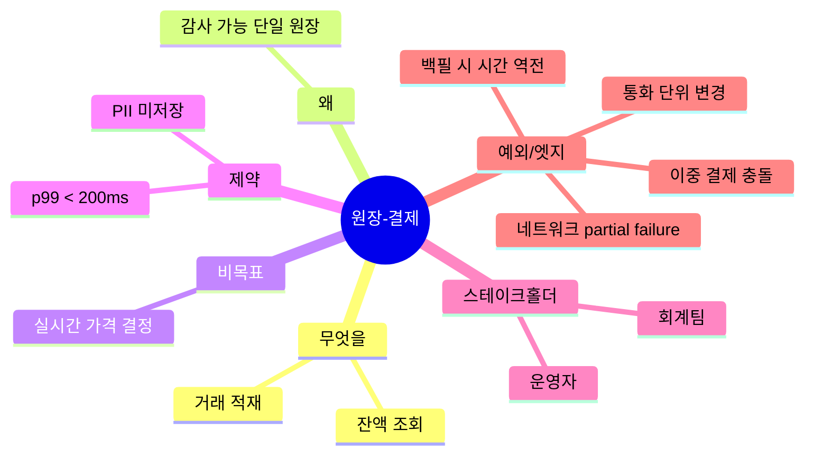
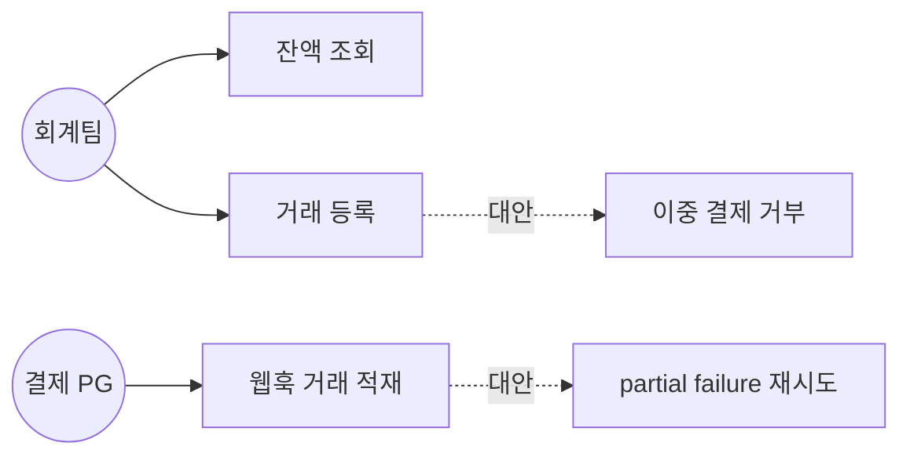
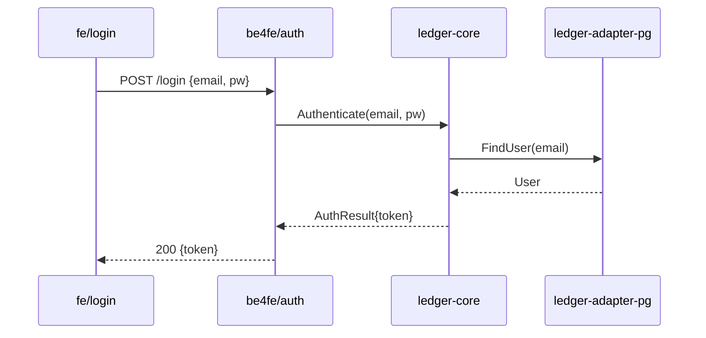

# 다이어그램 컨벤션

## 한 줄 요약
**인터뷰는 마인드맵 → 유즈케이스 다이어그램 → 시퀀스 다이어그램 순으로 진화한다.** 의도가 두꺼워질수록 더 형식 있는 그림으로 옮겨, 사용자가 같은 그림을 보며 누락·엣지·오해를 잡아낸다. 모든 다이어그램은 마크다운 안의 코드 펜스(Mermaid 또는 PlantUML 텍스트) 로 산출물에 박힌다 — 외부 이미지 의존 금지.

## 진화 단계

| 단계 | 페이즈 | 다이어그램 | 목적 |
| --- | ----- | --------- | ---- |
| 1- 발산 | 01 의도 인터뷰 | **마인드맵** | 도메인 명사·동사·예외를 폭넓게 펼침 |
| 2- 수렴 | 04 사용자 질의 | **유즈케이스** | 액터·시스템·시나리오 경계 합의 |
| 3- 구체화 | 06 계획 | **시퀀스** | 모듈 간 호출, 페이즈/스프린트 흐름 |

## 1- 마인드맵 (페이즈 01)

a- Mermaid `mindmap` 블록.
b- 루트 = 프로젝트 의도 핵심 명사 한 단어.
c- 1차 가지 = "무엇을", "왜", "비목표", "제약", "스테이크홀더", "엣지/예외".
d- 2차 가지 = 1차 가지 아래의 구체 항목.
e- 미인지 예외 후보를 별도 가지(`예외/엣지`) 로 의도적으로 부풀려 사용자에게 "이것도 고려해야 하나?" 질문 트리거.

예시:

````markdown

````

## 2- 유즈케이스 다이어그램 (페이즈 04)

a- Mermaid `graph` 또는 PlantUML `@startuml ... @enduml` 둘 중 하나로 통일 (프로젝트 시작 시 한 형식 고정).
b- 액터(사람·외부 시스템) 와 시스템 경계(박스), 유즈케이스(타원/노드).
c- 마인드맵의 "엣지/예외" 가지가 유즈케이스의 *대안 흐름* 으로 매핑되는지 사용자와 확인.

예시 (Mermaid):

````markdown

````

## 3- 시퀀스 다이어그램 (페이즈 06)

a- Mermaid `sequenceDiagram` 블록.
b- 모듈 단위로 그리되 *내부* (서비스 ↔ 도메인 ↔ 어댑터) 와 *외부* (FE ↔ BE ↔ DB ↔ 외부 API) 를 분리해 두 그림으로.
c- 페이즈별 시퀀스도 가능 — 하네스 자체의 페이즈 흐름을 시각화.
d- 각 화살표에 호출 함수명·요청/응답 페이로드 키를 표기.

예시 (모듈 내부):

````markdown

````

## 산출물 규칙

a- `intent/01-intent.md` 에 마인드맵 코드 블록 포함.
b- `intent/04-questions.md` (또는 별도 `intent/04-usecase.md`) 에 유즈케이스 다이어그램.
c- `plan/06-plan.md` 에 **시퀀스 + 유즈케이스 + 모듈 의존도** 셋 다 의무 (sprint-17, OR 우회 폐기) — 모듈 내부/외부 시퀀스 ≥ 1, 유즈케이스 ≥ 1, 모듈 의존 flowchart ≥ 1.
d- 모든 다이어그램은 마크다운 코드 펜스에 텍스트로 — PNG/JPG 첨부 금지 (가독성·diff 가능성·웹뷰 렌더 호환 위해).

## 웹뷰 렌더

페이즈 12 의 웹뷰가 마크다운을 렌더할 때 Mermaid 코드 펜스를 자동 감지해 SVG 로 그린다. 클라이언트는 `mermaid` npm 패키지 사용 (스캐폴드 README 의 확장 항목 참조).

## 사용자 검증 의례

각 다이어그램 산출 직후, 사용자에게 같은 그림을 보여주고 두괄식 한 줄 + 객관식 5개 이하로 묻는다 ([`interview.md`](interview.md) 컨벤션 준수):

```
질의: 마인드맵에 누락된 가지가 있습니까?

엣지/예외 가지에 다음 후보를 추가했습니다. 각 항목이 실제로 다뤄야 할 케이스인지 확인 부탁드립니다.

선택지:
1. 모두 다뤄야 함 — 그대로 진행
2. 일부 제거 — 어느 항목인지 알려주시면 갱신
3. 추가 필요 — 어떤 시나리오인지 자유 응답
4. 잘 모르겠음 — 비평가 페이즈로 이월
```

## 안티 패턴

a- 다이어그램 없이 텍스트만으로 의도/계획을 사용자에게 확인 — 누락이 보이지 않는다.
b- 외부 이미지 링크 의존 — diff/오프라인/웹뷰 호환 모두 깨짐.
c- 여러 모듈을 한 시퀀스에 욱여넣음 — 가독성 0. 분리.
d- **(v0.9.19 sprint-13)** 모듈 ≥ 4 인데 *단일 통합 시퀀스만* 출력 — 가독성 0 + cold review 분할 불가능. [`per-module-diagram-fan-out.md`](per-module-diagram-fan-out.md) (bb) 의 trigger 조건 (모듈 ≥ 4 OR consumer-producer 페어 ≥ 6) 시 per-module 다이어그램 ≥ 모듈 수 의무. self_lint C-PMDF 가 검증.
e- **(v0.9.19 sprint-13)** 모듈 ≤ 3 인데 over-fragmentation (per-module 강제 분할) — 의도 없이 비용 증가. trigger 조건 미달 시 단일 통합 OK.

## sprint-17 — HARD-RULE 9.a OR → AND (sequence + usecase + interface 셋 다 의무)

이전 룰: `Mermaid 시퀀스 ≥ 1 OR 인터페이스 정의 ≥ 3` — interface 만 채우고 sequence 우회 가능.

cold session `2026-05-05__001_mine_g4_theseus/plan/06-plan.md` 가 그 우회 직접 시연:
- `mermaid_diagrams: 1` (모듈 의존 flowchart 만)
- sequenceDiagram 0, usecase 0
- interface 7 (data_io, graph, registry, truck, simulation, outputs, invariants) → OR 우측만으로 9.a 통과

문제: interface 시그니처는 *결과*, sequence + usecase 는 *상호작용 흐름 + 액터 경계*. 후자가 빠지면 모듈화 설계 + universe 비교 모두 빈약. **AIDE 멀티버스 universe candidate 는 sequenceDiagram 의 differ 가 핵심 axis** — sequence 부재 → universe 의미 분기 0.

sprint-17 변경 (HARD-RULE 9.a):
- ~~"Mermaid 시퀀스 ≥ 1 *OR* 인터페이스 ≥ 3"~~ →
- **"Mermaid sequenceDiagram ≥ 1 AND Mermaid usecase/graph ≥ 1 AND 인터페이스 정의 ≥ 3"** (셋 다 AND).
- universe candidate (G3+) 도 동일 — [`aide-tree-symmetry.md`](aide-tree-symmetry.md) (ab) 정합.
- self_lint **C-DIAG-AND-COVERAGE** : `plan/06-plan.md` + 각 `plan/candidates/universe-N/06-plan.md` 본문에 sequenceDiagram code fence + usecase code fence (`graph` 또는 `useCase` 또는 `actor` keyword) + interface 정의 ≥ 3 셋 다 검출.

## v0.9.19 sprint-13 — per-module fan-out (bb 정합)

페이즈 06 plan / 페이즈 08 impl 의 use-case / sequence 다이어그램은 *단일 통합* 외에 *per-module 분할* 도 default 권장:
- 모듈 ≥ 4 OR consumer-producer 페어 ≥ 6 → per-module 다이어그램 ≥ 모듈 수
- 모듈 ≤ 3 → 단일 통합 OK
- 페이즈 시퀀스 (전체 흐름) 는 단일 보존
- 마인드맵 (단일 root) 분할 무의미

자세히: [`per-module-diagram-fan-out.md`](per-module-diagram-fan-out.md).
