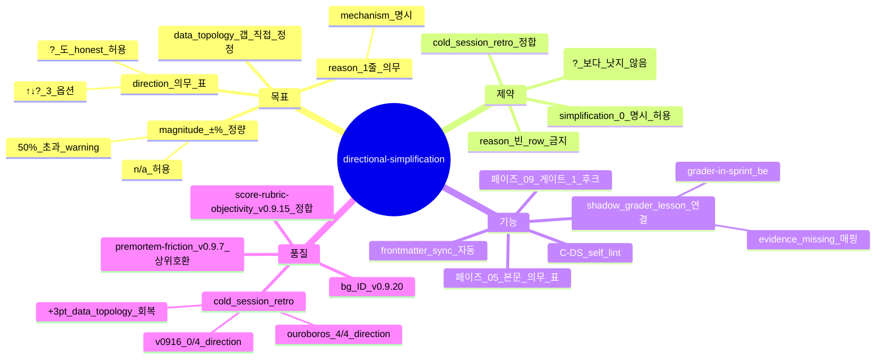

# Directional Simplification — simplification 의 방향성·정량 bias 진술 (sprint-14 / v0.9.20)

## 한 줄 요약

**페이즈 05 critique 산출물의 의무 표 = 각 introduced simplification 에 대해 (a) direction (↑/↓/?) (b) magnitude (±%) (c) reason 1 줄.** v0.9.13 [`05-critique.md`](../phases/05-critique.md) 의 critique 가 "이 simplification 이 *어떤 방향으로* 결과를 bias 하는지" 를 강제 안 함 → cold session 의 limitations 섹션이 *방향성/정량 0* 의 정성 서술만 (data_topology −3 의 직접 원인).

## 1. 결손 진단

cold session synthetic_mine_throughput_004 의 limitations 섹션 :

> "Capacity-1 lane is per direction, not per shared physical road. In reality the narrow ramp would lock both directions together — the data abstraction made here matches the CSV."

→ 방향성 (real congestion 이 어느 방향으로 bias) + 정량 (몇 %) 모두 부재. 1 위 ouroboros 의 limitations :

> "A more realistic single-physical-lane model would couple them … real congestion will be worse than predicted."

→ 방향 (worse) 명시. 정량 (몇 %) 까지는 부족하나 ↑ direction 명시만으로 +3 (data_topology 15 → 12 갭).

cold session retro :

| 회차 | simplification 표 | direction 명시 | magnitude 명시 | data_topology 점수 |
|---|:-:|:-:|:-:|:-:|
| v0915_cold01 | 4 정성 서술 | 0/4 | 0/4 | 13/15 |
| v0916_cold | 4 정성 서술 | 0/4 | 0/4 | 12/15 |
| ouroboros (참고) | 4 표 + bias | 4/4 | 0/4 | 15/15 |
| plan-mode (참고) | 4 표 + bias | 4/4 | 1/4 | 15/15 |

→ **direction column 0/4** = 갭의 직접 원인. 본 컨벤션 적용 시 +1~3pt 회복.

## 2. 운영 룰 — Directional Simplification Table

### A. critique 본문 의무 표

페이즈 05 산출물 [`intent/05-critique.md`](../phases/05-critique.md) 에 신규 의무 섹션 :

```markdown
## Simplification 방향성·정량 표 (directional-simplification.md bg 의무)

| ID | simplification | direction (↑/↓/?) | magnitude (±%) | reason | impact_dim |
|---|---|---|---|---|---|
| S-1 | "shared lane → independent directions" | ↑ throughput by 3-8% | +5% | "real congestion ramp couples directions" | data_topology |
| S-2 | "warmup=0 in single 480 min shift" | ? bias unknown | ±2% | "first 30 min initialisation noise dilution by full shift" | conceptual |
| S-3 | "fixed mean service time" | ↓ throughput by 1-4% | -2% | "exp/lognormal service has longer right tail" | sim_correctness |
| S-4 | "loaded-leg = empty-leg route" | ↓ throughput | n/a | "empty leg faster — direction underestimates real" | results |
```

각 row 의무 column :
- **direction** : ↑ / ↓ / ? (해당 simplification 이 *없을 때* 결과가 어느 방향으로 움직이는지). ? 허용 — *방향 미상* 도 명시가 본 컨벤션의 핵심 (정성 prose 보다 honest).
- **magnitude** : ±% 정량 추정 또는 `n/a` (정량 추정 불가 시). `n/a` row 가 표 의 50% 초과 시 self_lint warning.
- **reason** : 1 줄 — *왜* 그 방향/정량인지의 mechanism 한 마디.

### B. limitations 섹션 frontmatter contract

산출물 frontmatter 에 자동 sync :

```yaml
---
simplifications:
  - id: S-1
    direction: '↑'
    magnitude_pct: 5
    impact_dim: data_topology
  - id: S-2
    direction: '?'
    magnitude_pct: null
    impact_dim: conceptual
  - id: S-3
    direction: '↓'
    magnitude_pct: -2
    impact_dim: sim_correctness
  - id: S-4
    direction: '↓'
    magnitude_pct: null
    impact_dim: results
simplification_count: 4
direction_known_ratio: 0.75   # 4 중 3 row direction 명시
magnitude_known_ratio: 0.50    # 4 중 2 row 정량
---
```

[`grader-in-sprint.md`](grader-in-sprint.md) (be) 의 shadow grader 가 본 frontmatter 를 *명시적으로 평가* — direction_known_ratio < 1.0 시 lesson_candidate 자동 생성.

### C. self_lint 룰 신규 — C-DS

```
C-DS:
  검증: intent/05-critique.md 의 simplification 표 + frontmatter
  PASS 조건:
    - simplification_count >= 1 (작업이 simplification 0 면 명시 빈 표 + reason)
    - direction_known_ratio >= 0.50 (절반 이상 ↑/↓)
    - 각 row 의 reason 본문 ≥ 1 줄
  fail 조건:
    - 표 누락 또는 0 row
    - direction 모두 '?' (절반 이상이 미상)
    - reason 칸 빈 row 존재
  bench scope: 페이즈 05 산출물 + frontmatter sync
```

### D. 페이즈 09 게이트 후크

[`09-quality-gates.md`](../phases/09-quality-gates.md) 게이트 1 (의도 일치) 의 *증거* 차원에 본 표 활용 :

> 게이트 1 PASS 조건 강화 (sprint-14) :
> - simplification 표 ≥ 1 row 존재
> - direction 명시 row 가 표의 50% 이상
> - 각 simplification 이 페이즈 06 plan/06-plan.md 의 *해당 모듈 limitations* 본문에 매핑

게이트 1 fail 시 페이즈 05 재진입 → 표 보강.

## 3. 자기 검증 (메타)



## 4. 호환성

- v0.9.7 [`premortem-friction.md`](premortem-friction.md) — 콜드리뷰의 *forward simulation + derived_improvements* 와 본 컨벤션 simplification direction 분석 = 직교 (premortem 은 *결정 전* simulation, simplification 은 *결정 후* bias)
- v0.9.13 [`05-critique.md`](../phases/05-critique.md) — critique 산출물 본문 의무 표 추가 + frontmatter sync
- v0.9.16 [`score-rubric-objectivity.md`](score-rubric-objectivity.md) — strict checklist self-rating 의 *evidence* 차원으로 direction 명시 카운트
- v0.9.20 [`grader-in-sprint.md`](grader-in-sprint.md) (be) — shadow grader 의 lesson_candidate source

## 5. 본 컨벤션이 *케이스 종속이 아닌* 이유

a- direction (↑/↓/?) = 모든 modelling/engineering simplification 에 보편 적용 (mine simulation 외 ML eval / API design / refactor 까지)
b- magnitude ±% = generic 정량
c- reason = 1 줄 mechanism = 도메인 무관

## 6. 안티 패턴

a- simplification 표가 *prose paragraph* — column 강제 우회. C-DS fail.
b- direction column 모두 '?' — *방향 미상* 핑계로 검증 회피. 절반 이상 명시 강제.
c- magnitude n/a 100% — 정량 회피. 절반 이상 명시 권장 (warning).
d- reason 한 줄에 simplification *재기술* — *왜 그 방향* 명시 안 함. mechanism 1 마디 의무.
e- frontmatter sync 누락 — 본문 표만 있고 frontmatter 없음 → shadow grader 의 lesson 자동 매핑 불가.

## 7. 적용 페이즈

- 페이즈 05 (critique) — *home*
- 페이즈 06 (plan) — 우승 universe 의 limitations 섹션에 본 표 매핑 (decision_coverage 채점 입력)
- 페이즈 09 (게이트) — C-DS + 게이트 1 강화
- 페이즈 14 (handoff) — simplifications frontmatter 종합

## 8. 도입 배경 (sprint-14 / v0.9.20)

본 사용자 진단 (2026-05-05) — synthetic_mine_throughput_004 의 data_topology −3 분석 :

> ouroboros conceptual_model.md L275, L303-304:
>   "A more realistic single-physical-lane model would couple them … real congestion will be worse than predicted"
> 내 conceptual_model.md "Limitations" 는 4번째 항목에 "..." 한 줄. 방향이 맞고 방향성도 맞지만 정량화가 없다.
>
> 근본원인: Phase 02 intent-review 와 Phase 05 critique 가 modeller-self-perspective 에서만 작동함. "이 simplification 이 어떤 방향 으로 결과를 bias 하는지" 라는 질문을 강제하는 sub-phase 가 없음.
>
> 레슨: Phase 05 critique 에 강제 sub-question — "각 introduced assumption 에 대해, 그것이 빠질 때 결과가 어느 방향(↑/↓/?) 으로 얼마나(±%) 움직이는지 한 줄로 적어라". 이 방향성 표기가 conceptual_model.md "Limitations" 섹션의 frontmatter contract 가 되어야 함.

사용자 의도 = *direction 표기가 frontmatter contract*. 본 컨벤션이 표 + frontmatter sync 둘 다 의무화.
