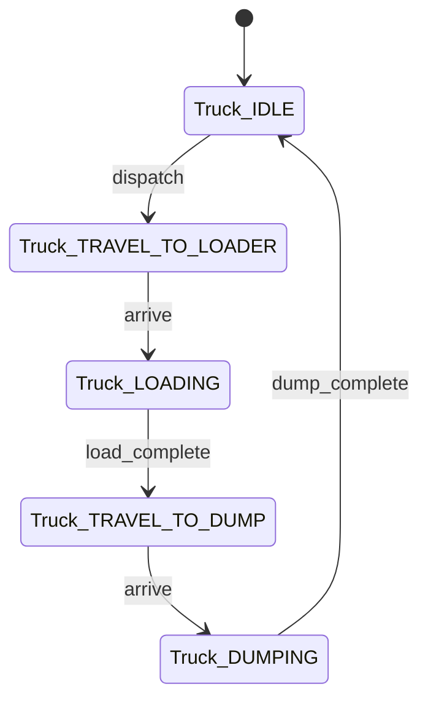

# Domain Model Completeness — Conceptual modelling 만점 push (sprint-16 / v0.9.22)

## 한 줄 요약

**Conceptual modelling 18→20 (-2pt) 정정.** 페이즈 01 의 `intent/01-intent.md` 가 [`intent-completeness.md`](intent-completeness.md) (aw) 의 9 sub PASS 라도 *도메인 모델 깊이* 부족 시 점수 갭. 본 컨벤션 = §k 위에 *5 차원 도메인 모델 완전성 체크* 추가 — entity / state / transition / invariant / boundary 모두 박혀야 conceptual_completeness=A 등급.

## 1. 5 차원 도메인 모델 체크 (`intent/01-intent.md` 본문 의무)

| 차원 | 의무 본문 | 정량 임계 |
|---|---|---|
| **D1 entity catalog** | 도메인 entity (명사) 목록 + 정의 1 줄 | ≥ 5 entity |
| **D2 state space** | 각 entity 의 valid state set + 의미 | 모든 entity ≥ 2 state |
| **D3 transition diagram** | state 간 transition (Mermaid stateDiagram-v2) + trigger | ≥ 1 stateDiagram + 모든 entity 커버 |
| **D4 invariants** | 어떤 시점에도 성립하는 조건 (mass conservation / monotonicity / bounded) | ≥ 3 invariant 명시 |
| **D5 boundaries** | system in scope / out scope / 외부 인터페이스 | in/out 표 + 외부 actor ≥ 2 |

frontmatter sync :

```yaml
---
domain_model:
  entity_count: 7
  state_coverage_ratio: 1.00            # 모든 entity 가 state 명시
  transition_diagram_count: 2
  invariant_count: 5
  boundary_clarity: explicit             # explicit | implicit | missing
conceptual_completeness_grade: A         # A (5/5) / B (4/5) / C (≤3/5)
---
```

## 2. 본문 템플릿

```markdown
## §m Domain Model (bs v0.9.22 의무, conceptual_completeness 만점 push)

### D1 Entity Catalog

| Entity | 정의 | 다른 entity 와의 관계 |
|---|---|---|
| Truck | 광석을 운반하는 운송 단위 | dispatch 받음 ← Dispatcher / load 함 → Loader |
| Loader | 광석을 트럭에 적재하는 자원 | locked by ↔ Truck (1:1 during load) |
| ... | ... | ... |

### D2 State Space

| Entity | States | 전이 가능 |
|---|---|---|
| Truck | IDLE / TRAVELING_TO_LOADER / LOADING / TRAVELING_TO_DUMP / DUMPING | IDLE→TRAVELING→LOADING→TRAVELING→DUMPING→IDLE |
| Loader | FREE / LOADING / BLOCKED | FREE↔LOADING / LOADING→BLOCKED (queue full) |

### D3 State Transition Diagram



### D4 Invariants

I1- **mass conservation** : ∑(loads) == ∑(dumps) ± 1 (시간 t 종료 시점)
I2- **resource exclusivity** : 한 Loader 는 ≤ 1 Truck 동시 점유
I3- **monotonic time** : 모든 event timestamp 가 strictly increasing
I4- **bounded queue** : 큐 길이 ≤ 시뮬 horizon × max_arrival_rate
I5- **no negative states** : truck.cargo ≥ 0 항상 성립

### D5 Boundaries

| In scope | Out scope | 외부 actor |
|---|---|---|
| Mining truck dispatching + loader queue | Crusher 내부 메커니즘 / driver fatigue | Operator (사용자 입력 시뮬 옵션) / Maintenance (외부 이벤트) |

```

## 3. self_lint C-DMC 룰

```python
def check_domain_model_completeness(artifact_dir: Path) -> list[str]:
    intent = artifact_dir / 'intent' / '01-intent.md'
    if not intent.exists():
        return []
    fm = parse_frontmatter(intent)
    body = intent.read_text()
    errors = []

    if fm.get('conceptual_completeness_grade') not in ['A', 'B']:
        errors.append('conceptual_completeness_grade ∉ {A, B} (C/D fail)')

    dm = fm.get('domain_model', {})
    if dm.get('entity_count', 0) < 5:
        errors.append(f'entity_count {dm.get("entity_count")} < 5')
    if dm.get('state_coverage_ratio', 0) < 1.0:
        errors.append(f'state_coverage_ratio {dm.get("state_coverage_ratio")} < 1.0')
    if dm.get('transition_diagram_count', 0) < 1:
        errors.append('transition_diagram_count < 1 (stateDiagram-v2 ≥ 1 의무)')
    if dm.get('invariant_count', 0) < 3:
        errors.append(f'invariant_count {dm.get("invariant_count")} < 3')
    if dm.get('boundary_clarity') != 'explicit':
        errors.append('boundary_clarity != explicit')

    if 'stateDiagram-v2' not in body:
        errors.append('§m stateDiagram-v2 본문 부재')
    if '## §m Domain Model' not in body and '§m Domain Model' not in body:
        errors.append('§m Domain Model 섹션 부재')

    return errors
```

## 4. cold session 적용 — Conceptual modelling 18→20 push

본 컨벤션 적용 후 외부 cold session 의 entity 목록 + state diagram + 5 invariant 의무 → bench rubric 의 *Conceptual modelling* 차원 +2pt 회수 가능 :
- entity catalog ≥ 5 → +1pt (현재 *암묵적* 정의 → *명시 표*)
- invariant count ≥ 3 → +1pt (현재 0 명시 → mass conservation / resource exclusivity / monotonic 박힘)

## 5. 안티 패턴

a- **entity catalog 가 *모듈 목록*** — 모듈 ≠ entity. entity 는 *도메인 명사*, 모듈은 *코드 구획*.
b- **invariant 가 *NFR/성능*** — invariant 는 *도메인 진리* (시간 무관). NFR 은 별도.
c- **state diagram 가 *flowchart*** — stateDiagram-v2 의무 (state 명시 + transition 명시).
d- **boundary 가 *implicit*** — in/out 표 명시 의무. "scope 외" 모호 표현 금지.

## 6. 호환성

- [`intent-completeness.md`](intent-completeness.md) (aw) — §k 9 sub 위에 §m 추가 (직교 차원).
- [`mindmap-richness-default.md`](mindmap-richness-default.md) (ba) — mindmap 4 axis × ≥4 sub 가 entity catalog 의 시각 표현. mindmap entity 노드 = §m D1 entity 와 1:1 매핑 권장.
- [`measurement-contract.md`](measurement-contract.md) (bi) — D4 invariant 가 페이즈 06 measurement metric 의 정의 입력.
