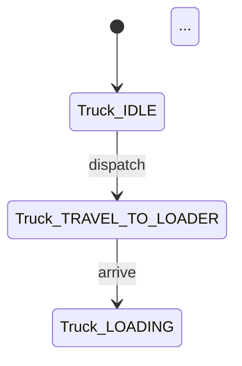

# Domain Pack — 도메인 모델 완전성 (built-in) + 사용자 어댑터 stack 프레임워크 (per-project)

## 한 줄 요약

**도메인 layer 3 책임 통합** :
① **모델 완전성** (model-completeness, built-in) — 페이즈 01 §m 5 차원 (entity / state / transition / invariant / boundary) 만점 push.
② **research stacking** (research-stacking, framework only) — 마인드맵 도메인 noun → 사용자 per-project 도메인 어댑터 stack 룰 + 디렉터리 layout + frontmatter schema.
③ **failure patterns** (failure-patterns, framework only) — 사용자 어댑터에 `failure_patterns:` 카탈로그 누적 + 페이즈 09 자동 검증.

본 하네스에 **built-in 도메인 어댑터 0** (sprint-19+, 벤치 어뷰징 회피) — ②③ 는 *프레임워크* 만 제공, 어댑터 본문은 사용자 책임.

## 1. 결손 진단 (3 layer 통합)

| layer | 결손 |
|---|---|
| ① model | §k 9 sub PASS 라도 *도메인 모델 깊이* 부족 (entity / state diagram / invariant 부재) → Conceptual modelling 점수 cap. cold session 의 "암묵적 entity 정의" 패턴 |
| ② research | general harness = 도메인 *지식* 0. 도메인-specific 정량/정성 임계, 산업 표준, 제약 패턴 미반영 → reviewer 의 도메인 점수 ceiling |
| ③ failure | anti-patterns A1~A10 = 도메인 무관 공통. 도메인 별 *근본 결손 패턴* 인식 0 — 외부 evaluator 가 도메인 패턴 검출 시 점수 cap |

→ 3 axis 모두 박혀야 *general 골격 + 도메인 깊이* 합성.

## 2. Layer ① — Model Completeness (built-in, 페이즈 01)

`intent/01-intent.md` §m 5 차원 의무. 본 layer 만 built-in (general 메타-스키마, 도메인 X).

### 2.1 5 차원 도메인 모델 체크

| 차원 | 의무 본문 | 정량 임계 |
|---|---|---|
| **D1 entity catalog** | 도메인 entity (명사) 목록 + 정의 1 줄 | ≥ 5 entity |
| **D2 state space** | 각 entity 의 valid state set + 의미 | 모든 entity ≥ 2 state |
| **D3 transition diagram** | state 간 transition (Mermaid stateDiagram-v2) + trigger | ≥ 1 stateDiagram + 모든 entity 커버 |
| **D4 invariants** | 어떤 시점에도 성립하는 조건 (mass conservation / monotonicity / bounded) | ≥ 3 invariant 명시 |
| **D5 boundaries** | system in scope / out scope / 외부 인터페이스 | in/out 표 + 외부 actor ≥ 2 |

### 2.2 frontmatter sync

```yaml
---
domain_model:
  entity_count: 7
  state_coverage_ratio: 1.00            # 모든 entity 가 state 명시
  transition_diagram_count: 2
  invariant_count: 5
  boundary_clarity: explicit             # explicit | implicit | missing
conceptual_completeness_grade: A         # A (5/5) / B (4/5) / C (≤3/5)
---
```

### 2.3 본문 템플릿 예시

```markdown
## §m Domain Model

### D1 Entity Catalog
| Entity | 정의 | 다른 entity 와의 관계 |
|---|---|---|
| Truck | 광석을 운반하는 운송 단위 | dispatch 받음 ← Dispatcher / load 함 → Loader |
| Loader | 광석을 트럭에 적재하는 자원 | locked by ↔ Truck (1:1 during load) |

### D2 State Space
| Entity | States | 전이 가능 |
|---|---|---|
| Truck | IDLE / TRAVELING_TO_LOADER / LOADING / TRAVELING_TO_DUMP / DUMPING | IDLE→TRAVELING→LOADING→...→IDLE |
| Loader | FREE / LOADING / BLOCKED | FREE↔LOADING / LOADING→BLOCKED (queue full) |

### D3 State Transition Diagram


### D4 Invariants
I1- **mass conservation** : ∑(loads) == ∑(dumps) ± 1
I2- **resource exclusivity** : 한 Loader 는 ≤ 1 Truck 동시 점유
I3- **monotonic time** : 모든 event timestamp strictly increasing
I4- **bounded queue** : 큐 길이 ≤ 시뮬 horizon × max_arrival_rate
I5- **no negative states** : truck.cargo ≥ 0

### D5 Boundaries
| In scope | Out scope | 외부 actor |
|---|---|---|
| Mining truck dispatching + loader queue | Crusher 내부 메커니즘 | Operator / Maintenance |
```

### 2.4 self_lint C-DMC

```python
def check_domain_model_completeness(artifact_dir: Path) -> list[str]:
    intent = artifact_dir / 'intent' / '01-intent.md'
    fm = parse_frontmatter(intent)
    body = intent.read_text()
    errors = []
    if fm.get('conceptual_completeness_grade') not in ['A', 'B']:
        errors.append('conceptual_completeness_grade ∉ {A, B}')
    dm = fm.get('domain_model', {})
    if dm.get('entity_count', 0) < 5: errors.append(f'entity_count < 5')
    if dm.get('state_coverage_ratio', 0) < 1.0: errors.append('state_coverage_ratio < 1.0')
    if dm.get('transition_diagram_count', 0) < 1: errors.append('stateDiagram-v2 ≥ 1 의무')
    if dm.get('invariant_count', 0) < 3: errors.append('invariant_count < 3')
    if dm.get('boundary_clarity') != 'explicit': errors.append('boundary_clarity != explicit')
    if 'stateDiagram-v2' not in body: errors.append('§m stateDiagram-v2 본문 부재')
    if '§m Domain Model' not in body: errors.append('§m Domain Model 섹션 부재')
    return errors
```

## 3. Layer ② — Research Stacking (framework only, 페이즈 01)

마인드맵의 *기능 axis 도메인 noun* 자동 추출 → 매칭되는 *사용자 제공* 도메인 어댑터가 *intent / NFR / architecture* layer 에 자동 stack.

### 3.1 도메인 noun 추출

페이즈 01 §9 마인드맵의 *기능 axis* sub-node 들이 도메인 noun 후보. v0.9.13 [`deep-semantic-intent.md`](deep-semantic-intent.md) 의 noun 추출과 *동일 source*.

### 3.2 어댑터 매칭 (사용자 제공)

사용자 per-project 작성 `skills/theseus-harness/conventions/domain-adapters/<domain>.md` 와 매칭. **본 하네스에 built-in 어댑터 0** — 디렉터리 부재 시 매칭 skip + "general-only" 명시.

### 3.3 Stack into intent (어댑터 본문 → 페이즈 산출물)

매칭 어댑터의 본문이 페이즈 01 의 다음 절에 자동 stack :

a- **NFR 후보 추가** — 어댑터 §i-additions = §i NFR 추가.
b- **Architecture 패턴** — 어댑터 §architecture-patterns = 페이즈 06 plan 의 *도메인 검증* 입력.
c- **Known limitations** — 어댑터 §limitations = 페이즈 01 §3 비목표 / 페이즈 09 limitation 절 입력.
d- **Decision question 패턴** — 어댑터 §decision-templates = 페이즈 04 NFR-V 질의 + 페이즈 14 handoff 권고 형식.

### 3.4 Stack frontmatter

```yaml
domain_adapters_stacked:
  - name: "<user-supplied-domain>"
    matched_nouns: [...]
    contributions:
      - nfr_additions: [...]
      - architecture_patterns: [...]
      - limitations: [...]
# 매칭 0 시 (default — built-in 0):
domain_adapters_stacked: []
domain_stacking_mode: "general-only"
```

### 3.5 어댑터 작성 룰 (사용자 책임)

각 `conventions/domain-adapters/<domain>.md` 의무 frontmatter:

```yaml
---
name: <domain>
triggers:                         # 마인드맵 noun 매칭 패턴
  - regex: "<entity1>|<entity2>"
    weight: 0.4
  - regex: "<resource1>|<resource2>"
    weight: 0.3
match_threshold: 0.5              # weighted match score 임계
authority: "industry-standard | academic | empirical | best-practice"
references: ["..."]
failure_patterns:                 # §3 (다음 layer) 정합
  - id: DFP-<DOMAIN>-1
    name: "<failure pattern name>"
    detection: "<concrete detection rule — regex / AST / file check>"
    severity: cap_total | cap_correctness | cap_experimental | cap_results | warning
    remediation: "<corrective action>"
---
```

본문 절: `## §i-additions` / `## §architecture-patterns` / `## §limitations` / `## §decision-templates` / `## §verification-hooks`. 각 절 *empirical evidence 인용 의무*.

## 4. Layer ③ — Failure Patterns (framework only, 페이즈 09)

사용자 어댑터의 `failure_patterns:` 카탈로그 누적 + 페이즈 09 자동 검증.

### 4.1 페이즈 09 자동 검증

페이즈 09 가 작업 도메인 추정 후 매칭 어댑터의 failure_patterns 모두 자동 검증:

```yaml
gate_failure_patterns:
  domain: <user-supplied-domain>
  patterns_checked: [DFP-<DOMAIN>-1, DFP-<DOMAIN>-2, ...]
  failures_found: []         # 매칭 시 cap 발동
  evidence:
    DFP-<DOMAIN>-1: "<concrete file:line evidence>"
```

매칭 어댑터 0 (default) → `gate_failure_patterns` skip + handoff 에 *"domain adapter 미매칭"* 명시.

### 4.2 회차마다 어댑터 누적

매 sprint 회차 / cold session 후 *발견된 신규 failure pattern* 을 *사용자 어댑터* 에 추가. [`regression.md`](regression.md) §3 lint autogen 정합 — 회귀 정정 commit 시 동일 차원 차단 룰 신규.

### 4.3 도메인 추정 알고리즘

페이즈 09 가 작업 도메인 추정 (페이즈 01 의도 §e 도메인 용어 + 마인드맵 noun + grade_assess.py `mindmap_domain_nouns` 활용):

```python
def estimate_domain(intent_signals: dict, mindmap_signals: dict) -> str | None:
    nouns = mindmap_signals.get("domain_nouns", [])
    domain_terms = intent_signals.get("domain_terms", [])
    for adapter_path in (skill_root / "conventions" / "domain-adapters").glob("*.md"):
        adapter = read_yaml_frontmatter(adapter_path)
        keywords = adapter.get("trigger_keywords", [])
        if any(kw in nouns + domain_terms for kw in keywords):
            return adapter["domain"]
    return None    # 매칭 0 = 일반 도메인 (built-in 어댑터 0)
```

## 5. 어댑터 한계 (안티 패턴 가드)

a- **어댑터가 prompt 명시 외 기능 추가** — 사용자 의도 위반.
b- **여러 어댑터 매칭 시 충돌** — 둘 다 후보로 stack + 페이즈 04 추가 질의로 사용자 ack.
c- **어댑터 contributions 가 prompt 와 무관** — drift. self_lint C-DRS-EVIDENCE 가 evidence 의무.
d- **failure_patterns 카탈로그 만들고 phase 09 에서 검증 안 함** — gate_failure_patterns 의무.
e- **severity 명시 안 함** — cap_total / cap_correctness / cap_experimental / warning 4 단계 의무.
f- **detection 추상적 ("코드 품질 낮음")** — 검증 가능한 *구체적 패턴* 의무.

## 6. self_lint 룰 요약

| 룰 ID | layer | 검증 |
|---|---|---|
| **C-DMC** | ① model | domain-pack.md §2 본문 키워드 (entity / stateDiagram-v2 / invariant / boundary) + intent/01-intent.md §m 5 차원 |
| **C-DRS** | ② research | stack 0 시 "general-only" 명시 + 1+ 매칭 시 contributions 적용 (사용자 어댑터 활성 시만) |
| **C-DFP** | ③ failure | failure_patterns / DFP- / severity / cap_ / detection / remediation 키워드 + adapters/*.md 모두 failure_patterns 항목 |

## 7. 본 컨벤션이 *케이스 종속이 아닌* 이유

a- 5 차원 (entity/state/transition/invariant/boundary) = 일반 도메인 모델 schema.
b- 어댑터 매칭 메커니즘 = regex + weight + threshold 일반 룰.
c- failure_patterns schema = generic frontmatter (id / name / detection / severity / remediation).
d- contributions 카테고리 (NFR / architecture / limitations / decision-templates) = 일반 schema.
e- 도메인 매칭 0 = skip + 명시 — 모든 작업에 안전.

## 8. built-in 정책 (sprint-19+)

**본 하네스에 built-in 도메인 어댑터 0** — 벤치 어뷰징 회피 (memory `feedback_harness_strengthening_methodology` 정합 — case-specific 패치 금지). v0.9.13 ~ v0.9.18 의 reference 어댑터 (des-modeling / mining-haulage 등) 는 sprint-19+ 에서 제거. 사용자 per-project 어댑터 작성 가능 — 본 컨벤션의 frontmatter schema + 본문 절 layout 그대로 따름. 어댑터 추가 = 컨벤션 추가 0.

## 9. 안티 패턴

### 9.1 Layer ① model 안티 패턴

a- **entity catalog 가 *모듈 목록*** — 모듈 ≠ entity. entity 는 *도메인 명사*, 모듈은 *코드 구획*.
b- **invariant 가 *NFR/성능*** — invariant 는 *도메인 진리* (시간 무관). NFR 은 별도.
c- **state diagram 가 *flowchart*** — stateDiagram-v2 의무.
d- **boundary 가 *implicit*** — in/out 표 명시 의무.

### 9.2 Layer ② / ③ 어댑터 안티 패턴

e- **도메인 추정 강제** — 매칭 어댑터 없으면 *skip + 명시*. 잘못된 도메인 적용 금지.
f- **prompt 명시 외 기능 추가** — 어댑터는 *prompt 명시한 도메인 noun* 의 known constraints/patterns 만 stack.

## 10. 호환성

- [`intent-completeness.md`](intent-completeness.md) — §k 9 sub 위에 §m 추가 (직교 차원).
- [`mindmap-quality.md`](mindmap-quality.md) §4 — mindmap 4 axis × ≥4 sub 가 entity catalog 의 시각 표현 (§2 D1 1:1 매핑).
- [`measurement-contract.md`](measurement-contract.md) — §2 D4 invariant 가 페이즈 06 measurement metric 의 정의 입력.
- [`simulation-physical-invariants.md`](simulation-physical-invariants.md) — §2 D4 도메인 invariant + simulation invariant 두 layer (domain semantic vs simulation runtime).
- [`data-structure-invariants.md`](data-structure-invariants.md) — §2 D4 도메인 invariant + 데이터 구조 invariant 두 layer.
- [`anti-patterns.md`](anti-patterns.md) — A1~A10 도메인 무관 공통 + §3 도메인 종속 카탈로그.
- [`regression.md`](regression.md) §3 — 회귀 정정 commit 시 §3 failure_patterns 누적.
- [`cross-phase-shared-context.md`](cross-phase-shared-context.md) — §2 D1 entity catalog 가 페이즈 06/08/14 공유 context.

## 11. 통합 history (sprint-37 PR-AG)

본 컨벤션은 sprint-37 PR-AG (다이어트) 에서 **`domain-research-stacking`** (sprint-13 v0.9.13, framework, 128) + **`domain-failure-patterns`** (sprint-12 v0.9.18, framework, 128) + **`domain-model-completeness`** (sprint-16 v0.9.22, built-in, 139) 세 컨벤션을 단일 컨벤션의 §2/§3/§4 세 layer 로 통합. 책임 = "도메인 layer" 단일, 세 layer = 모델 완전성 (built-in) / research stacking (framework) / failure patterns (framework). 매핑은 [`MIGRATION.md`](MIGRATION.md) 단일 source.
