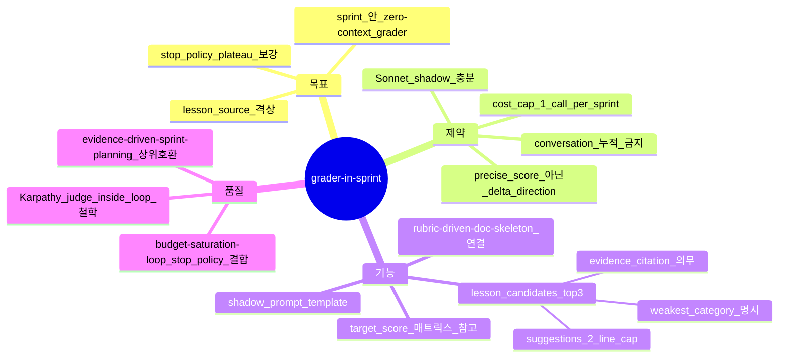

# Grader-in-Sprint — sprint loop 의 dual-objective stop (sprint-14 / v0.9.20)

## 한 줄 요약

**페이즈 10 sprint loop 의 정지 권위는 [`budget-saturation-loop.md`](budget-saturation-loop.md) §2 `stop_policy`(게이트 pass AND 무회귀 AND (plateau OR budget≥95%)) 다 — automated proxy 만으로는 인간/외부 채점이 보는 차원(서술 깊이/한계 정량화/해석 깊이)이 sprint 안에서 측정 안 된다.** 본 컨벤션이 *zero-context shadow grader* 를 sprint 안으로 끌어와 `stop_policy` 의 plateau/신호 판정에 shadow 관측을 보탠다(설계 B2 §2.3 — 절대 점수는 게이트가 아니다).

## 1. 결손 진단

cold session 회차에서 일관된 패턴 :

| 회차 | sprint count | auto_proxy | self_estimate | external_score | gap |
|---|:-:|:-:|:-:|:-:|:-:|
| v091_cold01 (v0.9.12) | 1 | 1.0 | 94 | n/a | n/a |
| v0913_cold01 (v0.9.13) | 3 | 1.0 | 94 | n/a | n/a |
| v0914_cold01 (v0.9.14) | 1-2 | 1.0 | 94 | n/a | n/a |
| v0915_cold01 (v0.9.15) | 3 | 1.0 | 94 | 93 | -1 |
| v0916_cold (synthetic_mine_throughput_004) | 1 | 1.0 | 94 | 90 | -4 |

→ **automated_pass_rate = 1.0 인데 외부 채점 90~93** = sprint 종료 조건이 *잘못된 차원* 위에 박혀 있음 (`sprints/01/report.json` :
```json
"decision": "no-op",
"reasoning": "phase 09 quality gate already at 1.0 / 1.0"
```
).

**카테고리별 손실 (synthetic_mine_throughput_004, 90 vs 97 gap)** :
- conceptual_modelling −1 (warmup section / Decision-Question Linkage 부재)
- data_topology −3 (limitations 정량화 누락)
- simulation_correctness −1 (proxy utilisation reconstruct)
- results_interpretation −1 (interpolation 미흡)
- code_quality −1 (inline comment 0)

7pt 갭 중 0pt 가 *automated check* 로 잡힘. 모든 갭이 *human/external rubric* 차원.

## 2. 운영 룰 — Dual-Objective Stop

### A. Stop 신호 = stop_policy + shadow 관측

정지 판정 자체는 `stop_policy`(gate AND no_regression AND (plateau OR budget≥95%)) 가 유일 권위다. shadow grader 는 그 판정에 쓰이는 *plateau 관측* 을 보강한다 — `shadow_grader_predicted_score` 의 delta 가 plateau_eps 이내로 수렴하면 plateau 신호에 합류(절대 점수 자체는 게이트 아님). axis 분배 상태·budget 비율은 참고 정보로 sprint report 에 기록.

### B. Shadow Grader 호출 — sprint 마다 1 회

```yaml
shadow_grader:
  call_phase: 페이즈 10 sprint NN 종료 직전
  inputs:
    - rubric: scoring/rubric.md OR <bench>/expected/scoring_rules.yaml (rubric-driven-doc-skeleton bj 적용 시)
    - artifacts: 본 sprint 의 변경 산출물 list (plan/06-plan.md / impl/08-impl-log.md / code/ / quality/09-quality-gate.md / handoff 우선)
    - context_mode: zero-context  # 누적 conversation 없이 fresh load
  output:
    - predicted_score: 0~100 OR 0.0~1.0
    - per_category_score: {category_name: score}
    - weakest_category: <name>
    - lesson_candidates: [<top-3 specific suggestions>]
  model: Sonnet (cheap shadow, precise score 가 아니라 *delta direction* 만 필요)
  cost_cap: 1 call per sprint (axis 별 sprint 마다 1, 총 ≥ 6)
```

### C. Lesson Application — shadow grader 출력이 다음 sprint 의 lesson source

```python
def next_sprint_lesson(shadow_output, axis_counts):
  weakest = shadow_output.weakest_category
  lesson_candidates = shadow_output.lesson_candidates
  axis = pick_axis_by_weakest(weakest, axis_counts)  # intent / plan / impl 중 어느 axis 로 진행
  return Lesson(
    type='content_depth',  # v0.9.15 budget-saturation-loop 의 lesson type 4 분류
    target_axis=axis,
    target_category=weakest,
    suggestions=lesson_candidates,
    source='shadow_grader_NN'  # honest 라벨링
  )
```

[`evidence-driven-sprint-planning.md`](evidence-driven-sprint-planning.md) (v0.9.16) 의 `evidence_missing` 자동 매핑 메커니즘 그대로 사용 — 단, source 가 `score-rubric-objectivity` 의 self-rating 이 아니라 *zero-context shadow grader* 로 격상.

### D. target_score 매트릭스 (참고 target — 게이트 아님)

| Grade | shadow target | source |
|---|:-:|---|
| G2 | 80 | scoring/rubric.md weak prior |
| G3 | 90 | scoring/rubric.md prior |
| G4 | **95** (default) | bench rubric OR scoring/rubric.md |
| G5 | 98 | bench rubric (mission-critical) |

[`grades.md`](grades.md) 의 임계 매트릭스에 *human-rubric target* row 신규.

### F. Shadow grader prompt template (zero-context)

```
You are a fresh reviewer. Score the following artifacts against the rubric below.
You have NO prior conversation context — read each artifact cold.

[RUBRIC]
{rubric_yaml or rubric_md}

[ARTIFACTS]
- plan/06-plan.md (full)
- impl/08-impl-log.md (full)
- quality/09-quality-gate.md (full)
- code/ (file list + relevant excerpts)

[OUTPUT FORMAT]
{
  "predicted_score": <0-100>,
  "per_category_score": {<category>: <score>},
  "weakest_category": "<name>",
  "weakest_category_evidence": "<1-2 line citation from artifact>",
  "lesson_candidates": [<top-3 specific suggestions, each ≤ 2 lines>]
}
```

bench rubric 부재 시 [`scoring/rubric.md`](../scoring/rubric.md) fallback. [`rubric-driven-doc-skeleton.md`](rubric-driven-doc-skeleton.md) (bj) 와 결합 시 bench rubric 자동 주입.

## 3. 자기 검증 (메타)



## 4. 호환성

- [`budget-saturation-loop.md`](budget-saturation-loop.md) — `stop_policy` plateau 판정에 shadow 관측 결합
- [`score-rubric-objectivity.md`](score-rubric-objectivity.md) — self-rating 의 noise 정정 + 본 컨벤션의 zero-context grader 가 *external* layer 추가 (self vs external 2 layer)
- [`evidence-driven-sprint-planning.md`](evidence-driven-sprint-planning.md) — `evidence_missing` source 가 self-rating 외에 shadow grader 출력도 합산
- [`intent-plan-impl-sprint-trinity.md`](intent-plan-impl-sprint-trinity.md) — axis 배분 참고에 shadow 관측 결합
- [`rubric-driven-doc-skeleton.md`](rubric-driven-doc-skeleton.md) (bj) — bench rubric 노출 시 본 컨벤션의 grader 입력 자동 갱신

## 5. 본 컨벤션이 *케이스 종속이 아닌* 이유

a- shadow grader 는 generic dual-signal. 어떤 task 든 downstream judge (pytest / eval.py / hidden tests / human reviewer / compile/lint) 존재.
b- shadow grader 의 입력 = rubric + artifacts → 도메인 무관 (rubric 만 갈아 끼움).
c- target_score 매트릭스 = 그레이드별 참고 정량(게이트 아님).

SWE-bench / MLE-bench / synthetic_mine_throughput / refactor task 모두 동일 메커니즘 — *judge 의 cheap shadow* 만 다른 source.

## 6. 안티 패턴

a- shadow grader 호출 0 — plateau 판정이 automated proxy 만으로 이뤄져 사각 발생.
b- shadow grader = self-rating 동일 모델 + 동일 컨텍스트 — *zero-context* 강제 위반. agent re-spawn (Sonnet fresh) 의무.
c- shadow predicted_score 를 이유로 정직한 stop_policy 정지를 막음 — plateau 는 벌이 아니라 정지 신호(설계 B2 §2.2-4).
d- shadow grader 출력의 lesson_candidates 무시 → 다음 sprint lesson 이 stale evidence_missing 만 — `evidence-driven-sprint-planning.md` 자동 매핑 우회.
e- shadow predicted_score 를 자기 self-estimate 로 *덮어쓰기* — honest 라벨링(sprint-narrative.md §2 delta tracking) 위반.

## 7. 적용 페이즈

- 페이즈 10 (sprint loop) — *home* (stop_policy plateau 보강)
- 페이즈 14 (handoff) — `shadow_grader_predicted_score` 종합 frontmatter 의무

## 8. 도입 배경 (sprint-14 / v0.9.20)

본 사용자 진단 (2026-05-05) — synthetic_mine_throughput_004 외부 채점 90 (1 위 ouroboros 97) 7pt 갭 분석 :

> sprints/01/report.json:
>   "decision": "no-op",
>   "reasoning": "phase 09 quality gate already at 1.0 / 1.0"
>
> Sprint 가 1번 돌고 즉시 종료. 자동 체크 57/57 = 100% 인데 human quality 는 천장에서 -7. Sprint 의 stop condition 이 wrong-metric 위에 박혀있음.

사용자 의도 = *sprint 가 더 도는 게 아니라 dimension 이 잘못됨*. Zero-context grader 를 *마지막 한 번* 이 아니라 *매 sprint* 호출. Sprint loop 의 *dual-objective* 가 됨.

본 컨벤션 = 7 패치 중 *가장 강한 generic* + *가장 leverage 높음* — 한 줄짜리 구조 변경 (stop condition AND 추가) 으로 모든 도메인의 sprint loop 에 작동.
