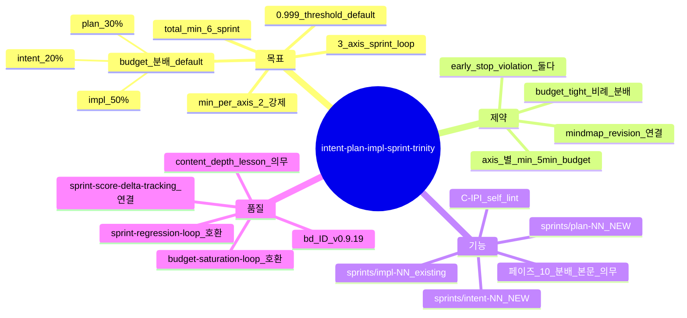

# Intent / Plan / Impl Sprint Trinity — 3 axis sprint loop (sprint-13 / v0.9.19)

## 한 줄 요약

**페이즈 10 sprint loop = 3 axis (intent / plan / impl) 각 ≥ 2 회 + 0.999 지향 + 전체 budget cap 내 분배.** v0.9.8 [`sprint-regression-loop.md`](sprint-regression-loop.md) + v0.9.15 [`budget-saturation-loop.md`](budget-saturation-loop.md) 가 *impl 단위만* 가정 — 의도 / 계획 단위 self-polishing 부재. 본 컨벤션이 trinity 분배 + axis 별 min 2 강제.

## 1. 결손 진단

v0.9.8 / v0.9.15 의 sprint loop :
- *impl 단위* sprint 만 (sprints/01..NN/report.json)
- intent 페이즈 산출물 = sprint 0 (의도 갱신은 페이즈 02 review + mindmap_revision +1 만)
- plan 페이즈 산출물 = sprint 0 (계획 갱신은 페이즈 11 회귀 시 부분 재진입만)

→ *self-polishing axis 단일성*. 의도 / 계획의 weakest dim 보강 0.

cold session 회차 :
- v0915_cold01 sprint count = 3 (모두 impl 단위)
- v0914_cold01 sprint count = 1-2 (모두 impl 단위)

**intent / plan 단위 sprint 발현 0** — *axis 자체 부재*.

## 2. 운영 룰 — Trinity Sprint

### A. 3 axis 정의

| Axis | 내용 | sprint 산출물 |
|---|---|---|
| **intent** | 페이즈 01 mindmap richness 보강 / §k 9 sub depth 보강 / §i derived NFR 추가 | sprints/intent-NN/report.json |
| **plan** | 페이즈 06 plan/06-plan.md 의 인터페이스/모듈 분할 보강 / per-module use-case 추가 / TODO DAG 의존 보강 | sprints/plan-NN/report.json |
| **impl** | 페이즈 08 impl/08-impl-log.md 의 코드 / 테스트 / NFR 충족 보강 (기존 sprint loop) | sprints/impl-NN/report.json (기존) |

### B. min per axis 임계

```yaml
sprint_trinity:
  axes: [intent, plan, impl]
  min_per_axis: 2
  total_min: 6           # 3 axis × 2 = 최소 6 sprint
  threshold_target: 0.999
```

axis 별 ≥ 2 sprint 강제 — 첫 sprint = baseline measure, 두 번째 sprint = lesson 적용 후 재측정.

### C. budget 분배 default

```yaml
budget_default_split:
  intent: 0.20    # 20% (90 min × 0.20 = 18 min)
  plan:   0.30    # 30% (27 min)
  impl:   0.50    # 50% (45 min)
```

총 100% 합. sprint axis 별 budget 가 *최소 sprint 1 회 분량* 이상 (axis 별 ≥ 5 min 보장).

### D. budget tight 시 axis 분배 보존

budget 90 → 60 min 으로 축소 시 :
- 비례 분배 (intent 12 / plan 18 / impl 30)
- axis 별 min 2 sprint 보장 — sprint 1 회 ~ 5 min 임계 보장
- min_per_axis 2 미달 시 self_lint C-IPI fail

### E. early stop violation 강화

```python
def early_stop_violation(state: SprintTrinityState) -> bool:
  axis_violation = any(c < 2 for c in (
    state.intent_sprint_count,
    state.plan_sprint_count,
    state.impl_sprint_count
  ))
  budget_violation = state.budget_used_total < 0.80
  return axis_violation OR budget_violation
```

기존 [`budget-saturation-loop.md`](budget-saturation-loop.md) 의 80% 임계 + axis 별 min 2 sprint *둘 다* 강제.

### F. self_lint 룰 신규 — C-IPI

```
C-IPI:
  검증: sprints/{intent,plan,impl}-NN/ 디렉터리 수
  PASS 조건:
    - intent ≥ 2 (intent-01, intent-02)
    - plan ≥ 2 (plan-01, plan-02)
    - impl ≥ 2 (impl-01, impl-02)
  fail 조건: 어느 axis 라도 < 2
  bench scope: handoff/14-handoff.md 진입 전 검증
```

## 3. 자기 검증 (메타)



## 4. 호환성

- v0.9.8 [`sprint-regression-loop.md`](sprint-regression-loop.md) — *impl 단위만* → 본 컨벤션이 axis 3 으로 확장
- v0.9.15 [`budget-saturation-loop.md`](budget-saturation-loop.md) — early stop violation 임계 강화 (axis 별 min 2 추가)
- v0.9.16 [`sprint-score-delta-tracking.md`](sprint-score-delta-tracking.md) — axis 별 lesson type honest tracking
- v0.9.16 [`evidence-driven-sprint-planning.md`](evidence-driven-sprint-planning.md) — axis 별 evidence_missing 자동 매핑

## 5. axis 별 lesson 매핑

| axis weakest | lesson |
|---|---|
| intent — mindmap richness | mindmap A 등급 도달까지 노드 추가 (mindmap-richness-default 적용) |
| intent — §k 9 sub depth | limitation / data-derived 분리 강화 (intent-completeness 적용) |
| intent — §i NFR | derived NFR 갯수 ↑ + 임계 정량화 (nfr-derivation 적용) |
| plan — 모듈 분할 | per-module use-case 다이어그램 추가 (per-module-diagram-fan-out 적용) |
| plan — 인터페이스 | 인터페이스 정의 ≥ 5 추가 + dataclass / pseudocode / 클래스 시그니처 (plan 의무 본문 강화) |
| plan — TODO DAG | 의존 그래프 verification + leaf TODO 별 테스트 TODO 추가 |
| impl — 기존 sprint-regression-loop §3 표 적용 | (기존 룰) |

## 6. 본 컨벤션이 *케이스 종속이 아닌* 이유

a- 3 axis 정의 = 페이즈 01 / 06 / 08 (도메인 무관)
b- min_per_axis = generic 정량
c- budget 분배 default = generic split

## 7. 안티 패턴

a- intent / plan axis sprint 0, impl 단위만 진행 — *axis 단일성 회귀*, C-IPI fail
b- intent sprint 의 lesson type 이 enforcement (예: §k 9 sub *형식 row 추가* 만, content depth 0pt) — sprint-score-delta-tracking honest 위반
c- budget 분배 무시 — impl 90% 점유 → intent / plan 형식적 1 sprint 만
d- min_per_axis = 1 default 회귀 — *최소 2 회* 가 본 컨벤션 핵심

## 8. 적용 페이즈

- 페이즈 10 (sprint loop) — *home*
- 페이즈 02 / 06 / 08 (intent / plan / impl 페이즈 산출물) — sprint NN 의 baseline + sprint NN+1 의 lesson 적용 위치
- 페이즈 09 (게이트) — C-IPI 검증 위치
- 페이즈 14 (handoff) — sprint trinity report 종합

## 9. 도입 배경 (sprint-13 / v0.9.19)

본 사용자 진단 (2026-05-05) :
- "intent 단위에서의 sprint 기본기능으로 진행 2회이상 무한 스코어링 0.999 를 지향"
- "plan 단위 유니버스 스프린트 기본 기능으로 진행 2회이상 무한 스코어링 0.999 를 지향"
- "impl 문서 작성과실제 구현 유니버스 2회이상 무한 스코어링 0.999 지향"
- "전체 시간 제한이내에서 진행 되도록 스프린트 캡"

사용자 의도 = *3 axis 의 sprint loop 가 base feature*, axis 별 ≥ 2 강제, 0.999 지향, 전체 budget cap 분배.

본 sprint-13 자체가 sprints/{intent,plan,impl}-{01,02}/ 6 디렉터리 출하 = 자기 적용.
