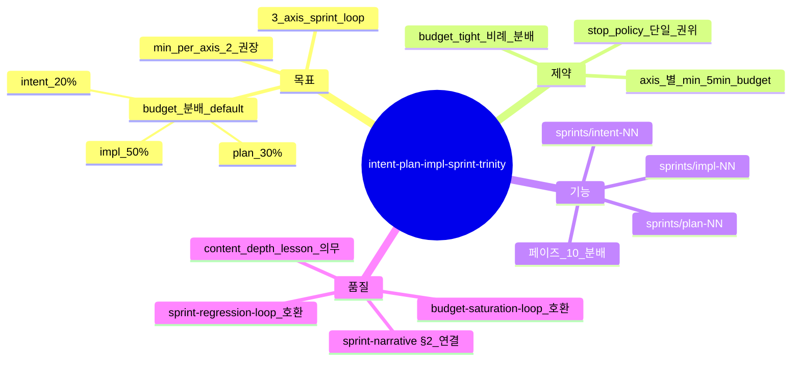

# Intent / Plan / Impl Sprint Trinity — 3 axis sprint loop (sprint-13 / v0.9.19, 설계 B2 §1 F5-3 강등)

## 한 줄 요약

**페이즈 10 sprint loop = 3 axis (intent / plan / impl) 분배 + 각 axis ≥ 2 회 권장 + 전체 budget 분배.** [`regression.md`](regression.md) §2 sprint loop + [`budget-saturation-loop.md`](budget-saturation-loop.md) 가 *impl 단위만* 가정 — 의도 / 계획 단위 self-polishing 부재. 본 컨벤션이 trinity 분배를 제공한다. **axis 별 min 2 강제는 advisory 로 강등**(설계 B2 §1 F5-3 — 신호 없이 sprint 을 강제하는 것은 80% floor 와 동일한 세리머니 계열이라 함께 처리, 판단 책임은 이 문서에 있음): 미달 시 handoff 에 사유 1줄 기록으로 충분.

## 1. 결손 진단

v0.9.8 / v0.9.15 의 sprint loop :
- *impl 단위* sprint 만 (sprints/01..NN/report.json)
- intent 페이즈 산출물 = sprint 0 (의도 갱신은 페이즈 02 review + mindmap_revision +1 만)
- plan 페이즈 산출물 = sprint 0 (계획 갱신은 페이즈 11 회귀 시 부분 재진입만)

→ *self-polishing axis 단일성*. 의도 / 계획의 weakest dim 보강 0.

cold session 회차 :
- v0915_cold01 sprint count = 3 (모두 impl 단위)
- v0914_cold01 sprint count = 1-2 (모두 impl 단위)

**intent / plan 단위 sprint 발현 0** — *axis 자체 부재*.

## 2. 운영 룰 — Trinity Sprint

### A. 3 axis 정의

| Axis | 내용 | sprint 산출물 |
|---|---|---|
| **intent** | 페이즈 01 mindmap richness 보강 / §k 9 sub depth 보강 / §i derived NFR 추가 | sprints/intent-NN/report.json |
| **plan** | 페이즈 06 plan/06-plan.md 의 인터페이스/모듈 분할 보강 / per-module use-case 추가 / TODO DAG 의존 보강 | sprints/plan-NN/report.json |
| **impl** | 페이즈 08 impl/08-impl-log.md 의 코드 / 테스트 / NFR 충족 보강 (기존 sprint loop) | sprints/impl-NN/report.json (기존) |

### B. min per axis 권장

```yaml
sprint_trinity:
  axes: [intent, plan, impl]
  min_per_axis_recommended: 2   # 권장, 강제 아님(설계 B2 §1 F5-3)
  stop_policy_ref: budget-saturation-loop.md  # 정지 권위는 manifest stop_policy 단일
```

axis 별 ≥ 2 sprint 권장 — 첫 sprint = baseline measure, 두 번째 sprint = lesson 적용 후 재측정. 미달인 채 정지(stop_policy 조건 충족)해도 무방 — handoff 사유 1줄 기록.

### C. budget 분배 default

```yaml
budget_default_split:
  intent: 0.20    # 20% (90 min × 0.20 = 18 min)
  plan:   0.30    # 30% (27 min)
  impl:   0.50    # 50% (45 min)
```

총 100% 합. sprint axis 별 budget 가 *최소 sprint 1 회 분량* 이상 (axis 별 ≥ 5 min 보장).

### D. budget tight 시 axis 분배 보존

budget 90 → 60 min 으로 축소 시 : 비례 분배(intent 12 / plan 18 / impl 30). axis 별 min 2 sprint 미달은 fail 이 아니라 handoff 사유 기록 대상(권장 미달).

### E. 정지 판정 = stop_policy 단일 권위

axis 별 sprint count 는 더 이상 별도 게이트가 아니다. 정지는 [`budget-saturation-loop.md`](budget-saturation-loop.md) §2 의 `stop_policy` 3조건(게이트 pass AND 무회귀 AND (plateau OR budget≥95%))이 유일하게 판정한다. axis 분배 미달은 handoff 기록 대상일 뿐 정지를 막지 않는다.

## 3. 자기 검증 (메타)



## 4. 호환성

- [`regression.md`](regression.md) §2 sprint loop (sprint-37 PR-AE 통합) — *impl 단위만* → 본 컨벤션이 axis 3 으로 확장
- [`budget-saturation-loop.md`](budget-saturation-loop.md) — 정지 판정 권위(stop_policy), axis 분배는 handoff 기록만
- v0.9.16 [`sprint-narrative §2.md`](sprint-narrative §2.md) — axis 별 lesson type honest tracking
- v0.9.16 [`evidence-driven-sprint-planning.md`](evidence-driven-sprint-planning.md) — axis 별 evidence_missing 자동 매핑

## 5. axis 별 lesson 매핑

| axis weakest | lesson |
|---|---|
| intent — mindmap richness | mindmap A 등급 도달까지 노드 추가 (mindmap-quality §4 적용) |
| intent — §k 9 sub depth | limitation / data-derived 분리 강화 (intent-completeness 적용) |
| intent — §i NFR | derived NFR 갯수 ↑ + 임계 정량화 (nfr-derivation 적용) |
| plan — 모듈 분할 | per-module use-case 다이어그램 추가 (per-module-diagram-fan-out 적용) |
| plan — 인터페이스 | 인터페이스 정의 ≥ 5 추가 + dataclass / pseudocode / 클래스 시그니처 (plan 의무 본문 강화) |
| plan — TODO DAG | 의존 그래프 verification + leaf TODO 별 테스트 TODO 추가 |
| impl — regression §2 sprint loop §2.5 표 적용 | (기존 룰) |

## 6. 본 컨벤션이 *케이스 종속이 아닌* 이유

a- 3 axis 정의 = 페이즈 01 / 06 / 08 (도메인 무관)
b- min_per_axis = generic 정량
c- budget 분배 default = generic split

## 7. 안티 패턴

a- intent / plan axis sprint 0, impl 단위만 진행 — *axis 단일성 회귀*, handoff 사유 기록 권장(강제 아님)
b- intent sprint 의 lesson type 이 enforcement (예: §k 9 sub *형식 row 추가* 만, content depth 0pt) — sprint-narrative §2 honest 위반
c- budget 분배 무시 — impl 90% 점유 → intent / plan 형식적 1 sprint 만

## 8. 적용 페이즈

- 페이즈 10 (sprint loop) — *home*
- 페이즈 02 / 06 / 08 (intent / plan / impl 페이즈 산출물) — sprint NN 의 baseline + sprint NN+1 의 lesson 적용 위치
- 페이즈 14 (handoff) — sprint trinity report 종합 + axis 미달 사유 기록 위치

## 9. 도입 배경 (sprint-13 / v0.9.19, 각주화)

원 사용자 진단(2026-05-05) 요지 = "intent/plan/impl 각 axis 2회 이상 스코어링 지향 + 전체 시간 제한 내 스프린트 캡". 당시 "0.999 지향"/"강제" 표현은 도달 불가 임계 perverse incentive 로 판명(설계 B2 §2) — stop_policy 로 대체. 3 axis 분배 자체는 base feature 로 유지.

본 sprint-13 자체가 sprints/{intent,plan,impl}-{01,02}/ 6 디렉터리 출하 = 자기 적용.
