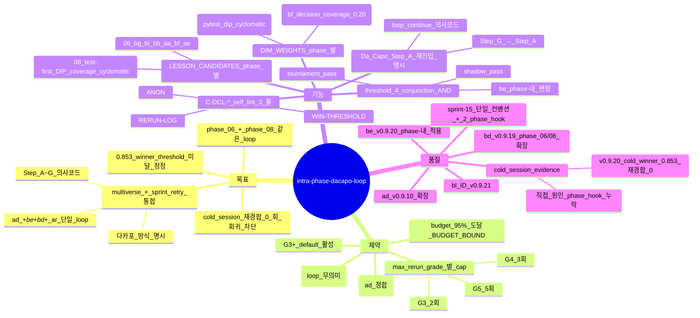

# Intra-Phase Da Capo Loop — multiverse + sprint retry 통합 (sprint-15 / v0.9.21)

## 한 줄 요약

**Tournament 발생 phase (06 plan / 08 impl) 안에서 *multiverse fan-out → tournament → shadow grade → threshold AND 검증 → 미달 시 lesson 적용 + 처음으로 돌아감* 의 루프.** 다카포 (D.C. = *처음으로 돌아가*) 방식. v0.9.10 [`tournament-blind-rerun.md`](tournament-blind-rerun.md) (ad) + v0.9.20 [`grader-in-sprint.md`](grader-in-sprint.md) (be) + v0.9.19 [`intent-plan-impl-sprint-trinity.md`](intent-plan-impl-sprint-trinity.md) (bd) 가 *각각 따로 박혀 있던* 임계 검증 + 재경합 + lesson 흐름을 *phase 06/08 안에서* 단일 의사코드로 통합. `2026-05-05__001_synthetic_mine_throughput__theseus-shipoftheseus__claude-opus-4-7__g4` cold session 의 winner_score=0.853 (G4 임계 0.999 미달) 에서 재경합 0 회 회귀 차단.

## 1. 결손 진단

본 cold session 산출물 (sprint-14 v0.9.20 적용 후) :

```
plan/tournament.md    → winner U1 = 0.853 (G4 threshold 0.999 미달, 0.146 갭)
plan/07-plan-review.md → 즉시 phase 07 진입
plan/candidates/      → universe-1/2/3 만 (재경합 산출물 0)
```

**임계 미달 인데 재경합 / lesson 적용 / Da Capo 0 회**. 룰은 박혀 있음 :

| 룰 | 위치 | trigger |
|---|---|---|
| ad tournament-blind-rerun | conventions/ | "임계 미달 시 anonymize 재경합" |
| be grader-in-sprint | conventions/ | "shadow grader → 4 conjunction AND" |
| bd sprint-trinity | conventions/ | "axis 별 sprint ≥ 2" |
| ar evidence-driven-sprint-planning | conventions/ | "evidence_missing → lesson 자동 매핑" |

→ **컨벤션 본문 따로따로 + phase 06/08 hook 에 *통합 의사코드* 부재** = agent 가 trigger 시점/조건 모호 → 자가 skip → "Winner clear → phase 07" 결론.

본 컨벤션 = 4 룰을 *phase-내 단일 loop* 의사코드로 통합 + phases/06-plan.md / phases/08-implement.md 에 *그대로 박힌 step* 으로 명시.

## 2. Da Capo Loop — 통합 의사코드 (phase-agnostic)

```python
# 다카포 (D.C., Da Capo) = 처음으로 돌아가서 다시.
# Tournament 후 winner 가 임계 미달이면 lesson 적용 후 multiverse fan-out (Step A) 으로 재진입.
#
# 적용 phase: 06 (plan-tree) / 08 (impl multiverse). G3+ default 활성, G2 비활성.

def dacapo_loop(
    phase: int,                  # 06 또는 08
    grade: Grade,                # G3 / G4 / G5
    inputs: PhaseInputs,         # 06: prompt + intent_artifacts / 08: plan_winner + plan_universes
    artifact_dir: Path,          # 06: plan/  /  08: impl/ + code/
):
    # ── 참고 target 매트릭스 (grades.md + be target_score) — 절대 게이트 아님.
    #    정지 판정의 실제 권위는 manifest stop_policy(설계 B2 §2.2) 단일 소스.
    threshold     = {G3: 0.97,  G4: 0.999,    G5: 0.99999}[grade]   # 참고값(레거시 grade 표기)
    shadow_target = {G3: 90,    G4: 95,       G5: 98     }[grade]
    width         = {G3: 3,     G4: 4,        G5: 6      }[grade]   # 활성 폭(manifest multiverse_widths 단일 소스) — multiverse.fan_out_width 게이트(B1)가 plan 초기 fan-out 을 이 바닥으로 강제. 격상 5/7/9(frozen_widths)는 편익 미실증 advisory(§8).
    max_rerun     = {G3: 2,     G4: 3,        G5: 5      }[grade]   # 참고용 가드 — "budget 충분 시 임계 도달까지 무한 회귀" 프레이밍은 폐기(설계 B2 §2.2), 실제 종료는 stop_policy budget_hard_cap
    budget_cap    = 0.95   # budget-saturation-loop stop_policy 정합

    # ── Step A. 초기 multiverse fan-out (Da Capo 의 *처음* 지점) ───────
    universes = initial_fan_out(phase, inputs, width)
    rerun = 0

    # ── Step A~F: 다카포 loop (재진입 entry point = Step A) ──────────
    while True:

        # Step B. Tournament — 6 차원 weighted score
        for u in universes:
            u.tournament_score = tournament_score_6dim(u, weights=DIM_WEIGHTS[phase])
        winner = argmax(universes, key='tournament_score')
        write(artifact_dir / f'tournament-{rerun:02d}.md', universes, winner)

        # Step C. Shadow grader — zero-context fresh load (be)
        shadow = call_shadow_grader(
            rubric        = load_generic_rubric(),    # cold-bench 정합 — bench rubric 차단
            artifacts     = collect_winner_artifacts(winner, phase),
            model         = 'Sonnet',
            context_mode  = 'zero-context',           # 누적 conversation 0
        )
        write(artifact_dir / f'shadow-grade-{rerun:02d}.json', shadow)
        # shadow grader 도 pure-review 디스패치 — state/review_dispatch_log.json 에 append
        # (phase 03 §리뷰 디스패치 로그 emit 스키마: agent_call_id / prior_context_token_count=0
        #  / loaded_artifacts=collect_winner_artifacts). phase 09 게이트의 review.context_minimality
        #  (v0.9.54 P1-A) 가 이 로그를 스캔해 순도/무결성/freshness/최소성을 값으로 판정한다.
        append_review_dispatch_log('state/review_dispatch_log.json', shadow.agent_call_id, 0, collect_winner_artifacts(winner, phase))

        # Step D. 4 conjunction AND threshold check (be — phase-내 변형)
        tournament_pass = (winner.tournament_score >= threshold)
        shadow_pass     = (shadow.predicted_score   >= shadow_target)

        if tournament_pass AND shadow_pass:
            promote_winner_to_phase_artifact(winner, phase)
            #   06: plan/06-plan.md (winner copy)
            #   08: code/ (winner code dir)
            return CONVERGED(winner, rerun_count=rerun)

        # Step E. Cap 체크 (rerun max 또는 budget 95%)
        rerun += 1
        if rerun >= max_rerun OR budget_used_total() >= budget_cap:
            promote_winner_to_phase_artifact(winner, phase)
            write_fallback_reason(
                artifact_dir / 'fallback-reason.md',
                reason = f"rerun={rerun}/{max_rerun}, "
                         f"budget={budget_used_total():.2f}, "
                         f"threshold-bound (winner={winner.tournament_score} "
                         f"< {threshold}, shadow={shadow.predicted_score} "
                         f"< {shadow_target})",
            )   # ah budget-aware-fallback frontmatter 의무
            return BUDGET_BOUND(winner, rerun_count=rerun)

        # Step F. Lesson 도출 + winner 갱신
        weakest = pick_weakest_dim(
            tournament    = winner.sub_scores,                 # 6 dim 중 최저
            shadow        = shadow.weakest_category,            # be
            evidence_gaps = winner.evidence_missing,            # ar v0.9.16
        )
        lesson = build_lesson(phase, weakest, candidates=LESSON_CANDIDATES[phase])
        winner_v2 = apply_lesson(winner, lesson)               # winner artifact 갱신
        write(artifact_dir / f'dacapo-rerun-{rerun:02d}.md', lesson, winner_v2)

        # Step G. Da Capo — 처음 (Step A) 으로 돌아감
        # anonymize 갱신된 winner + width-1 fresh universes 재 fan-out
        anon_prev   = anonymize_winner(winner_v2)              # ad rule
        fresh_seeds = pick_seeds_excluding(prev_seed=winner.seed, count=width - 1)
        fresh       = [spawn_universe(seed, phase) for seed in fresh_seeds]
        universes   = [anon_prev] + fresh                       # blind — agent 모름

        # ↑ Step B 로 자동 재진입 (while loop continue)
        continue
```

## 3. Phase-별 specialization

### Phase 06 (plan) — `LESSON_CANDIDATES[06]` + `DIM_WEIGHTS[06]`

```python
DIM_WEIGHTS[06] = {
    'cold_recall'        : 0.25,   # 의도 일치
    'dip_strictness'     : 0.20,   # DIP cap 0.6
    'simplicity'         : 0.15,   # 모듈 수
    'test_topology'      : 0.10,   # leaf TODO 별 test
    'fe_be_parity'       : 0.10,   # FE/BE 짝맞춤
    'decision_coverage'  : 0.20,   # bf v0.9.20 contested decision spike
}

LESSON_CANDIDATES[06] = [
    'bg directional-simplification 표 row 추가 (limitations 방향성 ↑/↓/?)',
    'bi measurement-contract reconstruct 정당화 추가',
    'bb per-module-diagram 분리 (모듈 ≥ 4 시)',
    'aa mindmap-quality §2 구조 (concept) 보강',
    'bf contested-decision spike 양 가지 코드 추가 (≤50 LOC)',
    'ae interface-first 인터페이스 정의 ≥ 5 추가',
]

def initial_fan_out(06, inputs, width):
    contested = extract_contested_decisions(inputs.prompt, inputs.intent_artifacts)  # bf
    seeds = pick_axis_priority(
        contested,
        priority_order = ['contested_decisions', 'paradigm_5_seeds'],   # bf v0.9.20
        count = width,
    )
    return [spawn_planner_universe(seed=s, universe_id=n) for n, s in enumerate(seeds, 1)]
    # 산출: plan/candidates/universe-N/{meta.md, 06-plan.md, code-spike.py}

def collect_winner_artifacts(winner, 06):
    return [
        winner.candidate_dir / '06-plan.md',
        winner.candidate_dir / 'meta.md',
        winner.candidate_dir / 'code-spike.py',  # bf 50 LOC
    ]
```

### Phase 08 (impl) — `LESSON_CANDIDATES[08]` + `DIM_WEIGHTS[08]`

```python
DIM_WEIGHTS[08] = {
    'pytest_pass_rate'   : 0.30,
    'coverage'           : 0.20,
    'dip_strictness'     : 0.15,   # cap 0.6 정합
    'cyclomatic'         : 0.10,
    'wall_clock'         : 0.10,
    'ruff_violations'    : 0.10,
    'loc_efficiency'     : 0.05,
}

LESSON_CANDIDATES[08] = [
    'test-first RED 보강 → 08-β 재실행 (test-after 패턴 정정, 페이즈 본문 안티 a)',
    'DIP 위반 정정 → 08-γ 재실행 (포트 인터페이스 도입)',
    'coverage 보강 → 08-β scope 확장 + 08-γ 재실행',
    'cyclomatic 분해 → 08-δ refactor 강화',
    'bi measurement-contract method 정정 (reconstruct → accumulate)',
    'bg directional simplification 본문 매핑 (limitations 코드 의무)',
    'bh commentary-policy density 적용 (audience=external-reviewer 시 docstring 의무)',
]

def initial_fan_out(08, inputs, width):
    # 페이즈 06 의 우승 universe + 머지 후보 N 개에 대해 5 sub-phase 독립 사이클
    universes = []
    for n in range(1, width + 1):
        plan_n = inputs.plan_universes[n] if n <= len(inputs.plan_universes) else inputs.plan_winner
        # 5 서브페이즈 (08-α/β/γ/δ/ε) 직렬 — universe 변경 시 08-α 재진입 룰 (기존)
        scope     = subagent_test_architect(plan_n)             # 08-α
        red_tests = subagent_test_writer(scope)                  # 08-β (RED 확인 의무)
        green     = subagent_implementer(red_tests, plan_n)      # 08-γ (GREEN)
        refactored = subagent_refactorer(green)                  # 08-δ
        impl_log  = subagent_implementer.write_log(plan_n, refactored)  # 08-ε
        universes.append(UniverseImpl(
            id        = n,
            code_dir  = f'code/universe-{n}/',
            artifacts = [scope, red_tests, green, refactored, impl_log],
        ))
    return universes
    # 산출: code/universe-N/, impl/08-test-scope.universe-N.md,
    #       impl/08-impl-log.universe-N.md

def collect_winner_artifacts(winner, 08):
    return [
        winner.code_dir,
        f'impl/08-impl-log.universe-{winner.id}.md',
        f'impl/08-test-scope.universe-{winner.id}.md',
    ]

def apply_lesson(winner, lesson, 08):
    # universe 변경 룰 정합 — 08-α 부터 재실행 (sprint-05-a 본문 룰)
    # 부분 재실행 (08-β 만) 금지
    new_winner = winner.copy()
    new_winner.scope = subagent_test_architect(winner.plan, lesson_pack=lesson)
    new_winner.red_tests = subagent_test_writer(new_winner.scope)
    new_winner.green = subagent_implementer(new_winner.red_tests, winner.plan)
    new_winner.refactored = subagent_refactorer(new_winner.green)
    new_winner.impl_log = subagent_implementer.write_log(winner.plan, new_winner.refactored)
    return new_winner
```

## 4. self_lint 룰 신규

```
C-DCL-WIN-THRESHOLD:
  검증: plan/tournament-NN.md / impl/tournament-impl-NN.md 의 winner_score
  PASS 조건:
    - winner.tournament_score >= threshold(grade) AND winner.shadow >= shadow_target(grade)
    - OR rerun_count == max_rerun + fallback_reason 본문 명시 (BUDGET_BOUND 정상 종료)
  fail 조건:
    - winner < threshold 인데 phase N+1 산출물 존재 + rerun_count == 0
    - winner < threshold 인데 fallback_reason 없음
  bench scope: phase 06 / phase 08 종료점

C-DCL-RERUN-LOG:
  검증: dacapo-rerun-NN.md 산출물의 frontmatter
  PASS 조건:
    - rerun_count >= 1 시 dacapo-rerun-NN.md 갯수 == rerun_count
    - 각 dacapo-rerun-NN.md 의 lesson_applied frontmatter 본문 ≥ 1 줄
    - lesson type ∈ LESSON_CANDIDATES[phase]
  fail 조건:
    - rerun trigger 됐는데 dacapo-rerun-NN.md 부재
    - lesson_applied 빈 frontmatter
  bench scope: 재경합 산출물 무결성

C-DCL-ANON:
  검증: rerun NN 의 universes 중 1 universe 가 anonymized previous winner
  PASS 조건:
    - rerun >= 1 시 universe 하나의 frontmatter scrub + universe ID 익명화 (ad C-TBR-ANON 정합)
  fail 조건:
    - rerun >= 1 인데 모두 fresh universes (anonymized prev 없음)
  bench scope: ad 와 cross-validation
```

## 5. 자기 검증 (메타)



## 6. 호환성

- v0.9.10 [`tournament-blind-rerun.md`](tournament-blind-rerun.md) (ad) — Step G 의 anonymize 룰 그대로 재사용
- v0.9.12 [`multiverse-impl-fan-out.md`](multiverse-impl-fan-out.md) (ag) — Step A `initial_fan_out(08)` 의 universe N 모두 실 코드 의무
- v0.9.12 [`budget-aware-fallback.md`](budget-aware-fallback.md) (ah) — Step E 의 BUDGET_BOUND 시 fallback_reason 의무
- v0.9.15 [`budget-saturation-loop.md`](budget-saturation-loop.md) (an) — budget 95% cap 정합
- v0.9.16 [`evidence-driven-sprint-planning.md`](evidence-driven-sprint-planning.md) (ar) — Step F lesson source 의 evidence_gaps 입력
- v0.9.19 [`intent-plan-impl-sprint-trinity.md`](intent-plan-impl-sprint-trinity.md) (bd) — phase 10 axis sprint 와 직교 (본 컨벤션 = phase-내 loop, bd = phase 간 axis sprint)
- v0.9.20 [`grader-in-sprint.md`](grader-in-sprint.md) (be) — Step C/D 의 shadow grader + 4 conjunction AND. 본 컨벤션이 *phase 10 만* 박혀있던 룰을 *phase 06/08 까지* 확장.
- v0.9.20 [`contested-decision-multiverse.md`](contested-decision-multiverse.md) (bf) — Step A `initial_fan_out(06)` 의 axis priority 정합

## 7. 본 컨벤션이 *케이스 종속이 아닌* 이유

a- Da Capo 의사코드 = phase 무관 single function template. 06 / 08 은 LESSON_CANDIDATES + DIM_WEIGHTS + initial_fan_out 만 다름.
b- threshold AND check = grade 매트릭스 정량 (도메인 X)
c- anonymize / fresh seed pick = ad 텍스트 처리 메커니즘 (도메인 X)

## 8. 안티 패턴

a- **Step D 의 AND 를 OR 로** — tournament_pass OR shadow_pass 로 약화하면 본 컨벤션 무력화. 4 conjunction AND 의무.
b- **Step G 의 anonymize 누락** — winner 갱신 후 *바로 fresh universe 만* 재 fan-out → ad C-TBR-ANON 위반 + 학습 전이 손실.
c- **Step F 의 lesson 이 enforcement** — "다음 sprint 에 measurement contract 체크 추가" 같은 *enforcement only* lesson → 점수 +0pt (an v0.9.15 lesson type 룰 위반). content depth lesson 의무.
d- **rerun_count 보고 누락** — phase 06/08 종료 산출물 frontmatter 에 `rerun_count` + `final_score` + `final_shadow` 의무.
e- **phase 06 와 phase 08 의 loop 가 동시 진행** — phase 08 은 phase 06 종료 후 시작 (페이즈 의존성). 본 컨벤션은 *phase 별 독립 loop* 만 가정.
f- **08-α 부분 재진입** — apply_lesson(08) 가 08-β 만 재실행 → universe 변경 룰 위반. 5 서브페이즈 전체 재진입 의무.
g- **survivors rerun (Da Capo 오해 — 가장 빈번한 회귀)** — Round N+1 = Round N 의 *top-K 생존자 head-to-head* 재가중 채점. **차단**.
   - **올바른 의미**: Round N+1 = `[anonymized prev winner] + [width - 1 NEW fresh universes (NEVER seen, lesson_pack pre-loaded)]`. universe IDs ≠ Round N IDs.
   - **자동 reject**: tournament-(NN+1).md universe IDs ⊆ tournament-NN.md universe IDs → fail.
   - C-DCL-FRESH-UNIVERSE 강제.
h- **dacapo-rerun-NN.md 역순 작성** — tournament-(NN+1).md *이후* 작성 → "Round N+1 universe spec" 의 의미 상실. **올바른 순서**: tournament-NN.md → dacapo-rerun-NN.md (NEW universe pool spec) → tournament-(NN+1).md.
i- **fresh universe 가 재라벨링** — 본문이 Round N universe 본문과 semantic diff < 30% → fresh 위반. lesson_pack 적용 + framing 변경 의무.
j- **max_rerun cap 으로 조기 종료 (sprint-28 정정, 설계 B2 §2.2 재정정)** — 실제 종료 권위는 manifest `stop_policy`(gate AND no_regression AND (plateau OR budget≥0.95)) 뿐이다. max_rerun (G3=2/G4=3/G5=5) 는 *조기 종료 가드(참고용)*. 구판의 "임계 도달까지 무한 회귀" 프레이밍은 도달 불가 임계 perverse incentive 라 폐기 — rerun 은 [`dacapo-mandatory-rerun.md`](dacapo-mandatory-rerun.md) 재정정대로 delta 신호가 있을 때 advisory 로 계속한다.
k- **scoring granularity coarse** — `0-3 4 단계 정수` / `0-10 정수` 등 coarse rating 으로 6-dim weighted (cf plan-tournament-scoring-strict) 우회. 0.0-1.0 연속값 의무. `각 criterion 0–3` 패턴 자동 reject (cf 정합).

## 9. 적용 페이즈

- 페이즈 06 (plan-tree) — *home* (initial fan-out + DIM_WEIGHTS + LESSON_CANDIDATES)
- 페이즈 08 (impl multiverse) — *home* (universe 별 5 서브페이즈 + head-to-head + lesson 시 08-α 재진입)
- 페이즈 02 / 05 / 11 / 13 (multi-phase 활성 시) — 본 의사코드 template 적용 가능 (sprint-15 default 06/08 만 의무, 나머지 옵션)

## 10. 도입 배경 (sprint-15 / v0.9.21)

본 cold session (`2026-05-05__001_synthetic_mine_throughput__theseus-shipoftheseus__claude-opus-4-7__g4`) 진단 :

> plan/tournament.md → winner U1 = 0.853 (G4 임계 0.999 미달)
> plan/07-plan-review.md → 즉시 phase 07 진입
> plan/candidates/universe-1/2/3 만 (재경합 산출물 0)

사용자 진단 (2026-05-05) :

> "스프린트 트리거 루프에 대한 진행방식을 정확히 진행할 수 있도록 스킬에 의사코드로 지금처럼 + 혹은 지금 제시한 yaml 스타일보다 더 의사코드에 가깝게 개선해서 0.9.21에 적용. plan 뿐만 아니라 impl 에서도 명확하게 스프린트가 임계값까지 레슨 적용 위너 갱신할 수 있도록 의사코드로 추가. 멀티버스 + 스프린트 재시도 : 다카포 방식이다."

본 컨벤션 의도 = 룰 본문 (ad / be / bd / ar) 따로따로 + phase 06/08 hook 의 *통합 의사코드 부재* → agent trigger 시점/조건 모호 정정. v0.9.20 의 7 패치 모두 *룰 본문* 강화였다면 v0.9.21 = *phase hook 의사코드* 강화. 다카포 (multiverse + retry) 가 본 하네스의 *진짜 차별 동력 (AIDE)* + *self-improving loop (sprint)* 의 통합 메타포.
