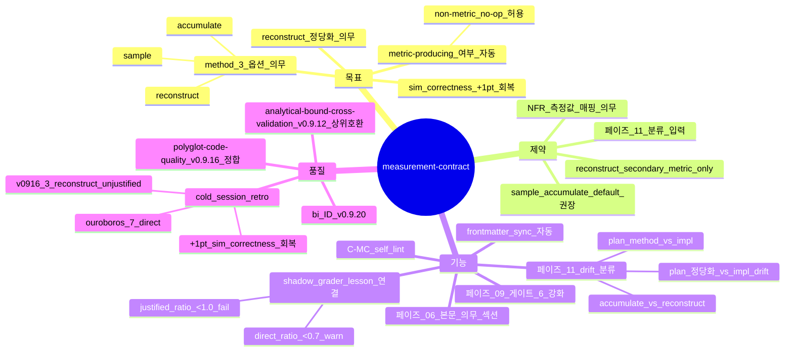

# Measurement Contract — metric 측정 방법 의무 명시 (sprint-14 / v0.9.20)

## 한 줄 요약

**페이즈 06 plan/06-plan.md 본문 의무 = 모든 정량 metric 에 대해 (a) 정의 (b) 측정 방법 (sample / accumulate / reconstruct) (c) reconstruct 시 정당화.** v0.9.13 [`06-plan.md`](../phases/06-plan.md) 의 본문 의무 (모듈 분할 / Mermaid / TODO DAG / 데이터 구조 / 의사코드 / 클래스 시그니처) 가 *measurement contract* 누락 → cold session 에서 *direct 측정 가능한 metric 도 reconstruct* 패턴 회귀 (sim_correctness −1).

## 1. 결손 진단

cold session synthetic_mine_throughput_004 simulation.py:166 :

```python
crusher_busy_proxy_min = sum(ts.cycles_completed for ts in truck_states) * mean_dump_time
```

→ proxy reconstruction. SimPy 에는 `Resource.users` / `Resource.queue` 가 모든 시점에 노출되어 있는데 사용 안 함.

ouroboros / plan-mode :

```python
# _ResourceTracker class — direct accumulation
def acquire(self):
  self.busy_time += (now - self.last_change) * self.in_use / self.capacity
  self.in_use += 1
  self.last_change = now
```

→ direct measurement. 차이 = *측정 방법 contract 부재* — 페이즈 06 plan 에서 "loader_utilisation 을 어떻게 측정할지" 가 *즉흥 결정* 됨 → 페이즈 08 에서 *reconstruction* 으로 fallback.

cold session retro :

| 회차 | metric 갯수 | direct 측정 | reconstruct | 정당화 명시 | sim_correctness 점수 |
|---|:-:|:-:|:-:|:-:|:-:|
| v0915_cold01 | 6 | 4 | 2 | 0/2 | 18/20 |
| v0916_cold | 7 | 4 | 3 | 0/3 | 18/20 |
| ouroboros (참고) | 7 | 7 | 0 | n/a | 19/20 |
| plan-mode (참고) | 7 | 6 | 1 | 1/1 (정당화 PASS) | 19/20 |

→ **reconstruct 정당화 0/3** = 직접 원인. 본 컨벤션 적용 시 +1pt 회복.

## 2. 운영 룰 — Measurement Contract Section

### A. plan/06-plan.md 본문 의무 신규 섹션

```markdown
## Measurement Contract (measurement-contract.md bi 의무)

| metric | 정의 | 측정 방법 | (reconstruct 시) 정당화 |
|---|---|---|---|
| loader_utilisation | D_LOAD busy_time / shift_length | **accumulate** (Resource.users hook on acquire/release) | n/a |
| crusher_utilisation | D_CRUSH busy_time / shift_length | **accumulate** (동일 hook) | n/a |
| ramp_utilisation | ramp Resource.users 적분 | **accumulate** | n/a |
| truck_dump_count | Σ cycles_completed | **sample** (run-end aggregate) | n/a |
| ramp_avg_queue_length | mean(queue length) | **sample** (event-driven snapshot) | n/a |
| total_throughput | Σ delivered tons | **accumulate** (per-cycle add) | n/a |
| (예시) crusher_busy_proxy | cycles × mean_dump_time | **reconstruct** | "direct accumulate 가능한데 의도적 proxy — A/B 비교를 위한 control. 본 metric 은 *secondary*, primary 는 accumulate 측정값." |
```

각 row 의 *측정 방법* 은 3 옵션 :
- **sample** — 특정 시점 / 종료 시점 single value (예: counter 의 final 값, snapshot)
- **accumulate** — 모든 event 시점에 누적 hook (예: Resource hook on acquire/release, integrator)
- **reconstruct** — 다른 metric 으로 *유도* (예: cycles × mean_time)

reconstruct 행은 **정당화 column 의무** — 왜 direct 측정이 불가능한지 / 의도적 proxy 인지 1 줄.

### B. metric-producing 여부 자동 판단

작업이 metric-producing 이 아닌 경우 (예: pure refactor, UI redesign without telemetry) → 표 자동 빈 :

```markdown
## Measurement Contract

(no quantitative metrics produced — pure refactor / UI work / no telemetry)
```

→ 본 컨벤션 비용 0 (no-op). simulation / ML eval / profiling / throughput benchmark / perf regression 등 *정량 evaluation* 작업에서만 의무 발현.

### C. frontmatter sync

```yaml
---
metrics:
  - name: loader_utilisation
    method: accumulate
    justification: null
  - name: crusher_busy_proxy
    method: reconstruct
    justification: "secondary control metric, primary uses accumulate"
metric_count: 7
direct_measurement_ratio: 0.86   # 6/7 accumulate or sample
reconstruct_justified_ratio: 1.00  # 1/1 reconstruct row 정당화
---
```

[`grader-in-sprint.md`](grader-in-sprint.md) (be) 의 shadow grader 가 본 frontmatter 를 *명시적으로 평가* — `direct_measurement_ratio < 0.7` 또는 `reconstruct_justified_ratio < 1.0` 시 lesson_candidate 자동 생성.

### D. 페이즈 09 게이트 6 (NFR 임계 일치) 강화

```
게이트 6 PASS 조건 강화 (sprint-14) :
- NFR 측정값 매핑 + 본 컨벤션의 measurement contract 표 row 1:1 일치
- reconstruct method 인 metric 이 NFR 임계 측정에 사용 시 fail (정당화로 합리화 불가)
- direct_measurement_ratio < 0.7 시 게이트 6 cap 0.85 (정직 bound)
```

페이즈 11 (회귀 바이섹트) 의 *plan defect vs impl defect* 판별에 본 contract 활용 :
- plan 의 method = accumulate 인데 impl 이 reconstruct → impl drift (페이즈 08 재진입)
- plan 의 method = reconstruct 인데 정당화 부족 → plan defect (페이즈 06 재진입)

### E. self_lint 룰 신규 — C-MC

```
C-MC:
  검증: plan/06-plan.md 의 Measurement Contract 섹션 + frontmatter
  PASS 조건:
    - 섹션 존재 (작업이 non-metric 이면 명시 빈 표 + reason)
    - metric_count >= 1 시 :
        - 모든 row 의 method 칸 채워짐 (sample / accumulate / reconstruct)
        - reconstruct row 모두 정당화 column 채워짐 (≥ 1 줄)
        - reconstruct_justified_ratio == 1.00
    - frontmatter sync 정합
  fail 조건:
    - 섹션 누락
    - metric 정의된 NFR (페이즈 01 §i) 가 contract 표에서 빠짐
    - reconstruct 정당화 누락 row
  bench scope: 페이즈 06 plan/06-plan.md + 페이즈 09 게이트 6 + 페이즈 11 분류
```

## 3. 자기 검증 (메타)



## 4. 호환성

- v0.9.12 [`analytical-bound-cross-validation.md`](analytical-bound-cross-validation.md) — analytical bound vs simulated 비교의 *측정 방법* 이 본 contract 에서 명시
- v0.9.13 [`06-plan.md`](../phases/06-plan.md) — 본문 의무 섹션 신규 (Measurement Contract). 기존 6 섹션 (모듈/Mermaid/TODO/데이터/의사코드/시그니처) + 1 = 7 섹션
- v0.9.16 [`polyglot-code-quality.md`](polyglot-code-quality.md) — 6 언어 무관 메트릭에 *measurement method ratio* 차원 신규
- v0.9.20 [`grader-in-sprint.md`](grader-in-sprint.md) — shadow grader 의 lesson_candidate source

## 5. 본 컨벤션이 *케이스 종속이 아닌* 이유

a- method 3 옵션 (sample / accumulate / reconstruct) = 모든 정량 metric 에 보편. simulation / ML eval / profiling / throughput / perf regression 모두 동일.
b- non-metric 작업 시 no-op (빈 표) — 부담 0.
c- 정당화 obligation = 1 줄 mechanism, generic.

simulation 외 ML eval (loss vs proxy) / profiling (real wall-clock vs estimated) / API throughput (instrumented vs reconstructed) / perf regression (direct timer vs derived) 모두 같은 contract 가 작동.

## 6. 안티 패턴

a- contract 표가 *prose paragraph* — column 강제 우회. C-MC fail.
b- 모든 metric 을 reconstruct 로 분류 → 정당화 column 의 *왜 direct 불가* 가 형식적 1 줄. 정당화의 mechanism 의무.
c- NFR §i 의 metric 이 contract 표에 누락 — 게이트 6 매핑 차단.
d- reconstruct 정당화 = "이게 더 빠르다" — *왜 direct 불가* 가 아닌 trade-off 변명. mechanism (예: hook 부재 / external API rate limit) 의무.
e- non-metric 작업인데 표 강제 채움 → 형식적 row 만 추가. 빈 표 + reason 명시가 honest.

## 7. 적용 페이즈

- 페이즈 06 (plan) — *home* (본문 의무 섹션 신규)
- 페이즈 09 (게이트 6) — NFR 측정값 매핑 + cap 0.85
- 페이즈 11 (회귀 바이섹트) — plan_defect vs impl_defect 분류 입력
- 페이즈 14 (handoff) — metric frontmatter 종합

## 8. 도입 배경 (sprint-14 / v0.9.20)

본 사용자 진단 (2026-05-05) — synthetic_mine_throughput_004 sim_correctness −1 분석 :

> agent-teams 는 _ResourceTracker 클래스로 SimPy resource 를 wrap해서 _in_use * elapsed / capacity 적분.
>
> 내 코드 simulation.py:166: crusher_busy_proxy_min = sum(ts.cycles_completed for ts in truck_states) * mean_dump_time
> Proxy reconstruction. SimPy 에는 Resource.users / Resource.queue 가 모든 시점에 노출되어 있는데 사용 안 함.
>
> 근본원인: Phase 06 plan 의 "Module interfaces" 가 함수 시그니처 만 contract 화함. 인스트루멘테이션 contract 가 없음. "loader_utilisation 을 어떻게 측정할지"는 phase 08 에서 즉흥 결정됨.
>
> 레슨: Phase 06 plan template 에 measurement contract 섹션 의무화. 각 출력 metric 에 대해:
>   - (a) 정의
>   - (b) 측정 방법 (sample / accumulate / reconstruct)
>   - (c) reconstruct 인 경우 — 왜 direct 측정이 불가능한지 정당화
>
> 내 경우 (c) 가 "정당화 불가" 였을 것이고, 그 자리에서 direct measurement 로 강제됐을 것.

사용자 의도 = *측정 방법을 plan 단계에서 contract 화* — 페이즈 08 에서 즉흥 reconstruct 회귀 차단.
