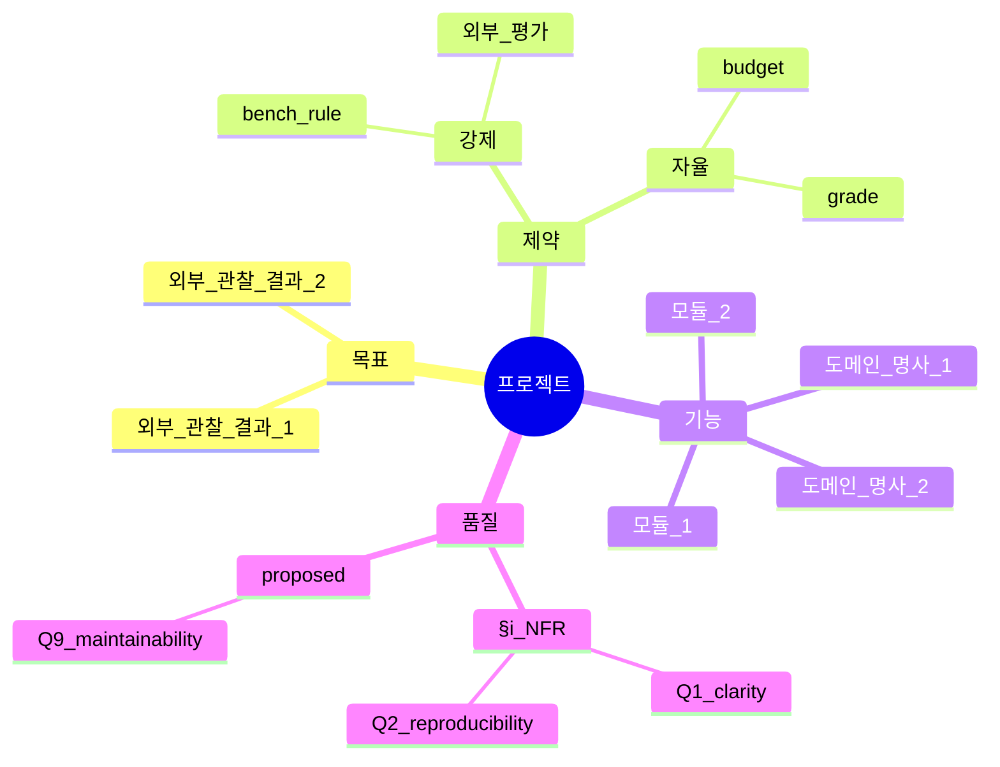

# Mindmap Centrality — 모든 페이즈가 reference 하는 canonical concept graph

## 한 줄 요약

**페이즈 01 의 마인드맵 = optional 한 ASCII 블록이 아니라 *모든 후속 페이즈가 reference 하는* canonical concept graph.** 마인드맵의 노드 / 엣지가 페이즈 02 (review 차원) / 페이즈 03 (콜드 framing 분류) / 페이즈 04 (질의 카탈로그) / 페이즈 06 (plan 모듈 분할) 의 *입력 구조* 자체. 본 컨벤션이 본 하네스의 *concept-driven* 흐름의 운영 형태.

## 1. 결손 진단

기존 페이즈 01 의 `intent/01-intent.md` §9 마인드맵 = 한 블록 ASCII tree. *작성 후 후속 페이즈 reference 0*. 형식적 산출물.

cold 회차 (`synthetic_mine_throughput_cold`) 의 페이즈 01 §9 마인드맵 5 가지 (강제 제약 / 도메인 / 멀티버스 / 점수 차원 / §i NFR + 회귀 짝) 가 페이즈 02-14 의 *그 어느 단계* 에서도 reference 되지 않음 — 사용자 지적 ("마인드맵이 부재인 이유는?") 의 본질.

## 2. 운영 룰

### Step 1 — 마인드맵 구조 강제

`intent/01-intent.md` §9 마인드맵은 다음 4 axis 의무 :

a- **목표 axis** (what) — 외부 관찰 가능 결과 노드.
b- **제약 axis** (constraint) — 강제/자율 분리.
c- **기능 axis** (functional) — 도메인 명사 + 동사.
d- **품질 axis** (NFR/qualitative) — §i derived NFR 노드.

각 axis 는 *동일 깊이* (≥ 2 sub-node) 강제. axis 누락 0.

### Step 2 — 마인드맵 → 후속 페이즈 reference 강제

| 페이즈 | 마인드맵 사용 |
|---|---|
| 02 doc-review | 마인드맵 4 axis 의 *각 노드* 에 *명확성 / 일관성 / 누락* 차원별 검증. 노드 별 issue ≥ 0 명시. |
| 03 cold-comprehension | 4 framing (parallel-cold-review §2) 이 *마인드맵 노드 별로* premortem 적용. framing × 노드 매트릭스. |
| 04 NFR-V 질의 | 품질 axis 의 §i 노드들이 *직접* Q-N{nfr_id}-V 질의 입력. |
| 06 plan 모듈 분할 | 기능 axis 의 노드들이 *모듈 / 파일 경로* 1:1 매핑 (모듈 = axis 노드의 직접 변환). |
| 09 게이트 | 품질 axis = derived gate, 제약 axis = static gate, 기능 axis = 의도-일치 gate, 목표 axis = 성공-지표 gate 매핑. |
| 14 handoff | 마인드맵 axis 별 결과 보고 — 모든 노드에 status (실현 / 부분 / 미실현) 명시. |

각 페이즈 산출물의 frontmatter 에 `mindmap_nodes_referenced: [...]` 강제 — 본 페이즈가 마인드맵의 *어느 노드* 를 다뤘는지 명시. self_lint C-MM (mindmap centrality) 룰이 본 frontmatter 키 누락 자동 fail.

### Step 3 — 마인드맵 진화 추적

페이즈 02-07 진행 중 *새 노드* 가 발견되면 (페이즈 02 누락 발견 / 페이즈 04 새 NFR / 페이즈 05 critique 결과 등) `intent/01-intent.md` §9 의 마인드맵을 *in-place 갱신* + frontmatter 의 `mindmap_revision: N` 증가. 페이즈 14 handoff 가 *모든 revision* 의 trace.

## 3. 마인드맵 형식 (Mermaid 의무, ASCII 보조)

ASCII tree 는 보조 — Mermaid 가 정본. 본 형식이 페이즈 06 의 모듈 분할 / 페이즈 09 의 게이트 매핑 자동 변환 가능.

## 4. 본 컨벤션이 *케이스 종속이 아닌* 이유

a- 4 axis (목표/제약/기능/품질) = 도메인 무관 의미군. simulation-bench 든 결제 시스템이든 동일.
b- 페이즈별 reference 룰 = 의미군 매핑 (functional axis → module 분할 등), 케이스 X.
c- mindmap 진화 = revision counter, 도메인 X.

## 5. v0.9.6/v0.9.7/v0.9.8 와의 직교성

| 컨벤션 | trigger | output | 본 컨벤션과의 관계 |
|---|---|---|---|
| v0.9.6 nfr-derivation | prompt 형용사 | derived gate | 품질 axis 가 §i 노드로 마인드맵에 직접 박힘 |
| v0.9.7 premortem-friction | 콜드리뷰 페이즈 진입 | derived improvements | premortem 발견 결손이 마인드맵 새 노드로 갱신 |
| v0.9.8 sprint-regression-loop | sprint 종료 시 dimension gap | next sprint lesson | weakest dim → 마인드맵의 어느 axis 가 약한가 매핑 |
| v0.9.8 parallel-cold-review | 페이즈 03 진입 | N framing 결손 합집합 | 4 framing 이 *마인드맵 노드 별* premortem (§2 step 2) |
| **v0.9.9 mindmap-centrality** | **페이즈 01-14 모두** | **canonical concept graph** | **모든 컨벤션의 reference axis** |

본 컨벤션이 *통합 layer* — 다른 컨벤션의 axis 를 마인드맵에 박는 *backbone*.

## 6. 안티 패턴

a- **§9 마인드맵을 형식적 ASCII 한 블록으로 작성 후 후속 페이즈 reference 0** — 본 컨벤션 핵심 위반.
b- **frontmatter `mindmap_nodes_referenced` 누락** — self_lint C-MM fail.
c- **마인드맵 axis 누락** (4 axis 중 ≤ 3) — drift 가드 위반.
d- **페이즈 진행 중 마인드맵 갱신 없음** — premortem / critique 결과가 마인드맵에 누락 = mindmap stale.

## 7. 그레이드별 활성

| Grade | 마인드맵 활성도 |
|---|---|
| G2 Simple | 4 axis ASCII only — Mermaid 옵션 |
| G3 Standard | 4 axis Mermaid + 페이즈 02/04/06 reference 의무 |
| G4 Complex | 4 axis Mermaid + 모든 페이즈 reference 의무 + revision tracking |
| G5 Critical | G4 + 마인드맵 자체에 대한 콜드 review (페이즈 03 의 framing 5 번째 = "마인드맵 평가자") |
