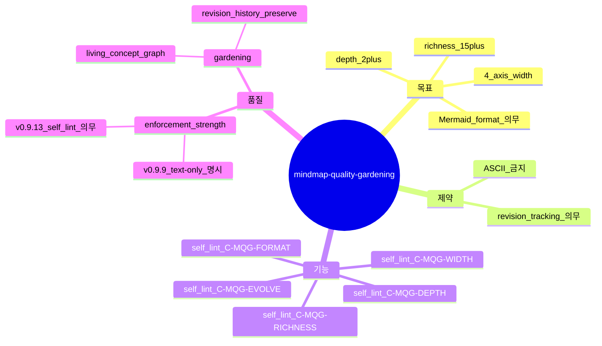

# Mindmap Quality Gardening — Mermaid 강제 + 깊이/폭/풍성도 임계 enforcement

## 한 줄 요약

**페이즈 01 §9 마인드맵 *반드시 Mermaid `mindmap` block* (ASCII tree fallback 금지) + 4 axis (목표/제약/기능/품질) × ≥3 sub-node 각각 + ≥1 깊이 (sub-sub-node) ≥ 2 axis + 총 노드 ≥ 15.** v091_cold01 회차에서 마인드맵이 ASCII 회귀 — 본 컨벤션이 가드닝 enforcement.

## 1. 결손 진단

v0.9.9 [`mindmap-centrality.md`](mindmap-centrality.md) §3 = "Mermaid 의무, ASCII 보조" 명시 — 그러나 *enforcement 약*. v091_cold01 회차에서 마인드맵 ASCII tree 로 작성 + Mermaid 미사용 — silent regression.

```
v01_cold (v0.9.9) §9      → Mermaid mindmap block + 4 axis
v091_cold01 (v0.9.12) §4  → ASCII tree, Mermaid 미박힘  ← 회귀
```

원인 = mindmap-centrality.md 가 Mermaid 강제만, *품질 임계* 미정. ASCII tree 라도 frontmatter 의 mindmap_nodes_referenced 만 박히면 형식적 통과.

## 2. 운영 룰 (4 임계)

페이즈 01 §9 의 마인드맵 산출물 의무 :

### A. 형식 임계 — Mermaid `mindmap` block

```yaml
- format: Mermaid `mindmap` block (```mermaid mindmap ... ```)
- ASCII tree 사용 금지 (보조도 X — Mermaid 만)
- self_lint C-MQG-FORMAT: ```mermaid mindmap``` 패턴 매칭 ≥ 1
```

### B. 폭 임계 — 4 axis × ≥3 sub-node 각각

```
root((프로젝트))
  목표        ← axis 1
    sub-1     ← ≥3
    sub-2
    sub-3
  제약        ← axis 2
    ...3+
  기능        ← axis 3
    ...3+
  품질        ← axis 4
    ...3+
```

`self_lint C-MQG-WIDTH` = 4 axis 모두 ≥ 3 sub-node.

### C. 깊이 임계 — ≥ 2 axis 가 sub-sub-node 보유

```
기능
  domain
    truck       ← sub-sub
    loader
    crusher
  modules
    topology    ← sub-sub
    simulation
```

`self_lint C-MQG-DEPTH` = 4 axis 중 ≥ 2 axis 가 sub-sub-node ≥ 1.

### D. 풍성도 임계 — 총 노드 ≥ 15 (v0.9.19 sprint-13: A default 임계 ≥ 25)

`self_lint C-MQG-RICHNESS` = mindmap 의 leaf node + intermediate node 합 ≥ 15. **v0.9.19 sprint-13** [`mindmap-richness-default.md`](mindmap-richness-default.md) (ba) 가 A 등급 default 격상 — 임계 ≥ 25 노드 + sub-sub-sub 1+ axis 강제. C-MRD-A-DEFAULT 가 grade 별 검증 (G4+ A 의무, G3 C 허용, B fallback PASS with lesson).

## 3. Quality 등급 (자기 검증)

**v0.9.19 sprint-13 갱신** — A 등급 default 격상 ([`mindmap-richness-default.md`](mindmap-richness-default.md) ba). B 등급은 fallback PASS *with lesson*.

| 등급 | 형식 | 폭 | 깊이 | 풍성도 | 결과 (sprint-13) |
|---|---|---|---|---|:-:|
| **A (default G4+)** | Mermaid | 4 axis × ≥4 | ≥3 axis sub-sub + ≥1 axis sub-sub-sub | ≥25 노드 | ✅ default — *천정 도달 default* |
| **B (fallback PASS with lesson)** | Mermaid | 4 axis × ≥3 | ≥2 axis sub-sub | ≥15 노드 | ✅ PASS — *sprint NN+1 의 mindmap 보강 lesson trigger* |
| C (G3 fallback) | Mermaid | 4 axis × ≥2 | ≥1 axis sub-sub | ≥10 노드 | ⚠️ G3 OK, G4 fail |
| D (regression) | ASCII | n/a | n/a | <10 | **❌ self_lint fail** |

A 등급 default 격상 사유 — v0.9.13 ~ v0.9.18 cold session 회차에서 B plateau (13~18 노드) 발현, A 등급 *옵션 도달* 부재. v0.9.19 ba 가 *templated stub* + B fallback 룰로 A default 강제.

v091_cold01 = D 등급. v01_cold = B 등급. 본 컨벤션이 D 등급 차단 + B 이상 강제.

## 4. 가드닝 룰 (sprint loop 동안 마인드맵 진화)

마인드맵 = canonical concept graph. 페이즈 진행 중 *새 발견* (페이즈 02 결손 / 페이즈 04 NFR / 페이즈 05 critique) 시 *마인드맵 갱신* 의무 :

- 새 노드 추가 시 `mindmap_revision: N` 증가
- 갱신 reason frontmatter 명시
- 기존 노드 삭제 0 (history preserve)

`self_lint C-MQG-EVOLVE` = 페이즈 진행 중 mindmap_revision 가 *증가* 했는지 검증. 페이즈 02-09 동안 revision 0 = 가드닝 누락.

## 5. 본 컨벤션이 *케이스 종속이 아닌* 이유

a- Mermaid 표준 = 도메인 무관.
b- 4 axis (목표/제약/기능/품질) = mindmap-centrality §2 의 generic axis.
c- 임계 (≥3 sub / ≥15 nodes) = generic 정량.

## 6. 안티 패턴

a- ASCII tree 회귀 (v091_cold01 사례) — C-MQG-FORMAT auto-fail.
b- Mermaid block 박지만 4 axis 중 일부 누락 — C-MQG-WIDTH auto-fail.
c- 모든 axis sub-sub 없음 (flat) — C-MQG-DEPTH fail.
d- mindmap_revision = 1 그대로 페이즈 14 까지 — gardening 누락.

## 7. v0.9.13 의 다른 컨벤션과의 상호작용

- v0.9.13 [`deep-semantic-intent.md`](deep-semantic-intent.md) = §i 의 implied framing 추출 → 마인드맵의 *품질 axis* 에 새 노드 추가 (mindmap_revision +1).
- v0.9.13 [`domain-research-stacking.md`](domain-research-stacking.md) = 도메인 어댑터 stack → *기능 axis* 에 도메인-specific 노드 추가 (mindmap_revision +1).

본 컨벤션 = 마인드맵의 *살아 있는* 진화 enforcement.

## 8. 자기 검증

본 컨벤션 자체의 mindmap (메타) :



13 노드 — 본 임계 (15) 미달 :) 메타 적용 시 본 컨벤션 자체도 가드닝 필요. v0.9.14 후속에서 보강.
