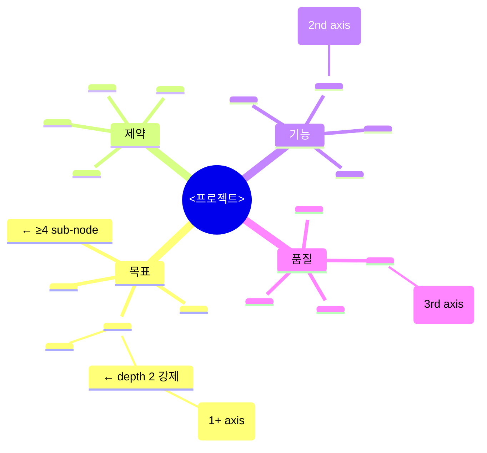
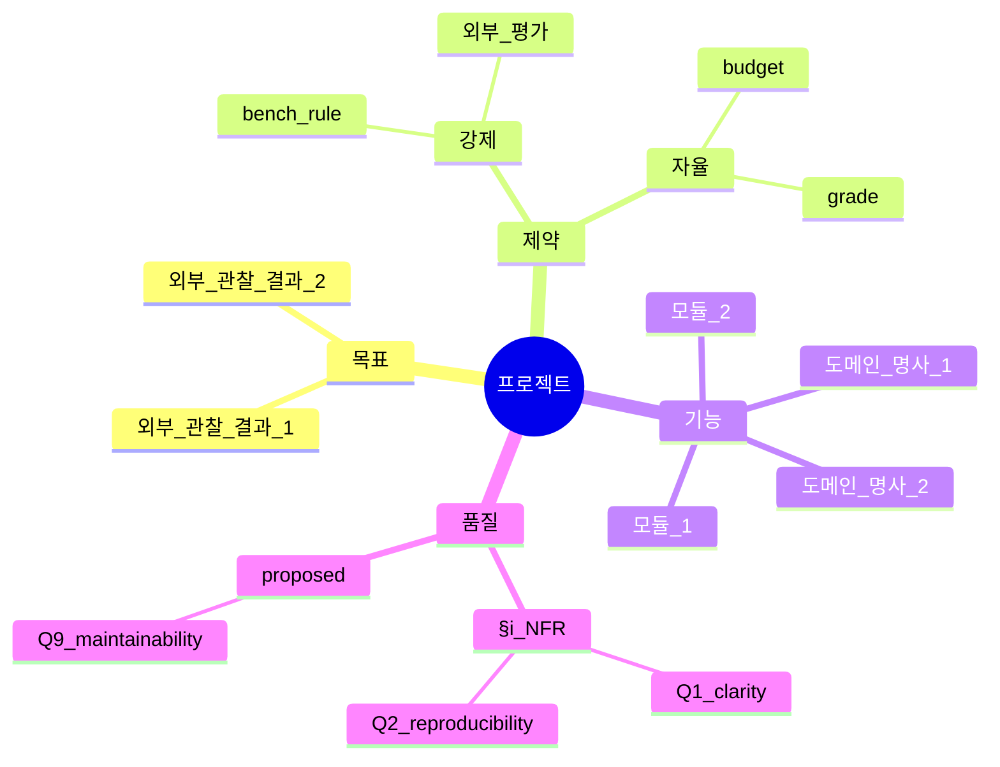

# Mindmap Quality — canonical concept graph (구조 + 형식 + 풍성도 default)

## 한 줄 요약

**페이즈 01 §9 마인드맵 = 모든 후속 페이즈가 reference 하는 *canonical concept graph*.** 본 컨벤션은 세 layer 통합:
① **구조** (centrality) — 4 axis (목표/제약/기능/품질) × 페이즈 02-14 reference 매트릭스 + revision tracking.
② **형식** (gardening) — Mermaid `mindmap` block 강제 (ASCII 금지) + 폭/깊이/풍성도 임계 + Quality 등급 (A/B/C/D).
③ **풍성도** (richness-default) — A 등급 default 격상 (≥25 노드 / 4 axis × ≥4 sub / 3 axis sub-sub + 1 axis sub-sub-sub) + agent 프롬프트 templated stub + B fallback PASS *with lesson*.

본 컨벤션이 본 하네스의 *concept-driven* 흐름의 운영 형태.

## 1. 결손 진단

기존 페이즈 01 의 `intent/01-intent.md` §9 마인드맵 = 한 블록 ASCII tree. *작성 후 후속 페이즈 reference 0*. 형식적 산출물.

cold 회차 누적 결손 :

- `synthetic_mine_throughput_cold` — 5 가지 마인드맵이 페이즈 02-14 의 *그 어느 단계* 에서도 reference 되지 않음 (사용자 지적: "마인드맵이 부재인 이유는?")
- `v091_cold01` — Mermaid 강제만 있고 *품질 임계* 미정 → ASCII tree 회귀 (silent regression)
- `v01_cold` ~ `v0916_cold` — A 등급 발현 0, B/C/D plateau (13~18 노드)

→ 세 layer 모두 enforcement 박혀야 본질적 mindmap centrality.

## 2. Layer ① — 구조 (4 axis + 페이즈 reference 매트릭스)

### 2.1 4 axis 의무

`intent/01-intent.md` §9 마인드맵은 다음 4 axis 의무 :

a- **목표 axis** (what) — 외부 관찰 가능 결과 노드.
b- **제약 axis** (constraint) — 강제/자율 분리.
c- **기능 axis** (functional) — 도메인 명사 + 동사.
d- **품질 axis** (NFR/qualitative) — §i derived NFR 노드.

각 axis 는 *동일 깊이* (≥ 2 sub-node) 강제. axis 누락 0.

### 2.2 페이즈 reference 매트릭스

| 페이즈 | 마인드맵 사용 |
|---|---|
| 02 doc-review | 4 axis 의 *각 노드* 에 *명확성 / 일관성 / 누락* 차원별 검증. 노드 별 issue ≥ 0 명시. |
| 03 cold-comprehension | 4 framing (parallel-cold-review §2) 이 *마인드맵 노드 별로* premortem 적용. framing × 노드 매트릭스. |
| 04 NFR-V 질의 | 품질 axis 의 §i 노드들이 *직접* Q-N{nfr_id}-V 질의 입력. |
| 06 plan 모듈 분할 | 기능 axis 의 노드들이 *모듈 / 파일 경로* 1:1 매핑. |
| 09 게이트 | 품질 axis = derived gate, 제약 axis = static gate, 기능 axis = 의도-일치 gate, 목표 axis = 성공-지표 gate 매핑. |
| 14 handoff | 4 axis 별 결과 보고 — 모든 노드에 status (실현 / 부분 / 미실현) 명시. |

각 페이즈 산출물 frontmatter 에 `mindmap_nodes_referenced: [...]` 강제 — 본 페이즈가 마인드맵의 *어느 노드* 를 다뤘는지 명시. self_lint **C-MM** 룰이 본 frontmatter 키 누락 자동 fail.

### 2.3 마인드맵 진화 추적 (revision)

페이즈 02-07 진행 중 *새 노드* 가 발견되면 (페이즈 02 누락 / 페이즈 04 새 NFR / 페이즈 05 critique) `intent/01-intent.md` §9 의 마인드맵을 *in-place 갱신* + frontmatter 의 `mindmap_revision: N` 증가. 페이즈 14 handoff 가 *모든 revision* 의 trace.

self_lint **C-MQG-EVOLVE** = 페이즈 진행 중 mindmap_revision 가 *증가* 했는지 검증. 페이즈 02-09 동안 revision 0 = 가드닝 누락.

## 3. Layer ② — 형식 (Mermaid 강제 + 4 임계)

### 3.1 Mermaid 의무 (ASCII 금지)

```yaml
- format: Mermaid `mindmap` block (```mermaid mindmap ... ```)
- ASCII tree 사용 금지 (보조도 X — Mermaid 만)
- self_lint C-MQG-FORMAT: ```mermaid mindmap``` 패턴 매칭 ≥ 1
```

### 3.2 폭 임계 — 4 axis × ≥3 sub-node

```
root((프로젝트))
  목표        ← axis 1
    sub-1     ← ≥3
    sub-2
    sub-3
  제약        ← axis 2
    ...3+
  기능        ← axis 3
    ...3+
  품질        ← axis 4
    ...3+
```

self_lint **C-MQG-WIDTH** = 4 axis 모두 ≥ 3 sub-node.

### 3.3 깊이 임계 — ≥ 2 axis 가 sub-sub-node

```
기능
  domain
    truck       ← sub-sub
    loader
    crusher
  modules
    topology    ← sub-sub
    simulation
```

self_lint **C-MQG-DEPTH** = 4 axis 중 ≥ 2 axis 가 sub-sub-node ≥ 1.

### 3.4 풍성도 임계 — 총 노드 ≥ 15 (B) / ≥ 25 (A)

self_lint **C-MQG-RICHNESS** = mindmap 의 leaf + intermediate 노드 합 ≥ 15 (B 임계) — A 등급 임계는 §4 참조.

## 4. Layer ③ — 풍성도 default (A 등급 + templated stub)

### 4.1 Quality 등급 표 (sprint-13 v0.9.19 갱신)

| 등급 | 형식 | 폭 | 깊이 | 풍성도 | 결과 |
|---|---|---|---|---|:-:|
| **A (default G4+)** | Mermaid | 4 axis × ≥4 | ≥3 axis sub-sub + ≥1 axis sub-sub-sub | ≥25 노드 | ✅ default — 천정 도달 default |
| **B (fallback PASS with lesson)** | Mermaid | 4 axis × ≥3 | ≥2 axis sub-sub | ≥15 노드 | ✅ PASS — sprint NN+1 mindmap 보강 lesson trigger |
| C (G3 fallback) | Mermaid | 4 axis × ≥2 | ≥1 axis sub-sub | ≥10 노드 | ⚠️ G3 OK, G4 fail |
| D (regression) | ASCII | n/a | n/a | <10 | ❌ self_lint fail |

A 등급 default 격상 사유 — `v01_cold` ~ `v0916_cold` 회차에서 B plateau (13~18 노드), A *옵션 도달* 부재. v0.9.19 ba 가 *templated stub* + B fallback 룰로 A default 강제.

### 4.2 발현 강제 — intent-extractor 프롬프트 templated section

[`../agents/intent-extractor.md`](../agents/intent-extractor.md) 프롬프트에 *마인드맵 templated stub* 의무:

````
### Templated Section §9 (mindmap-quality.md §4)


````

agent 가 본 stub 을 *그대로 base* 로 출력 후 도메인-specific 노드 ≥ 9 개 추가하면 자동 ≥ 25 노드 + A 등급 도달.

### 4.3 fallback PASS — B 등급 + lesson

A 미달 시 B 등급 = PASS *with lesson* (페이즈 09 게이트 PASS, sprint NN+1 의 mindmap 보강 lesson trigger):

```python
def evaluate_mindmap_richness(mindmap):
    grade = compute_grade(mindmap)
    if grade in ("A", "B"):
        return "PASS"  # B 는 sprint NN+1 lesson trigger
    if grade == "C":
        return "PASS_G3_ONLY"  # G4+ fail
    return "FAIL"  # D
```

self_lint **C-MRD-A-DEFAULT** = `mindmap_quality_grade` frontmatter PASS 조건: 'A' (G4 default) 또는 'B' (with lesson). fail 조건: 'C' (G4+ 시) 또는 'D'.

## 5. 마인드맵 형식 예시



본 형식이 페이즈 06 의 모듈 분할 / 페이즈 09 의 게이트 매핑 자동 변환 가능.

## 6. self_lint 룰 요약

| 룰 ID | layer | 검증 |
|---|---|---|
| **C-MM** | ① 구조 | 페이즈 산출물 frontmatter `mindmap_nodes_referenced` 존재 |
| **C-MQG-FORMAT** | ② 형식 | ` ```mermaid mindmap``` ` 패턴 매칭 ≥ 1 |
| **C-MQG-WIDTH** | ② 형식 | 4 axis 모두 ≥ 3 sub-node |
| **C-MQG-DEPTH** | ② 형식 | ≥ 2 axis 가 sub-sub-node 보유 |
| **C-MQG-RICHNESS** | ② 형식 | leaf + intermediate 합 ≥ 15 |
| **C-MQG-EVOLVE** | ① 진화 | 페이즈 진행 중 mindmap_revision 증가 |
| **C-MRD-A-DEFAULT** | ③ 풍성도 | `mindmap_quality_grade` ∈ {A, B} (G4+ default A) |

## 7. 그레이드별 활성

| Grade | 마인드맵 활성도 |
|---|---|
| G2 Simple | 4 axis ASCII only — Mermaid 옵션 |
| G3 Standard | 4 axis Mermaid + 페이즈 02/04/06 reference 의무 |
| G4 Complex | 4 axis Mermaid + 모든 페이즈 reference 의무 + revision tracking + A 등급 default |
| G5 Critical | G4 + 마인드맵 자체에 대한 콜드 review (페이즈 03 의 framing 5 번째 = "마인드맵 평가자") |

## 8. 본 컨벤션이 *케이스 종속이 아닌* 이유

a- 4 axis (목표/제약/기능/품질) = 도메인 무관 의미군. simulation-bench 든 결제 시스템이든 동일.
b- 페이즈별 reference 룰 = 의미군 매핑 (functional axis → module 분할 등), 케이스 X.
c- mindmap 진화 = revision counter, 도메인 X.
d- Mermaid 표준 = 도메인 무관.
e- 임계 (≥3 sub / ≥15 nodes / ≥25 nodes A) = generic 정량.
f- templated section = 도메인 무관 stub.
g- fallback PASS with lesson = regression §2 sprint loop 일반 메커니즘 활용.

## 9. 다른 컨벤션과의 직교성

| 컨벤션 | trigger | output | 본 컨벤션과의 관계 |
|---|---|---|---|
| nfr-derivation | prompt 형용사 | derived gate | 품질 axis 가 §i 노드로 마인드맵에 직접 박힘 |
| premortem-friction | 콜드리뷰 페이즈 진입 | derived improvements | premortem 발견 결손이 마인드맵 새 노드로 갱신 |
| regression §2 sprint loop | sprint 종료 시 dimension gap | next sprint lesson | weakest dim → 마인드맵의 어느 axis 가 약한가 매핑 |
| parallel-cold-review | 페이즈 03 진입 | N framing 결손 합집합 | 4 framing 이 *마인드맵 노드 별* premortem |
| deep-semantic-intent | §i implied framing 추출 | NFR + framing | 품질 axis 의 새 노드 (revision +1) |
| domain-research-stacking | 도메인 어댑터 stack | 도메인-specific 노드 | 기능 axis 의 새 노드 (revision +1) |
| evidence-driven-sprint-planning | sprint NN+1 lesson | source 매핑 | B fallback 시 자동 lesson source |
| **mindmap-quality** (본) | **페이즈 01-14 모두** | **canonical concept graph** | **모든 컨벤션의 reference axis** |

본 컨벤션이 *통합 layer* — 다른 컨벤션의 axis 를 마인드맵에 박는 *backbone*.

## 10. 안티 패턴

### 10.1 Layer ① 구조

a- §9 마인드맵을 형식적 ASCII 한 블록으로 작성 후 후속 페이즈 reference 0 — 본 컨벤션 핵심 위반.
b- frontmatter `mindmap_nodes_referenced` 누락 — self_lint C-MM fail.
c- 마인드맵 axis 누락 (4 axis 중 ≤ 3) — drift 가드 위반.
d- 페이즈 진행 중 mindmap_revision 갱신 0 — premortem / critique 결과가 마인드맵에 누락 = mindmap stale.

### 10.2 Layer ② 형식

e- ASCII tree 회귀 (v091_cold01 사례) — C-MQG-FORMAT auto-fail.
f- Mermaid block 박지만 4 axis 중 일부 누락 — C-MQG-WIDTH auto-fail.
g- 모든 axis sub-sub 없음 (flat) — C-MQG-DEPTH fail.

### 10.3 Layer ③ 풍성도

h- A 등급 default 명시 안 하고 B 임계 그대로 — 발현 0 회귀 (v0.9.13 패턴).
i- templated section 없이 agent 가 *짐작* 으로 mindmap 생성 — D 등급 회귀 위험.
j- B fallback 의 lesson trigger 무시 → sprint NN+1 mindmap 갱신 0 → mindmap_revision = 1 plateau.
k- C 등급 G3 PASS 가 *G4 작업에 무단 적용* — C-MRD-A-DEFAULT 가 grade 별 분리 의무.

## 11. 호환성

- [`intent-completeness.md`](intent-completeness.md) — §k 9 sub 와 직교 (mindmap = §9 axis, §k = §a~§i sub-criterion)
- [`domain-model-completeness.md`](domain-model-completeness.md) — mindmap 4 axis × ≥4 sub 가 entity catalog 의 시각 표현. mindmap entity 노드 = §m D1 entity 와 1:1 매핑 권장
- [`intent-refresh.md`](intent-refresh.md) — 각 refresh universe 가 자체 mindmap 갱신 의무 (initial 그대로 복사 금지)
- [`rubric-driven-doc-skeleton.md`](rubric-driven-doc-skeleton.md) — Mermaid 마인드맵 ToC 가 본 skeleton 의 §9 섹션으로 매핑

## 12. 통합 history (sprint-37 PR-AD)

본 컨벤션은 sprint-37 PR-AD (다이어트) 에서 **`mindmap-centrality`** (sprint-09 v0.9.9, 구조) + **`mindmap-quality-gardening`** (sprint-13 v0.9.13, 형식) + **`mindmap-richness-default`** (sprint-13 v0.9.19, 풍성도) 세 컨벤션을 단일 컨벤션의 §2/§3/§4 세 layer 로 통합. 책임 = "canonical mindmap quality" 단일, 세 layer = 구조 (centrality) / 형식 (gardening) / 풍성도 (richness-default). 매핑은 [`MIGRATION.md`](MIGRATION.md) 단일 source.
