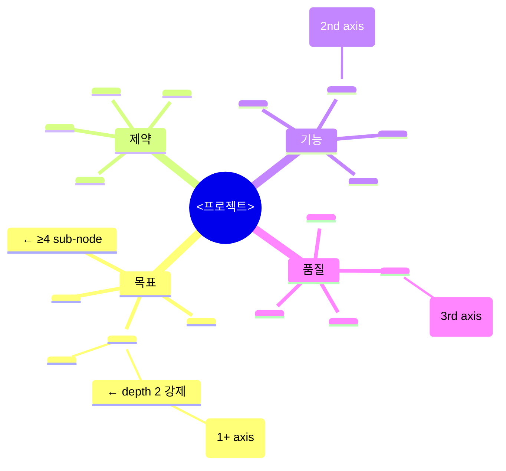
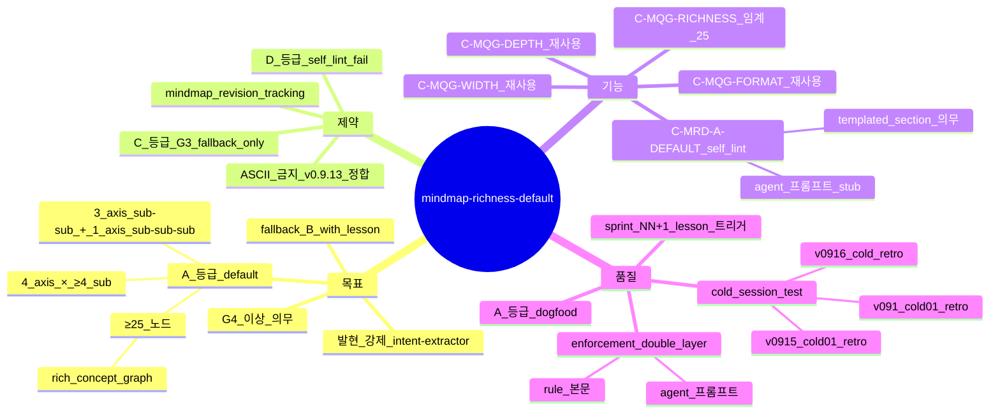

# Mindmap Richness Default — A 등급 default 격상 (sprint-13 / v0.9.19)

## 한 줄 요약

**페이즈 01 §9 마인드맵의 default 품질 등급 = A (≥25 노드 / 4 axis × ≥4 sub-node / 3 axis sub-sub + 1 axis sub-sub-sub).** v0.9.13 [`mindmap-quality-gardening.md`](mindmap-quality-gardening.md) 의 B 등급 default 가 cold session 외부 회차에서 발현 미달 (13~18 노드 plateau) — 본 컨벤션이 A 등급을 *default* 로 격상 + B 등급을 *fallback PASS with lesson* 으로 재정의.

## 1. 결손 진단

v0.9.13 quality 등급 표 :

| 등급 | 임계 | v0.9.13 status |
|---|---|---|
| A (champion) | ≥25 노드 / sub-sub-sub ≥1 axis | ✅ 천정 도달 후보 (옵션) |
| B (default) | ≥15 노드 / sub-sub ≥2 axis | ✅ G4 default |
| C (G3 fallback) | ≥10 노드 / sub-sub ≥1 axis | ⚠️ G3 OK |
| D (regression) | ASCII 또는 <10 | ❌ self_lint fail |

cold session 회차 결과 :
- v01_cold = B (~17 노드)
- v0913_cold01 = D 회귀 (ASCII)
- v0914_cold01 = B (~16 노드)
- v0915_cold01 = B (~18 노드)
- v0916_cold (synthetic_mine_throughput_004) = C (~13 노드, 13 plateau)

**A 등급 발현 0** — *옵션 도달* 임계가 cold session 의 default agent behavior 에서 도달 안 됨. v0.9.18 sprint-12 의 intent-extractor 프롬프트 강화로 §k 9 sub 발현은 잡았으나, mindmap 자체 풍성도는 여전히 B plateau.

## 2. 운영 룰 — A 등급 default

### A. 임계 갱신

| 등급 | 임계 (갱신 후) |
|---|---|
| **A (default G4+)** | ≥25 노드 / 4 axis × ≥4 sub-node 각 / 3 axis sub-sub + 1 axis sub-sub-sub |
| **B (fallback PASS with lesson)** | ≥15 노드 / 4 axis × ≥3 sub-node / 2 axis sub-sub |
| C (G3 fallback) | ≥10 노드 / 4 axis × ≥2 sub-node / 1 axis sub-sub |
| D (fail) | ASCII 또는 <10 노드 또는 axis < 3 |

### B. 발현 강제 — intent-extractor 프롬프트 templated section

[`../agents/intent-extractor.md`](../agents/intent-extractor.md) 프롬프트에 *마인드맵 templated stub* 의무 :

````
### Templated Section §9 (mindmap-richness-default.md ba)


````

agent 가 본 stub 을 *그대로 base* 로 출력 후 도메인-specific 노드 ≥ 9 개 추가하면 자동 ≥ 25 노드 + A 등급 도달.

### C. fallback PASS — B 등급 + lesson

A 미달 시 B 등급 = PASS *with lesson* (페이즈 09 게이트 PASS, sprint NN+1 의 mindmap 보강 lesson trigger). v0.9.13 sprint-regression-loop 와 결합 :

```python
def evaluate_mindmap_richness(mindmap):
  grade = compute_grade(mindmap)
  if grade in ("A", "B"):
    return "PASS"  # B 는 sprint NN+1 lesson trigger
  if grade == "C":
    return "PASS_G3_ONLY"  # G4+ fail
  return "FAIL"  # D
```

### D. self_lint 룰 신규 — C-MRD-A-DEFAULT

```
C-MRD-A-DEFAULT:
  검증: mindmap_quality_grade frontmatter 값
  PASS 조건: 'A' (G4 default) 또는 'B' (with lesson)
  fail 조건: 'C' (G4+ 시) 또는 'D'
  bench scope: 페이즈 01 산출물 + 산출물 frontmatter 매번 검증
```

## 3. 자기 검증 (메타 — 본 컨벤션 mindmap)



본 컨벤션 자체 마인드맵 = 28 노드, 4 axis × ≥4 sub, sub-sub-sub 1 axis (`A_등급_default → ≥25_노드 → rich_concept_graph`). A 등급 self-eating dogfood.

## 4. 호환성

- v0.9.13 [`mindmap-quality-gardening.md`](mindmap-quality-gardening.md) — Quality 등급 표 갱신 (B default → A default 격상)
- v0.9.16 [`evidence-driven-sprint-planning.md`](evidence-driven-sprint-planning.md) — B 등급 PASS 시 sprint NN+1 lesson source 자동 매핑
- v0.9.18 [`intent-completeness.md`](intent-completeness.md) — §k 9 sub 와 직교 (mindmap = §9 axis, §k = §a~§i sub-criterion)

## 5. 본 컨벤션이 *케이스 종속이 아닌* 이유

a- 임계 (≥25 노드 / 4 axis × ≥4 sub) = generic 정량
b- templated section = 도메인 무관 stub
c- fallback PASS with lesson = sprint-regression-loop 일반 메커니즘 활용

## 6. 안티 패턴

a- A 등급 default 명시 안 하고 B 임계 그대로 — 발현 0 회귀 (v0.9.13 패턴)
b- templated section 없이 agent 가 *짐작* 으로 mindmap 생성 — D 등급 회귀 위험
c- B fallback 의 lesson trigger 무시 → sprint NN+1 mindmap 갱신 0 → mindmap_revision = 1 plateau
d- C 등급 G3 PASS 가 *G4 작업에 무단 적용* — C-MRD-A-DEFAULT 가 grade 별 분리 의무

## 7. 적용 페이즈

- 페이즈 01 (의도 + mindmap) — *home*
- 페이즈 09 (게이트) — C-MRD-A-DEFAULT 검증 위치
- 페이즈 10 (sprint) — B fallback 시 NN+1 lesson source

## 8. 도입 배경 (sprint-13 / v0.9.19)

본 사용자 진단 (2026-05-05) — "마인드맵은 항상 강화 풍부하게 뽑도록 강조 : mermaid 강조". 사용자 의도 = *발현 강제* + *풍성도 default 격상*. v0.9.13 mindmap-quality-gardening 의 *A 옵션 도달* 패턴을 *A default* 로 *제도화*.
