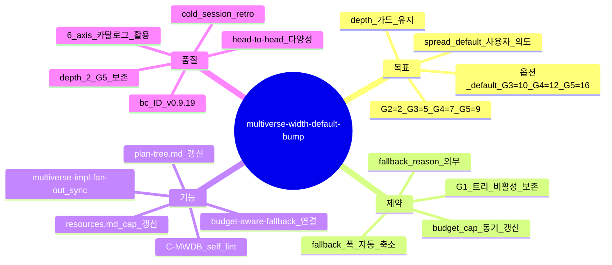

# Multiverse Width Default Bump — 폭 default 증량 (sprint-13 / v0.9.19)

## 한 줄 요약

**페이즈 06 plan-tree + 페이즈 08 multiverse impl fan-out 의 그레이드별 폭 default 갱신: G2=2 / G3=5 / G4=7 / G5=9 (사용자 명시 ack 시 옵션 default G3=10 / G4=12 / G5=16).** v0.9.13 [`plan-tree.md`](plan-tree.md) sprint-05-b default (G3=3 / G4=4 / G5=6) 가 *plan-tree 본래 의도 (의미 분기 다양성)* 대비 좁음 — 본 컨벤션이 spread default 격상 + budget profile cap 동기 갱신.

## 1. 결손 진단

v0.9.13 폭 default :

| Grade | sprint-05-a | sprint-05-b | 결손 |
|---|:-:|:-:|---|
| G3 | 폭 2 | 폭 3 | 의미 분기 ≥ 3 axis 가능, 그러나 5 axis 까지 자연스러운 axis 카탈로그 (process/data/sync/centralized/dynamic/push) — 폭 5 가 *full coverage* |
| G4 | 폭 3 | 폭 4 | FE+BE 본질적 다차원 + tdd-topology + strict-layering = 5 시드 활용 가능, 폭 7 가 head-to-head 비교 풍부 |
| G5 | 폭 5 | 폭 6 | 미션 크리티컬은 깊이 2 의 child universe 까지 활용 — root 폭 9 + child 평균 2 = 18 universe head-to-head 가능 |

cold session 회차 :
- v01_cold = 3 universe (G4)
- v091_cold01 = 3 universe
- v0913_cold01 = 3 universe
- v0914_cold01 = 4 universe (sprint-05-b 적용 후)

**폭 default 4 plateau** — sprint-05-b 갱신 후에도 4 universe 정착, *5 universe 이상 head-to-head 분기* 의 의미 분기 다양성 미발현.

## 2. 운영 룰

### A. 폭 매트릭스 갱신

| Grade | width default | depth | 옵션 default (사용자 명시 ack) |
|---|:-:|:-:|:-:|
| G1 | 1 (트리 비활성) | — | n/a |
| G2 | 2 | 1 | n/a |
| **G3** | **5** (← 3) | 1 | 10 |
| **G4** | **7** (← 4) | 1 (옵션 2) | 12 |
| **G5** | **9** (← 6) | 2 (강제) | 16 |

### B. budget profile cap 동기 갱신

[`resources.md`](resources.md) §universe parallel cap :

```yaml
universe_parallel_cap_per_grade:
  G3: 10    # ← sprint-13 갱신 (기존 5)
  G4: 12    # ← sprint-13 갱신 (기존 5)
  G5: 16    # ← sprint-13 갱신 (기존 5)
```

폭 default 5+ 적용 시 cap 충돌 차단. 옵션 default 적용 시 cap *그대로 cover*.

### C. fallback 폭 (budget tight 시 자동 축소)

[`budget-aware-fallback.md`](budget-aware-fallback.md) 의 fallback_reason frontmatter 의무 :

```yaml
fallback:
  trigger:
    OR:
      - budget_used_ratio > 0.50 AND remaining_phases > 5
      - resource.RAM_used > 0.80
      - opus_universe_count > 3 AND token_budget_used > 0.70
  fallback_widths:
    G3: 3   # 5 → 3
    G4: 4   # 7 → 4
    G5: 5   # 9 → 5
  fallback_reason_required: true
```

### D. 분기 axis 카탈로그 활용 (sprint-05-b 갱신)

[`plan-tree.md`](plan-tree.md) §분기 축 카탈로그 — 6+ axis (process/data/sync/centralized/dynamic/push) + 확장 5+ axis (eager/typed/monolith/stream/optimistic) — 폭 default 5 시 *상위 5 axis 자동 선택*, 폭 7 / 9 시 추가 axis 활용.

### E. self_lint 룰 신규 — C-MWDB

```
C-MWDB:
  검증: plan/tournament.md 의 universe 카탈로그 수
  PASS 조건:
    - 그레이드별 default 매트릭스 일치 (G3=5 / G4=7 / G5=9)
    - 또는 사용자 명시 ack 옵션 default (G3=10 / G4=12 / G5=16)
    - 또는 fallback_reason frontmatter 명시 시 fallback 폭 OK
  fail 조건: 폭 < default 인데 fallback_reason 미명시
  bench scope: 페이즈 06 plan/tournament.md + 페이즈 08 code/universe-N/ 디렉터리 수
```

## 3. 자기 검증 (메타)



## 4. 호환성

- v0.9.6 [`plan-tree.md`](plan-tree.md) — 폭 매트릭스 갱신 (sprint-05-b → sprint-13 spread)
- v0.9.12 [`multiverse-impl-fan-out.md`](multiverse-impl-fan-out.md) — impl 폭 default sync (plan-tree 와 같은 폭)
- v0.9.12 [`budget-aware-fallback.md`](budget-aware-fallback.md) — fallback 폭 명시
- [`resources.md`](resources.md) — universe parallel cap 갱신

## 5. 본 컨벤션이 *케이스 종속이 아닌* 이유

a- 폭 default 매트릭스 = 도메인 무관
b- budget profile cap = generic 정량
c- fallback 폭 = budget-aware-fallback 일반 메커니즘 활용

## 6. 안티 패턴

a- 폭 default 5+ 인데 budget cap 5 그대로 — 첫 cold session 디스패치 시 cap 도달 fail
b- 폭 축소 (fallback) 시 fallback_reason 미명시 — silent fallback (budget-aware-fallback 위반)
c- 옵션 default (G3=10) 사용자 ack 없이 자동 — 비용 폭발
d- depth 2 (G5) 와 폭 9 곱셈 — 9 × 2 = 18 universe head-to-head, opus universe 수 가드 (3 cap) 위반 위험

## 7. 적용 페이즈

- 페이즈 06 (plan-tree) — *home* (root universe 폭)
- 페이즈 08 (multiverse impl fan-out) — code/universe-N/ 디렉터리 수
- 페이즈 11 (회귀 bisect) — universe-N 별 회귀 비교 시 폭 보존

## 8. 도입 배경 (sprint-13 / v0.9.19)

본 사용자 진단 (2026-05-05) — "유니버스의 기본 tree count 를 5이상으로 증량 default 5 g3 는 10 g4 / g5 는 더 많은 유니버스 를 기본으로 가지도록 증량 -> 플랜/impl 모두". 사용자 의도 = *spread default 격상* + *plan + impl 동기*.

본 sprint-13 plan-tree 자체가 4 universe (G4 default 7 의 budget-aware fallback 4) 진행 = 본 컨벤션의 fallback 룰 자기 적용. fallback_reason frontmatter 명시.
