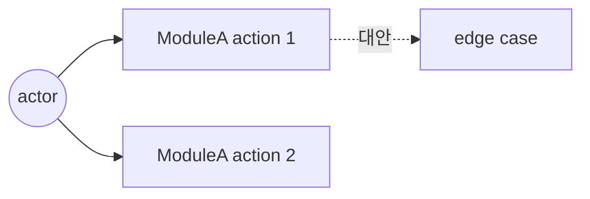
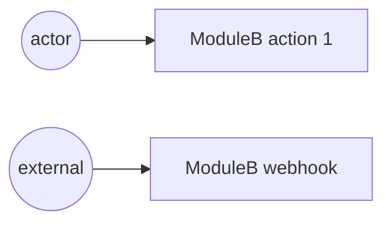
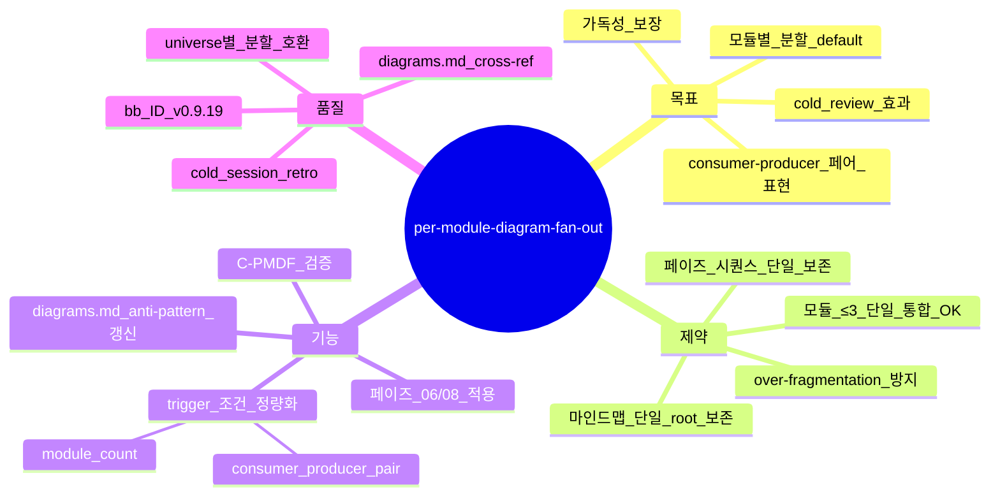

# Per-Module Diagram Fan-Out — usecase / sequence 모듈별 분할 (sprint-13 / v0.9.19)

## 한 줄 요약

**페이즈 06 plan / 페이즈 08 impl 의 use-case / sequence 다이어그램이 단일 통합만 강요되지 않는다 — 모듈 ≥ 4 또는 consumer-producer 페어 ≥ 6 시 *모듈별 분할* 권장.** v0.9.13 [`diagrams.md`](diagrams.md) 의 단일 시퀀스 패턴이 모듈 수 큰 케이스에 가독성 폭망 — 본 컨벤션이 *모듈별 fan-out* 을 default 로 격상.

## 1. 결손 진단

v0.9.13 [`diagrams.md`](diagrams.md) §3 = "모듈 단위로 그리되 *내부* (서비스 ↔ 도메인 ↔ 어댑터) 와 *외부* (FE ↔ BE ↔ DB ↔ 외부 API) 를 분리해 두 그림으로". → *내부* + *외부* = 2 분할만 default. 모듈 자체가 ≥ 4 인 경우 단일 시퀀스로 모든 모듈을 욱여넣음.

cold session 회차 :
- v0914_cold01 plan/06-plan.md = 단일 시퀀스 1 개 (내부 only)
- v0915_cold01 plan/06-plan.md = 단일 시퀀스 1 개
- v091_cold01 plan/06-plan.md = 단일 시퀀스 1 개

**모듈별 fan-out 발현 0** — `diagrams.md` 의 "여러 모듈 욱여넣음 = 안티" 룰만 *negative* 명시, *positive default* (모듈별 fan-out) 부재.

## 2. 운영 룰

### A. Trigger 조건

```yaml
diagram_fan_out_trigger:
  OR:
    - module_count >= 4
    - consumer_producer_pair >= 6
  diagrams_per_module: 1+    # use-case 또는 sequence
  union_diagram: optional    # 모듈 ≤ 3 시 단일 통합 OK
```

모듈 수 / consumer-producer 페어 자동 카운트 — `plan/06-plan.md` 의 모듈 분할 + 인터페이스 정의 분석.

### B. 다이어그램 종류 분배

| 다이어그램 | per-module 분할 | 단일 통합 |
|---|---|---|
| 마인드맵 (페이즈 01) | n/a (단일 root) | ✅ 항상 |
| use-case (페이즈 04, 06) | **모듈 ≥ 4 시 권장** | ≤ 3 시 OK |
| sequence (페이즈 06, 08) | **모듈 ≥ 4 시 권장** | ≤ 3 시 OK |
| 페이즈 시퀀스 (전체 흐름) | n/a | ✅ 항상 |

### C. 모듈별 다이어그램 출력 패턴

```markdown
## per-module use-case 다이어그램 (모듈 ≥ 4 trigger)

### use-case: ModuleA



### use-case: ModuleB



### (모듈 ≥ 4 만큼 반복)
```

### D. C-PMDF (미등록)

```
C-PMDF:
  검증: plan/06-plan.md 의 per-module 다이어그램 수
  PASS 조건:
    - module_count <= 3 → 단일 통합 OK (1+ 다이어그램)
    - module_count >= 4 OR consumer_producer_pair >= 6 → ≥ module_count per-module 다이어그램
  fail 조건: module_count >= 4 인데 단일 시퀀스 1 개만
  bench scope: 페이즈 06 plan/06-plan.md + 페이즈 08 impl/08-impl-log.md
```

## 3. 자기 검증 (메타)



## 4. 호환성

- v0.9.6 [`diagrams.md`](diagrams.md) — 단일 시퀀스 anti-pattern 명시 + per-module fan-out cross-ref
- [`aide-tree.md`](aide-tree.md) §3 (sprint-37 PR-AB 통합) — universe 별 sequenceDiagram 의무 + 본 컨벤션 = universe 안 *모듈* fan-out (직교)
- v0.9.12 [`multiverse-impl-fan-out.md`](multiverse-impl-fan-out.md) — universe 단위 fan-out + 본 컨벤션 모듈 단위 fan-out (universe × 모듈 = 2D fan-out)

## 5. 본 컨벤션이 *케이스 종속이 아닌* 이유

a- trigger 조건 (module_count / consumer_producer_pair) = generic 정량
b- 다이어그램 종류 분배 = 도메인 무관
c- self_lint 룰 = plan 산출물 일반 패턴

## 6. 안티 패턴

a- 모듈 ≥ 4 인데 단일 시퀀스 1 개로 모든 호출 욱여넣음 — 가독성 0, C-PMDF fail
b- 모듈 ≤ 3 인데 per-module 분할 강제 — over-fragmentation, 의도 없이 비용 증가
c- 페이즈 시퀀스 (전체 흐름) 도 모듈별 분할 — 페이즈 시퀀스의 본질 (전체 step 흐름) 깨짐
d- 마인드맵을 모듈별 분할 — 마인드맵은 단일 root 의 concept graph, 분할 무의미

## 7. 적용 페이즈

- 페이즈 06 (plan) — *home*
- 페이즈 08 (impl) — universe-N 별 + module-N 별 2D fan-out
- 페이즈 09 (게이트) — C-PMDF 검증 위치

## 8. 도입 배경 (sprint-13 / v0.9.19)

본 사용자 진단 (2026-05-05) — "usecase / seq / 다이어그램은 단일 다이어그램으로만 뽑지않아도됨. 개별 모듈의 usecase / seq 는 각 모듈의 소비자-생산자 간 복잡도가 표현목적에 충분 하다면 개별 다이어그램으로 구현 해도 좋음 — 강조". 사용자 의도 = *허용* (옵션) 이 아닌 *권장 default* (모듈 ≥ 4 트리거) 로 격상.

본 sprint-13 plan/06-plan.md 자체가 5 모듈 (ConventionAuthor / PhaseEditor / SkillVersionBumper / HardRule9Updater / SprintTrinityRunner) per-module use-case 5 다이어그램 분할 출하 = 자기 적용.
