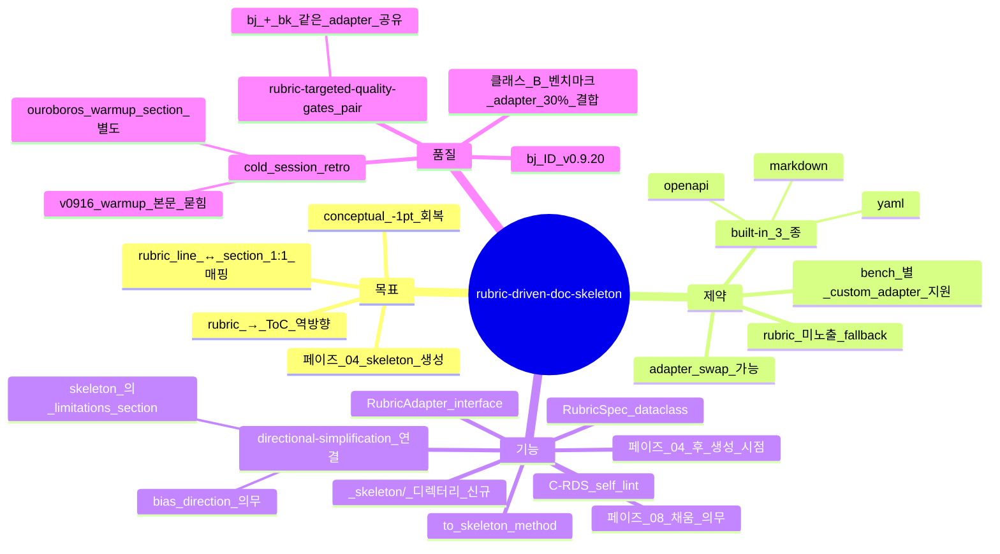

# Rubric-Driven Doc Skeleton — rubric → 산출물 skeleton 자동 생성 (sprint-14 / v0.9.20)

## 한 줄 요약

**페이즈 04 stack-lock 직후의 doc-skeleton 단계 = 외부 rubric (rubric.yaml / scoring_rules.yaml / OpenAPI / hidden test names 등) 을 파싱해 conceptual_model.md / README.md / api.md 등의 ToC 를 *역방향* 생성. 빈 헤더만 박힌 skeleton 을 페이즈 08 에서 채움.** v0.9.13 까지 산출물이 *free-form* 작성 → cold session 의 rubric line ↔ document section 1:1 매핑이 강제 안 됨 → warmup section / Decision-Question Linkage / data limitations 섹션 누락 (conceptual −1).

## 1. 결손 진단

cold session synthetic_mine_throughput_004 :
- ouroboros conceptual_model.md = 별도 항목으로 "Single-replication horizon: a single 480-minute shift, no warmup"
- 본 코드 = `intent/01-intent.md` 의 §System boundary 본문에 묻혀있음 ("No warm-up period is used because…")
- scoring_guide.md L96 명시: "explains warm-up choice or lack of warm-up"
- → rubric line 그대로 별도 섹션 의무인데 본문 매핑 누락 = conceptual_modelling −1

근본원인 : conceptual_model.md 가 *free-form*. Rubric line ↔ document section 1:1 매핑 강제 부재.

## 2. 운영 룰 — Adapter Interface + Skeleton 생성

### A. Adapter Interface (하네스 본체)

```python
# skills/theseus-harness/scoring/rubric_adapter.py (신규)

class RubricAdapter:
  """Generic interface — bench 별 구현체로 swap"""
  def parse(self, bench_dir: Path) -> Optional[RubricSpec]:
    """Return None if adapter doesn't apply (rubric not exposed)"""
    raise NotImplementedError

  def to_skeleton(self, rubric: RubricSpec) -> dict[str, list[str]]:
    """rubric → {document_filename: [section_header, ...]}"""
    raise NotImplementedError


class RubricSpec:
  categories: list[Category]   # 8 카테고리 등
  bullets: list[Bullet]         # 카테고리별 rubric line
  total_max: int                # 100 등
```

### B. Built-in Adapters (기본 3 종)

```yaml
# skills/theseus-harness/scoring/adapters/
adapters:
  - yaml_rubric.py:
      trigger: <bench>/expected/scoring_rules.yaml exists
      parse: yaml.safe_load → RubricSpec
  - markdown_guide.py:
      trigger: <bench>/SCORING_GUIDE.md exists
      parse: markdown header + bullet 추출 → RubricSpec
  - openapi.py:
      trigger: <bench>/openapi.yaml or *.openapi.json exists
      parse: paths/components 추출 → RubricSpec (API task 용)
```

bench 별 specialised adapter 가 필요하면 `<bench>/.theseus-rubric-adapter.py` 신규 (사용자가 박음, 본 하네스는 자동 import).

### C. Fallback (rubric 미노출 벤치마크)

rubric 미노출 작업 (= "build me X") :

```python
def fallback_skeleton() -> dict[str, list[str]]:
  return {
    "intent/01-intent.md": [
      "Goal", "Acceptance Criteria", "System Boundary", "Assumptions",
      "Limitations", "NFRs", "Out of Scope", "Mindmap (§9)"
    ],
    "plan/06-plan.md": [
      "Module Decomposition", "Interfaces", "Data Structures",
      "Pseudocode", "Class Signatures", "Measurement Contract",
      "TODO DAG", "Sequence Diagrams"
    ],
    "handoff/14-handoff.md": [
      "Summary", "What Was Built", "Limitations",
      "Open Questions", "Decision-Question Linkage", "Self-Estimate"
    ]
  }
```

→ 클래스 A 의 generic conceptual_model.md template 과 동일 (`templates/intent.template.md` 의 ToC 와 sync).

### D. Skeleton 생성 페이즈 — 페이즈 04 stack-lock 직후

```
페이즈 04 finish (stack-lock + Q-D9 + Q-D-AUDIENCE) →
  RubricAdapter.parse(<bench_dir>) →
    if RubricSpec 비어 있음 → fallback_skeleton()
    else → adapter.to_skeleton(rubric)
  → 빈 헤더 skeleton 박음 (`.ShipofTheseus/<프로젝트>/_skeleton/`)
```

```markdown
# .ShipofTheseus/<프로젝트>/_skeleton/conceptual_model.md (예시)

## System Boundary

(rubric line: scoring_guide.md L80 — "describes system boundary explicitly")

## Warmup Choice

(rubric line: scoring_guide.md L96 — "explains warm-up choice or lack of warm-up")

## Limitations (with directional bias)

(rubric line: scoring_guide.md L120 — "limitations identified")
(directional-simplification.md bg 호환 — direction/magnitude 표 의무)

## Decision-Question Linkage

(rubric line: scoring_guide.md L155 — "answers the decision questions")
```

→ 본문은 비어있고 *헤더 + rubric line 인용* 만. 페이즈 08 implementer 가 빈 섹션을 *순서대로* 채움.

### E. self_lint 룰 신규 — C-RDS

```
C-RDS:
  검증: _skeleton/ 디렉터리 + 페이즈 08 산출물의 헤더 일치
  PASS 조건:
    - _skeleton/<file>.md 존재 (rubric 노출 또는 fallback)
    - 페이즈 08 산출물 헤더 = skeleton 헤더 (재배치 OK, 추가 OK, *누락은 fail*)
    - rubric line 인용 frontmatter 일치
  fail 조건:
    - skeleton 의 헤더가 산출물 누락 (rubric line 매핑 손실)
    - skeleton 미생성 (페이즈 04 후 _skeleton/ 빈 디렉터리)
  bench scope: 페이즈 04 _skeleton/ + 페이즈 08 산출물 헤더 비교
```

### F. Adapter 등록 (벤치마크 디렉토리 측)

```yaml
# benchmarks/<bench>/.theseus-rubric-adapter.yaml (옵션)
adapter_module: yaml_rubric  # built-in 3 종 OR custom path
rubric_source: expected/scoring_rules.yaml
output_files:
  - conceptual_model.md
  - README.md
  - run.py.docstring
```

→ bench 가 본 yaml 만 박으면 자동 적용. 본 하네스 본체 변경 0.

## 3. 자기 검증 (메타)



## 4. 호환성

- v0.9.13 [`mindmap-quality-gardening.md`](mindmap-quality-gardening.md) — Mermaid 마인드맵 ToC 도 본 skeleton 의 §9 섹션으로 매핑
- v0.9.18 [`intent-completeness.md`](intent-completeness.md) — §k 9 sub 가 본 skeleton 의 sub-section 으로 매핑 (직교)
- v0.9.20 [`directional-simplification.md`](directional-simplification.md) (bg) — Limitations 섹션이 본 skeleton 의 의무 헤더
- v0.9.20 [`rubric-targeted-quality-gates.md`](rubric-targeted-quality-gates.md) (bk) — *같은 adapter* 사용 (rubric 1 회 파싱, skeleton + gates 둘 다 입력)

## 5. 본 컨벤션이 *케이스 종속이 아닌* 이유

a- adapter interface = generic. yaml / markdown / openapi 외 SWE-bench (hidden test names) / MLE-bench (required-output spec) / API task (OpenAPI) 모두 동일 메커니즘.
b- fallback skeleton = 도메인 무관 generic ToC.
c- rubric line ↔ section 1:1 매핑 = 어떤 외부 rubric 에도 작동.

→ 클래스 B (메커니즘 generic + 벤치마크 adapter) 분류. 본체에 interface + 3 built-in, bench 측에 optional custom adapter.

## 6. 안티 패턴

a- skeleton 미생성인 채로 페이즈 08 진행 → free-form 작성 → rubric line 매핑 손실. C-RDS fail.
b- skeleton 헤더를 implementer 가 *재배치/이름 변경* — rubric line frontmatter 인용으로 mapping 보존 의무.
c- adapter 가 모든 bench 에 강제 적용 — fallback skeleton 의 generic ToC 가 *비-bench 작업* 에서도 작동해야 함.
d- bench specialised adapter 를 본 하네스 본체에 박음 — `<bench>/.theseus-rubric-adapter.py` 외부에 박는 게 fragmentation 정합.
e- skeleton 의 *본문* 까지 LLM 이 미리 채움 — *empty header only* 가 본 컨벤션. 본문은 페이즈 08 implementer 가 채움.

## 7. 적용 페이즈

- 페이즈 04 (사용자 질의) — *home* (stack-lock 직후 skeleton 생성)
- 페이즈 06 (plan) — skeleton 의 plan/06-plan.md 헤더 사용
- 페이즈 08 (impl) — implementer 가 skeleton 채움
- 페이즈 09 (게이트) — C-RDS + bk (rubric-targeted gates) 검증
- 페이즈 14 (handoff) — skeleton 의 handoff/14-handoff.md 헤더 사용

## 8. 도입 배경 (sprint-14 / v0.9.20)

본 사용자 진단 (2026-05-05) — synthetic_mine_throughput_004 conceptual_modelling −1 분석 :

> ouroboros L315 별도 항목으로 "Single-replication horizon: a single 480-minute shift, no warmup". plan-mode 도 §6 에 별도 라인. 내 doc 는 §System boundary 본문에 묻혀있음 ("No warm-up period is used because…").
>
> scoring_guide.md L96 명시: "explains warm-up choice or lack of warm-up" — rubric line 그대로.
>
> 근본원인: conceptual_model.md 가 free-form 으로 작성됨. Rubric line ↔ document section 의 1:1 매핑이 강제되지 않음.
>
> 레슨: Phase 04 stack-lock 직후에 doc-skeleton phase 추가. SCORING_GUIDE.md 의 rubric bullets 를 파싱해서 conceptual_model.md / README.md 의 ToC 를 역방향 으로 생성. 빈 헤더만 박힌 skeleton 을 phase 08 에서 채우게 함. 누락 0 보장.

사용자 의도 = *rubric line 누락 0 보장*. 본 컨벤션 = adapter + fallback skeleton + 1:1 매핑 강제.
