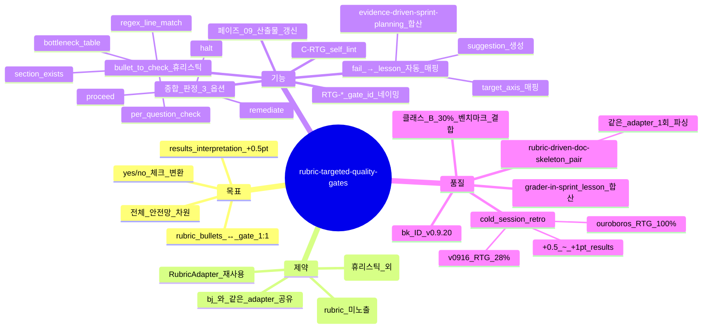

# Rubric-Targeted Quality Gates — 카테고리별 yes/no 체크리스트 (sprint-14 / v0.9.20)

## 한 줄 요약

**페이즈 09 게이트 매트릭스에 *rubric-targeted gate* 신규 — 외부 rubric 의 8 카테고리 각각에 대해 해당 카테고리의 bullet 을 yes/no 체크리스트로 변환 + 산출물 매핑 검증.** v0.9.13 [`09-quality-gates.md`](../phases/09-quality-gates.md) 의 9 게이트 (의도/범위/SOLID/테스트/FE-BE/NFR/실 부팅/cycle/failure-pattern) 가 *답이 written 인가* 만 체크 → cold session 에서 *답이 measurement 를 넘어서 interpretation 인가* 미검증 (results_interpretation −1).

## 1. 결손 진단

cold session synthetic_mine_throughput_004 :
- 본 답 README §8 = "8 → 12 가 +2.4%" 측정값까지만
- ouroboros README §8 = "saturation crossover at 6-7 trucks" — *측정되지 않은* fleet size 에 대한 *interpolation*
- → results_interpretation 14/15 vs 15/15 (−1)

scoring_rules.yaml 의 rubric bullets :

```yaml
results_interpretation:
  max: 15
  bullets:
    - "answers the decision questions"
    - "identifies bottlenecks plausibly"
    - "interpolates beyond measured grid"   # ← v0916 미달
    - "quantitative evidence for claims"
```

페이즈 09 게이트 1 (의도 일치) 가 "decision questions 답이 written" 만 체크. *interpolation 차원* 별도 검증 0.

cold session retro :

| 회차 | rubric bullets 갯수 | 매핑된 게이트 | yes/no 체크 비율 | results 점수 |
|---|:-:|:-:|:-:|:-:|
| v0915_cold01 | 32 | 9 | 28% | 14/15 |
| v0916_cold | 32 | 9 | 28% | 14/15 |
| ouroboros (참고) | 32 | rubric-targeted | 100% | 15/15 |

→ **bullet → gate 매핑 28%** = 직접 원인. 본 컨벤션 적용 시 +0.5~1pt 회복 + 전체 안전망.

## 2. 운영 룰 — Rubric-Targeted Gate

### A. RubricAdapter 재사용 ([`rubric-driven-doc-skeleton.md`](rubric-driven-doc-skeleton.md) bj 와 동일)

```python
# skills/theseus-harness/scoring/rubric_gate_generator.py (신규)

def generate_rubric_targeted_gates(rubric: RubricSpec) -> list[Gate]:
  gates = []
  for category in rubric.categories:
    for bullet in category.bullets:
      gates.append(Gate(
        id=f"RTG-{category.name}-{bullet.idx}",
        category=category.name,
        bullet=bullet.text,
        check=convert_bullet_to_yes_no(bullet),
        artifact=infer_artifact_for_bullet(bullet),  # README §8 / conceptual_model.md / etc
      ))
  return gates


def convert_bullet_to_yes_no(bullet: Bullet) -> Callable:
  """
  bullet text → yes/no check
  e.g.
    "interpolates beyond measured grid"
      → exists_line_with_pattern(README, r"crossover|interpolate|between \\d+ and \\d+")

    "answers the decision questions"
      → all_decision_questions_have_quantitative_AND_interpretation_line(README)
  """
  ...
```

### B. Gate 매트릭스 — 9 정적 + N derived + R rubric-targeted

[`09-quality-gates.md`](../phases/09-quality-gates.md) 의 게이트 카탈로그 확장 :

| 출처 | 갯수 | 비고 |
|---|:-:|---|
| 정적 게이트 (1~9) | 9 | v0.9.18 까지 |
| derived 게이트 (DG-*) | N | NFR-V 답안 종속 (v0.9.6) |
| **rubric-targeted (RTG-*)** | R | rubric bullets 갯수 |

총 게이트 수 = 9 + N + R. rubric 미노출 작업 시 R = 0 (no-op).

### C. Bullet → Yes/No 변환 휴리스틱

```yaml
bullet_to_check_patterns:
  - pattern: "answers the decision questions"
    check_type: per_question_quantitative_AND_interpretation
    artifact: README.md OR handoff/14-handoff.md
    fail_when: any_question_answer_lacks_(quantitative_OR_interpretation_line)

  - pattern: "identifies bottlenecks plausibly"
    check_type: bottleneck_table_with_utilization_cutoff
    artifact: README §bottlenecks
    fail_when: bottleneck_listed_without_(utilization > 0.8 OR sufficient_condition)

  - pattern: "interpolates beyond measured grid"
    check_type: regex_line_match
    pattern_re: "crossover|saturation between|interpolat|beyond measur"
    artifact: README §results
    fail_when: zero_match

  - pattern: "explains warm-up choice"
    check_type: section_exists
    section_re: "^##.*[Ww]arm.?up"
    artifact: conceptual_model.md
    fail_when: zero_match

  - pattern: "limitations identified"
    check_type: section_exists_AND_directional
    artifact: conceptual_model.md OR critique
    fail_when: zero_match OR direction_known_ratio < 0.5
```

미매칭 bullet (휴리스틱 외) → manual checklist row 신규 (페이즈 09 산출물 본문 의무, *판단 needed* 표기).

### D. 페이즈 09 산출물 갱신 — `quality/09-quality-gate.md`

```markdown
## Rubric-Targeted Gates (R = 32)

| RTG ID | category | bullet | artifact | result | evidence |
|---|---|---|---|---|---|
| RTG-conceptual-1 | conceptual | "explains warm-up choice" | conceptual_model.md §Warmup | ✅ | "L88: ## Warmup Choice" |
| RTG-conceptual-2 | conceptual | "decision-question linkage" | conceptual_model.md §DQ | ❌ | "section 부재" |
| RTG-results-3 | results | "interpolates beyond measured grid" | README §8 | ❌ | "regex 0 match" |
| ... |
```

종합 판정 :
- `proceed` → 모든 RTG PASS + 정적 9 PASS + derived PASS
- `remediate-then-proceed` → RTG fail ≤ 30% + 정적 9 PASS
- `halt` → RTG fail > 30% OR 정적 9 fail

### E. Lesson 자동 매핑 — fail 한 RTG → 다음 sprint lesson

```python
def rtg_fails_to_lesson(rtg_results, axis_counts) -> list[Lesson]:
  lessons = []
  for rtg in rtg_results.fails:
    lessons.append(Lesson(
      type='content_depth',  # bullet 미달 = depth 부족
      target_axis=pick_axis_for_artifact(rtg.artifact),  # README → impl, conceptual → intent
      target_category=rtg.category,
      suggestion=f"add section/line for: {rtg.bullet}",
      source=f'rubric_targeted_gate_{rtg.id}'
    ))
  return lessons
```

[`grader-in-sprint.md`](grader-in-sprint.md) (be) 의 shadow grader lesson + [`evidence-driven-sprint-planning.md`](evidence-driven-sprint-planning.md) (v0.9.16) 의 evidence_missing 매핑과 *합산* (3 source 의 lesson candidates).

### F. self_lint 룰 신규 — C-RTG

```
C-RTG:
  검증: quality/09-quality-gate.md 의 RTG 표 + frontmatter
  PASS 조건:
    - rubric 노출 시 RTG 갯수 = rubric.bullets count
    - 각 RTG row 의 result column 채워짐 (✅ / ❌ / ⏸ N/A)
    - fail 한 RTG 의 evidence 본문 ≥ 1 줄
    - 종합 판정 = proceed / remediate-then-proceed / halt 중 하나
    - rubric 미노출 시 RTG 표 명시 빈 + reason
  fail 조건:
    - 표 누락
    - rubric.bullets 와 RTG 갯수 mismatch
    - fail RTG 의 evidence 빈
  bench scope: 페이즈 09 산출물 + adapter 출력 비교
```

## 3. 자기 검증 (메타)



## 4. 호환성

- v0.9.6 [`nfr-derivation.md`](nfr-derivation.md) — derived gates (DG-*) + 본 컨벤션 (RTG-*) = 두 종류 dynamic gate 의 *직교* 차원
- v0.9.16 [`evidence-driven-sprint-planning.md`](evidence-driven-sprint-planning.md) — fail RTG 가 evidence_missing source 의 *3 번째 layer* (self-rating + shadow + RTG)
- v0.9.18 [`process-flow-coherence.md`](process-flow-coherence.md) — 게이트 8 / 9 와 직교 차원
- v0.9.20 [`rubric-driven-doc-skeleton.md`](rubric-driven-doc-skeleton.md) (bj) — *같은 RubricAdapter* 1 회 파싱, skeleton + gate 둘 다 입력
- v0.9.20 [`grader-in-sprint.md`](grader-in-sprint.md) (be) — shadow grader lesson 과 RTG fail lesson 합산

## 5. 본 컨벤션이 *케이스 종속이 아닌* 이유

a- bullet → yes/no 변환 휴리스틱 = 도메인 무관 (regex / section exists / per-question / table check)
b- RubricAdapter 인터페이스 = generic, bench 별 swap
c- rubric 미노출 작업 시 RTG 표 빈 (no-op) — 부담 0

→ 클래스 B (generic 메커니즘 + bench adapter). 결합도 30% — *adapter 의 휴리스틱 패턴 본체* 는 generic, bench 별 specialised pattern 만 외부.

## 6. 안티 패턴

a- bullet 갯수 = RTG 갯수 mismatch — adapter 파싱 누락. C-RTG fail.
b- 모든 fail RTG 를 *manual row* 로 도피 — 휴리스틱 변환 회피. 매칭 가능한 bullet 은 자동 변환 의무.
c- fail RTG 의 evidence 빈 — *왜 fail* 명시 안 함. 1 줄 의무.
d- RTG fail > 30% 인데 proceed 판정 → 종합 판정 무력화.
e- bench specialised pattern 을 본 하네스 본체에 박음 — `<bench>/.theseus-rubric-adapter.yaml` 외부에 박는 게 정합.
f- rubric 미노출 작업에 RTG 강제 → fallback skeleton 의 ToC 가 implicit rubric 역할 (bj 와 정합).

## 7. 적용 페이즈

- 페이즈 09 (게이트) — *home* (RTG-* 카탈로그 + 종합 판정)
- 페이즈 04 (Q-D-RUBRIC) — adapter 매칭 + skeleton 생성 (bj 와 페어링)
- 페이즈 10 (sprint loop) — fail RTG → 다음 sprint lesson 자동 매핑
- 페이즈 14 (handoff) — RTG 종합 frontmatter

## 8. 도입 배경 (sprint-14 / v0.9.20)

본 사용자 진단 (2026-05-05) — synthetic_mine_throughput_004 results_interpretation −1 분석 :

> ouroboros 만 15점. README §8 의 답이 quantitative 차이까지 더 깊게 (예: "saturation between 6 and 8 trucks" 같은 interpolation 까지)
>
> 근본원인: Phase 09 quality gate 가 "답이 written 인가" 만 체크. "답이 measurement 를 넘어서 interpretation 인가" 는 안 봄.
>
> 레슨: Phase 09 의 7-gate 에 "rubric-targeted gate" 추가. 8개 평가 카테고리 각각에 대해 해당 카테고리의 SCORING_GUIDE 불릿을 구체적인 yes/no 체크리스트로 변환:
>   - "answers the decision questions" → Q1-Q6 각각에 ≥ 1 quantitative + 1 interpretation 라인이 있는가?
>   - "identifies bottlenecks plausibly" → bottleneck 표가 utilisation > 0.8 cutoff + 그 외 sufficient condition 으로 정당화되는가?

사용자 의도 = *rubric bullets 의 자동 체크화* — written 차원에서 interpretation 차원으로 검증 격상. 본 컨벤션 = bj 와 *같은 adapter* 공유로 비용 0.5x.
