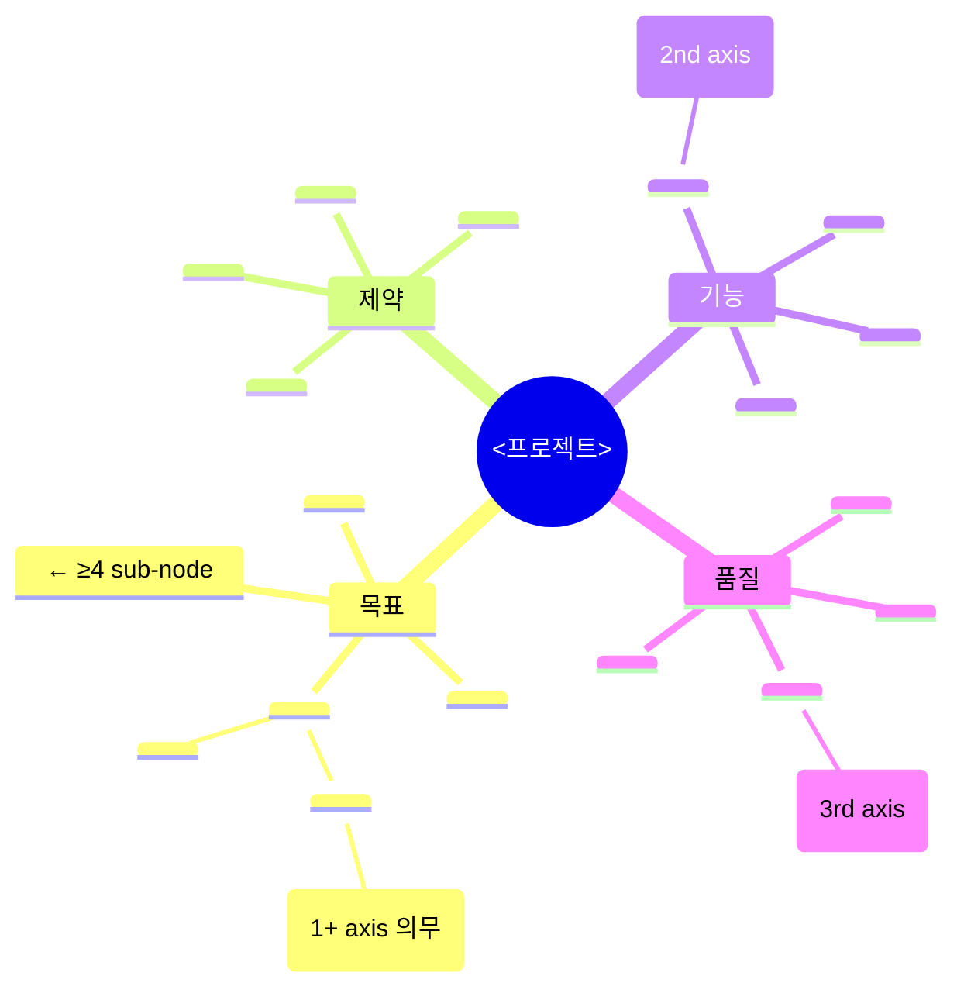

# Phase 01 — 의도 추출

## 한 줄 요약
**사용자 원문 요청을 구조화된 의도 문서로 만들어 모든 후속 에이전트가 같은 출발점을 갖게 한다.** 해석은 하되, 답을 정하지는 않는다.

## 입력
- 사용자의 원본 요청 (대화 첫 메시지).
- `naming/00-naming.md` (프로젝트명·모듈명 확정본).
- 레포의 `README.md` 와 분명한 진입점 — 의도가 실 코드에 grounding 되도록.

## 서브에이전트
[`../agents/intent-extractor.md`](../agents/intent-extractor.md) 프롬프트로 `Agent(subagent_type="general-purpose")` 호출.

## 산출물
`intent/01-intent.md` — [`../templates/intent.template.md`](../templates/intent.template.md) 의 모든 섹션 채움. 헤더는 [`../conventions/timing.md`](../conventions/timing.md) 의 시간 정보 포함.

채울 항목:

a- **무엇을** — 한 문단, 외부에서 관찰 가능한 결과.
b- **왜** — 풀려는 문제 또는 전달 가치.
c- **비목표** — 명시적으로 범위 밖.
d- **제약** — 성능·호환·보안·운영·마감.
e- **유비쿼터스 언어** — 도메인 용어 정의.
f- **스테이크홀더** — 결과의 소비자.
g- **성공 지표** — 외부에서 관찰·계량 가능.
h- **열린 질문** — 원문에서 결정 불가한 것 (반드시 1개 이상).
i- **Derived NFRs from prompt qualitative adjectives** ([`../conventions/nfr-derivation.md`](../conventions/nfr-derivation.md), v0.9.6) — prompt 본문의 *형용사군* (clear/reproducible/interpretable/...) 을 LLM-driven semantic match 로 nfr-derivation 표 의미군 (Q1~Q10) 에 매핑 + 매칭된 NFR 후보 list. 각 항목에 (a) 출처 형용사 인용 (b) 매핑 의미군 ID (c) verification method 후보 ≥1. 매칭 0개면 "functional-only — qualitative NFR 명시 0" 명시 (drift 가드). *본 §i 는 §d 의 명시 제약 과 직교* — d 는 *명시 임계* (성능 200ms 등), i 는 *prompt 형용사 도출 NFR*.

j- **Grade signals 산출 (v0.9.17 신규)** — `intent/01-grade-signals.json` + `intent/01-mindmap-signals.json` 두 산출물. 본 §a~§i + 마인드맵을 18+ 차원 신호로 추출 (외부 관찰 결과 수 / 비목표 수 / 제약 수 / 임계 수 / 도메인 용어 수 / 스테이크홀더 수 / 성공 지표 수 / 측정 지표 수 / 열린 질문 수 / NFR 수 / 형용사 수 / 마인드맵 노드 수 / axis 수 / 깊이 / 외부 시스템 / 도메인 noun / multi-scenario / external evaluator / FE+BE / refactor 모듈 수 / safety_critical / irreversible_change). [`../conventions/grades.md`](../conventions/grades.md) 의 신호 카탈로그 표 정합. 페이즈 04 Q-G1 직전 `scoring/grade_assess.py` 가 본 두 산출물을 입력으로 그레이드 추정 (default = G4, 키워드 매칭 X).

  **신호 추출 룰** (intent-extractor 에이전트):
  - `safety_critical` / `irreversible_change` 는 *사용자 명시 ack* 만 True — 자율 키워드 매칭 금지. 의도 §b 왜 / §d 제약에 사용자가 명시한 경우만.
  - `mindmap_*` 는 §a~§i 와 별도로 마인드맵 markdown 파싱.
  - boolean 신호 (`multi_scenario` / `external_evaluator` / `fe_be_split`) 는 §a 무엇을 / §d 제약 / §g 성공 지표에서 *명시 표현* 검출 시 True.

## 성공 기준

a- 문서 자족성 — 원문을 보지 않은 사람이 이 문서만 읽고 무엇을 만들어야 할지 알 수 있다.
b- 기본 백엔드 스택은 사용자가 명시 없으면 Go 로 가정하되, 이 문서는 기술 비종속이다 — 스택 선택은 페이즈 06 (계획) 의 책임. 의도 단계는 "Go 가 자연스러운가" 정도의 메모만 허용.
c- 열린 질문이 비어 있지 않다.
d- §i "Derived NFRs" 절이 *존재* — 매칭 결과가 0개라도 "functional-only" 명시. self_lint 가 §i 누락 자동 fail.
e- §j "Grade signals" 두 산출물 박힘 — `intent/01-grade-signals.json` + `intent/01-mindmap-signals.json`. 페이즈 04 Q-G1 입력. self_lint C-GAv2 가 누락 검증.

## 흔한 실패

a- 원문을 그대로 복창 — 해석 없음. 재실행 지시.
b- 명시 안 된 스택을 결정해버림 — 의도 단계에서 결정 금지, 가정 메모만 허용.
c- 열린 질문 0개 — 게으른 추출. 재실행.

> **공통 안티 패턴** (조기 추상화 / 분산 모놀리스 / 두괄식 누락 / 객관식 라벨 등) 은 [`../SKILL.md`](../SKILL.md) "안티 패턴 통합 카탈로그" 참조.

## v0.9.19 sprint-13 갱신 — 마인드맵 A 등급 default + intent sprint loop

a- **마인드맵 A 등급 default** ([`../conventions/mindmap-richness-default.md`](../conventions/mindmap-richness-default.md), ba) — §9 마인드맵 산출물의 frontmatter `mindmap_quality_grade` 가 A (≥25 노드 / 4 axis × ≥4 sub / 3 axis sub-sub + 1 axis sub-sub-sub) default. B fallback PASS *with lesson* — sprint NN+1 의 mindmap 보강 trigger. C/D = 페이즈 02 진입 거부.

b- **intent-extractor templated stub 의무** — agent 가 *templated mindmap stub* 을 base 로 출력 후 도메인-specific 노드 ≥ 9 개 추가 (자동 ≥ 25 노드 + A 등급 도달).

c- **intent sprint loop** ([`../conventions/intent-plan-impl-sprint-trinity.md`](../conventions/intent-plan-impl-sprint-trinity.md), bd) — 페이즈 10 sprint trinity 의 *intent axis* 가 본 페이즈 산출물을 polishing 대상. axis 별 ≥ 2 sprint 강제. 첫 sprint = baseline measure, 두 번째 sprint = mindmap richness / §k limitation / §i derived NFR 보강.

### Templated Section §9 (mindmap-richness-default.md ba)

agent 는 본 stub 을 *그대로 base* 로 도메인-specific 노드 ≥ 9 개 추가하면 자동 ≥ 25 노드 + A 등급 도달. self_lint C-MRD-A-DEFAULT + C-MQG-FORMAT/WIDTH/DEPTH/RICHNESS 검증.
