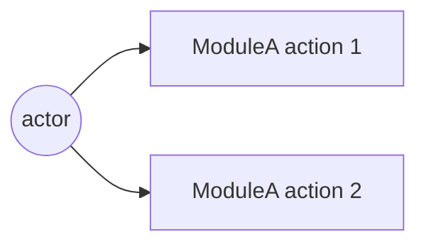
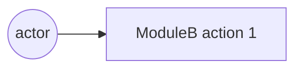

# Phase 06 — 계획 (TODO 형)

## 한 줄 요약
**TODO 단위의 평탄한 구현 계획을 만든다.** 각 TODO 는 한 번의 서브에이전트 호출로 끝낼 수 있을 만큼 작고, 명확한 "완료 조건" 을 갖는다.

## 마지막 sub-step — TODO DAG 분석 의무 호출 (sprint-34 v0.9.39)

phase 06 종료 *직전* (canonical `plan/06-plan.md` 확정 후, phase 07 진입 전) 다음 명령 의무 호출:

```bash
python skills/theseus-harness/scoring/sub_agent_dispatch.py analyze-todos \
    --plan-md .ShipofTheseus/<프로젝트>/plan/06-plan.md --grade <G>
```

출력은 `plan/06-todo-fan-out.json` 에 보존 — phase 08 implementer 가 입력으로 사용:

- exit 0 + `max_parallel ≥ 2` → phase 08 가 같은 level 의 TODO 를 *동시 fan-out* (`recommended_mode` 따라 parallel/competition)
- exit 0 + `max_parallel = 1` → 순차 dispatch (의존 chain)
- exit 1 (cyclic 의존 또는 `total_todos = 0` 또는 형식 비정합) → phase 06 재진입 강제, `intent/00-violation.md` 기록

자세한 위상 정렬 알고리즘 + 그레이드별 모드 추천: [`../conventions/subagent-trigger.md`](../conventions/subagent-trigger.md).

## 입력
- `intent/01-intent.md`, `intent/04-answers.md`, `intent/05-critique.md`, `intent/05-decisions.md`
- `naming/00-naming.md` (모듈명 확정본)

## 서브에이전트
[`../agents/planner.md`](../agents/planner.md) 로 `Agent(subagent_type="Plan")`.

## 산출물
`plan/06-plan.md` — [`../templates/plan.template.md`](../templates/plan.template.md) 의 7개 필드를 모든 TODO 에 채움:

| 필드 | 의미 |
| ---- | ---- |
| `ID` | `T-001`, `T-002`, … |
| `제목` | 명령형 한 줄 |
| `모듈` | 명명 페이즈에서 정해진 모듈명 (`be4fe/auth`, `fe/login` 등) |
| `레이어` | `domain` / `application` / `adapter` / `ui` / `infra` / `test` |
| `의존` | 다른 TODO ID 목록 |
| `완료 조건` | 외부 관찰·테스트 가능 |
| `테스트` | 단위·통합·E2E 어느 것을 같이 출하 |
| `목 표면` | 노출하는 포트/페이크 |

## 시퀀스 다이어그램 동봉 (필수)

[`../conventions/diagrams.md`](../conventions/diagrams.md) §3 에 따라 `plan/06-plan.md` 에 두 종류의 Mermaid 시퀀스 다이어그램을 코드 펜스로 동봉:

a- **모듈 내부 시퀀스** — 도메인 ↔ 어댑터 ↔ 포트 호출 흐름.
b- **모듈 외부 시퀀스** — FE ↔ BE ↔ DB ↔ 외부 API.

각 화살표에 호출 함수명·요청/응답 페이로드 키 표기. PlantUML 도 허용하지만 프로젝트 시작 시 형식 하나로 고정.

## 플랜 트리 (디폴트, G3+) — AIDE 멀티버스

[`../conventions/plan-tree.md`](../conventions/plan-tree.md) 가 본 페이즈의 *디폴트 동작*. G3 이상이면 단일 플랜 대신 2~5 우주의 트리:

a- 폭 (root 우주 수) 와 깊이 cap 은 [`../conventions/grades.md`](../conventions/grades.md) 의 그레이드 매트릭스 + plan-tree 매트릭스 병합 결정.
b- 시드 카탈로그 5 종 (domain-first / adapter-first / minimal-subtraction / tdd-topology / strict-layering) 중 그레이드별 필수 + 옵션 시드 선택.
c- 형제 우주는 격리 + 병렬 디스패치 ([`../conventions/competition.md`](../conventions/competition.md) 재사용).
d- 자식 우주는 부모 우주 완료 후 깊이 layer 단위 디스패치 (자원 가드).
e- 토너먼트는 plan-reviewer (페이즈 07) 가 우주별 fresh 콜드 리딩 (4 답) → 5 차원 점수 → auto_resolve.
f- 결과는 `plan/tournament.md` (사용자 대면) + `plan/06-plan.md` (우승 우주 사본, 다음 페이즈 입력).

G1·G2 는 트리 비활성 — 단일 플랜 그대로.

옛 트리거 진입 ([`../conventions/competition.md`](../conventions/competition.md) 의 트리거 b "모듈 분할 길항") 은 *G3+ 에서는 항상 참* 으로 의미 변경 — 디폴트 진입.

## 필수 섹션

a- **스캐폴딩** — 모듈 경계, 포트 인터페이스, 패키지 레이아웃. 로직 전.
b- **테스트 인프라** — 단위·통합·E2E 하네스 셋업. 첫 기능 TODO 전.
c- **백엔드 기능 TODO** — 의존에 따라 프론트와 교차 배치.
d- **프론트엔드 기능 TODO** — 동일.
e- **연결 TODO** — 모듈 간 e2e 연결.
f- **하드닝 TODO** — 에러 경로, 엣지, 옵저버빌리티.

## 기본 스택

사용자가 다른 스택을 명시하지 않으면:

a- **백엔드 / API / 엔진** — Go (`net/http`, `chi` 또는 `echo`, 표준 라이브러리 우선).
b- **프론트엔드** — bun + React (Phase 12 의 웹뷰와 같은 런타임 패밀리, 빌드 도구 통일).
c- **테스트 — Go** — 표준 `testing` + `testify`. 통합은 `httptest`.
d- **테스트 — FE** — `bun test` + `playwright` (E2E).

다른 스택 결정이 있다면 `intent/05-decisions.md` 또는 `intent/04-answers.md` 에 명시되어 있어야 한다.

## TODO 사이즈 룰

a- 한 서브에이전트 호출에 끝낼 수 있을 것 (대략 < 200 LOC 변경).
b- 단일 외부 관찰 가능한 "완료 조건".
c- 테스트 같은 줄에 명시 — "테스트는 T-099 에서" 금지.

## 성공 기준

a- `의존` 그래프가 acyclic — 본인이 검증.
b- 모든 leaf TODO 아래에 테스트 TODO 가 최소 하나.
c- 모든 TODO 제목에 "and" 없음 — 있으면 분할 신호.

## 흔한 실패

> **공통 안티 패턴** (A1~A10) 은 [`../SKILL.md`](../SKILL.md) "안티 패턴 통합 카탈로그" 참조. 본 페이즈 고유 실패는 (현재 발견 없음 — 후속 회차에서 추가).

## implementation guidance — plan 본문 의무 (sprint-05-e Q3)

plan 이 *what to build* 에 그치지 않고 *how to build* 의 핵심 디자인 결정도 본문에 박는다 — 별도 impl-design.md 신규 산출물 만들지 않고 plan 본문 흡수가 정공 (메모리 보수화 정합).

### 본문 의무 추가 (HARD-RULE 9.a 강화)

기존 본문 의무 :
- 모듈 분할 + 파일 배치 (≥ 5 파일 경로)
- Mermaid 시퀀스 ≥ 1 OR 인터페이스 정의 ≥ 3
- TODO DAG (T-001, ...)

**추가 (sprint-05-e)** :
- **데이터 구조** ≥ 2 — 핵심 entity / state object 의 dataclass 또는 schema 정의 (필드 타입 명시)
- **의사코드** ≥ 1 — 핵심 알고리즘 (디스패치 / 라우팅 / 머지 등) 의 의사코드 또는 단계별 설명
- **클래스 시그니처** ≥ 3 — 주요 클래스의 `__init__` + 핵심 메서드 시그니처 (Python 형식 또는 의사 형식)

### 왜 신규 산출물 (impl-design.md) 안 만드나

a- plan 이 충분히 상세하면 *중복* — sprint-05-c universe 별 plan 569~699 lines 에 이미 implementation guidance 일부 포함
b- 산출물 1 추가 = sub-agent 호출 + 시간 비용
c- plan + impl-log 의 관계 = 디자인 + 결과. 그 사이 *implementation guidance 디자인* 분리 = 응집 약화
d- HARD-RULE 9.a 본문 의무 강화로 *plan 안에서* implementation guidance 박는 것이 정공

### 산출물 매핑

| 본문 의무 | 페이즈 11 회귀 분류 (sprint-05-e Q1) 와의 연결 |
|----|----|
| 모듈 분할 + 파일 배치 | impl 이 plan 따랐는지 = 디렉터리 일치 |
| Mermaid / 인터페이스 | impl 의 인터페이스 시그니처 = plan 일치 |
| TODO DAG | impl-log 의 TODO 매핑 = plan ID 일치 |
| **데이터 구조** | impl 의 dataclass 필드 = plan schema 일치 → impl defect 검출 |
| **의사코드** | impl 의 알고리즘 동작 = plan 의사코드 일치 → plan defect vs impl defect 판별 |
| **클래스 시그니처** | impl 의 메서드 시그니처 = plan 일치 → drift 검출 |

페이즈 11 회귀 분류가 본 implementation guidance 와 *대응* — plan 의 데이터 구조/의사코드/클래스 시그니처가 명시되어 있어야 회귀 시 *plan defect vs impl defect* 자동 판별 가능.

### sprint-05-c 회고

sprint-05-c 의 universe-3 plan 569 lines 에 데이터 구조 (TruckPool dict, Truck dataclass, EventQueue heap), 의사코드 (`_dispatch_event(ev)` switch), 클래스 시그니처 (`SchedulerLoop.run(env)`, `EventQueue.push/pop`) 모두 박혀있었음. 본 sprint-05-e 룰은 그 패턴을 *명시 의무* 로 격상.

## 폭 default 5/7/9 + per-module use-case + plan sprint loop

### 폭 default 격상 ([`../conventions/multiverse-width-default-bump.md`](../conventions/multiverse-width-default-bump.md), bc)

| Grade | 폭 default | 옵션 default (사용자 명시 ack) | 비고 |
|---|:-:|:-:|---|
| G2 | 2 | n/a | single 또는 2 후보 |
| G3 | **5** (← 3) | 10 | axis 카탈로그 상위 5 활용 |
| G4 | **7** (← 4) | 12 | 5 시드 + 2 axis (FE+BE × stance) |
| G5 | **9** (← 6) | 16 | depth 2 자식 분기 + 4 axis 추가 |

budget tight 시 fallback 폭 + `fallback_reason` frontmatter 의무 ([`../conventions/budget-aware-fallback.md`](../conventions/budget-aware-fallback.md)). self_lint C-MWDB 가 검증.

### per-module use-case / sequence 다이어그램 default ([`../conventions/per-module-diagram-fan-out.md`](../conventions/per-module-diagram-fan-out.md), bb)

페이즈 06 plan/06-plan.md 의 모듈 수 ≥ 4 OR consumer-producer 페어 ≥ 6 → per-module 다이어그램 ≥ 모듈 수 의무. 모듈 ≤ 3 시 단일 통합 OK.

```markdown
### Templated per-module section (bb 의무)

## per-module use-case 다이어그램 (모듈 ≥ 4 trigger)

### use-case: ModuleA


### use-case: ModuleB


(모듈 ≥ 4 만큼 반복)
```

self_lint C-PMDF 가 검증.

### plan sprint loop ([`../conventions/intent-plan-impl-sprint-trinity.md`](../conventions/intent-plan-impl-sprint-trinity.md), bd)

페이즈 10 sprint trinity 의 *plan axis* 가 본 페이즈 산출물을 polishing 대상. axis 별 ≥ 2 sprint 강제. 첫 sprint = baseline measure, 두 번째 sprint 의 axis lesson 후보 :
- 모듈 분할 보강 (per-module use-case 추가)
- 인터페이스 정의 ≥ 5 추가 (dataclass / pseudocode / 클래스 시그니처)
- TODO DAG 의존 보강 (leaf TODO 별 테스트 TODO 추가)

## Contested Decisions + Measurement Contract

### Contested Decisions 추출 + universe axis 회전 ([`../conventions/contested-decision-multiverse.md`](../conventions/contested-decision-multiverse.md), bf)

본 페이즈 진입 시 plan-tree 분기 *전에* sub-procedure :

1- **추출** — `prompt + intent/03-comprehension.md + intent/05-critique.md` 에서 *contested decisions* 자동 파싱 (3 source : prompt explicit hedge / cold-read implicit 자신없음 / critique potential ⚠).
2- **`plan/contested-decisions.md` 신규 산출물** — 표 + frontmatter (id / source / kind / branch_a / branch_b / impact_dim).
3- **universe axis 결정** :
   - decisions ≥ width → 상위 width decisions 의 *branch_a/branch_b* 양 가지를 universe seed
   - decisions < width → decisions + paradigm seed (5 시드 카탈로그) 보충
   - decisions = 0 → paradigm seed fallback (v0.9.13 default)
4- **각 universe `meta.md` 에 code spike (≤ 50 LOC)** — 같은 인터페이스 다른 구현. prose 비교 0.

### Tournament 채점 갱신 — `decision_coverage` 차원 (bf)

[`../conventions/plan-tree.md`](../conventions/plan-tree.md) 5 차원 → 6 차원 (가중 재분배) :

| 차원 | 가중 |
|---|---:|
| cold_recall | 0.25 (← 0.30) |
| dip_strictness | 0.20 (← 0.25) |
| simplicity | 0.15 (← 0.20) |
| test_topology | 0.10 (← 0.15) |
| fe_be_parity | 0.10 |
| **decision_coverage** (신규) | **0.20** |

`decision_coverage < 0.6` universe 즉시 탈락. self_lint C-CDM 검증.

### Measurement Contract — 본문 의무 섹션 ([`../conventions/measurement-contract.md`](../conventions/measurement-contract.md), bi)

`plan/06-plan.md` 신규 의무 섹션 — 모든 정량 metric 에 method 명시 :

```markdown
## Measurement Contract (measurement-contract.md bi 의무)

| metric | 정의 | 측정 방법 | (reconstruct 시) 정당화 |
|---|---|---|---|
| (예시) loader_utilisation | D_LOAD busy_time / shift | accumulate (Resource hook) | n/a |
| (예시) crusher_busy_proxy | cycles × mean_dump_time | reconstruct | "secondary control metric, primary uses accumulate" |
```

method 3 옵션 : **sample** (snapshot) / **accumulate** (event hook 누적) / **reconstruct** (다른 metric 으로 유도). reconstruct row 는 *정당화 column 의무* (1 줄 mechanism — 왜 direct 측정 불가).

frontmatter sync :

```yaml
---
metrics: [{name: ..., method: ..., justification: ...}]
metric_count: <N>
direct_measurement_ratio: <0.0-1.0>
reconstruct_justified_ratio: <0.0-1.0>
---
```

작업이 non-metric (pure refactor / UI 변경) 시 표 빈 + reason (no-op). self_lint C-MC 검증. 페이즈 09 게이트 6 강화 (direct_ratio < 0.7 시 cap 0.85). 페이즈 11 회귀 분류에 plan_method vs impl 비교가 입력.

### plan 본문 의무 (HARD-RULE 9.a 강화 — sprint-14 추가)

기존 (sprint-05-e) :
- 모듈 분할 + 파일 배치 (≥ 5 파일 경로)
- Mermaid 시퀀스 ≥ 1 OR 인터페이스 정의 ≥ 3
- TODO DAG
- 데이터 구조 ≥ 2 / 의사코드 ≥ 1 / 클래스 시그니처 ≥ 3

**추가 (sprint-14)** :
- **Measurement Contract 표 ≥ 1 row** (또는 빈 표 + reason for non-metric)
- **per-universe code spike** (각 universe meta.md, ≤ 50 LOC, contested decisions 매핑 시)
- **plan frontmatter `audience` field** ([`../conventions/commentary-policy.md`](../conventions/commentary-policy.md) bh) — `internal-self | external-reviewer | mixed`

## Da Capo Loop (의사코드)

[`../conventions/intra-phase-dacapo-loop.md`](../conventions/intra-phase-dacapo-loop.md) (bl) — multiverse fan-out + tournament + shadow grade + threshold AND + lesson + 처음으로 돌아감. **다카포 방식**.

본 phase 의 *home* loop. tournament 결과 winner_score 가 grade threshold 미달 시 *재경합 0 회* 회귀 (cold session `2026-05-05__001_synthetic_mine_throughput__...g4` 의 winner=0.853 회귀) 차단.

```python
# Phase 06 Da Capo Loop — 본 phase 본문에 *그대로 박힌 의사코드*. agent 가 이 step 순서대로 실행.

def phase_06(grade, prompt, intent_artifacts):
    threshold     = {G3: 0.97, G4: 0.999, G5: 0.99999}[grade]
    shadow_target = {G3: 90,   G4: 95,    G5: 98     }[grade]
    width         = {G3: 5,    G4: 7,     G5: 9      }[grade]   # bc multiverse-width-default-bump
    max_rerun     = {G3: 2,    G4: 3,     G5: 5      }[grade]
    artifact_dir  = '.ShipofTheseus/<프로젝트>/plan/'

    # ── Step A. Initial multiverse fan-out (Da Capo *처음* 지점) ───────
    contested = extract_contested_decisions(prompt, intent_artifacts)  # bf 3 source 파싱
    seeds = pick_axis_priority(
        contested,
        priority = ['contested_decisions', 'paradigm_5_seeds'],         # bf v0.9.20
        count    = width,
    )
    universes = [
        spawn_planner_universe(seed=seeds[n], universe_id=n)             # u, ag, ae
        for n in range(1, width + 1)
    ]
    # 산출: plan/candidates/universe-N/{meta.md, 06-plan.md, code-spike.py(≤50 LOC)}
    rerun = 0

    while True:

        # ── Step B. Tournament — 6 차원 weighted score (bf decision_coverage 0.20) ─
        for u in universes:
            u.tournament_score = score_6dim(u, weights={
                'cold_recall':       0.25,
                'dip_strictness':    0.20,
                'simplicity':        0.15,
                'test_topology':     0.10,
                'fe_be_parity':      0.10,
                'decision_coverage': 0.20,    # bf v0.9.20 신규 차원
            })
        winner = argmax(universes, key='tournament_score')
        write(f'{artifact_dir}tournament-{rerun:02d}.md', universes, winner)

        # ── Step C. Shadow grader (be v0.9.20) — zero-context Sonnet ──
        shadow = call_shadow_grader(
            rubric       = load_generic_rubric(),                # cold-bench 정합 (bench rubric 차단)
            artifacts    = [winner.dir / '06-plan.md',
                            winner.dir / 'meta.md',
                            winner.dir / 'code-spike.py'],
            model        = 'Sonnet',
            context_mode = 'zero-context',
        )
        write(f'{artifact_dir}shadow-grade-{rerun:02d}.json', shadow)

        # ── Step D. 4 conjunction AND threshold (be 의 phase-내 변형) ──
        tournament_pass = (winner.tournament_score >= threshold)
        shadow_pass     = (shadow.predicted_score   >= shadow_target)
        if tournament_pass AND shadow_pass:
            promote_to_phase_artifact(winner, target=f'{artifact_dir}06-plan.md')
            return CONVERGED(winner, rerun_count=rerun)         # → phase 07 진입

        # ── Step E. Cap (max_rerun OR budget 95%) ─────────────────────
        rerun += 1
        if rerun >= max_rerun OR budget_used_total() >= 0.95:
            promote_to_phase_artifact(winner, target=f'{artifact_dir}06-plan.md')
            write_fallback_reason(
                f'{artifact_dir}fallback-reason.md',
                reason = f'rerun={rerun}/{max_rerun}, '
                         f'budget={budget_used_total():.2f}, '
                         f'winner={winner.tournament_score} < {threshold}, '
                         f'shadow={shadow.predicted_score} < {shadow_target}',
            )   # ah budget-aware-fallback 의무
            return BUDGET_BOUND(winner, rerun_count=rerun)

        # ── Step F. Lesson 도출 + winner 갱신 ─────────────────────────
        weakest = pick_weakest_dim(
            tournament    = winner.sub_scores,                  # 6 dim 중 최저
            shadow        = shadow.weakest_category,             # be
            evidence_gaps = winner.evidence_missing,             # ar v0.9.16
        )
        lesson = build_lesson(weakest, candidates=[
            'bg directional-simplification 표 row 추가 (limitations 방향성 ↑/↓/?)',
            'bi measurement-contract reconstruct 정당화',
            'bb per-module-diagram 분리 (모듈 ≥ 4 시)',
            'aa mindmap-quality §2 구조 (concept) 보강',
            'bf contested-decision spike 양 가지 코드 (≤50 LOC) 추가',
            'ae interface-first 인터페이스 정의 ≥ 5 추가',
        ])
        winner_v2 = apply_lesson(winner, lesson)                # winner artifact 갱신
        write(f'{artifact_dir}dacapo-rerun-{rerun:02d}.md', lesson, winner_v2)

        # ── Step G. Da Capo — *처음* (Step A) 으로 돌아감 ──────────────
        anon_prev = anonymize_winner(winner_v2)                 # ad v0.9.10 룰 (frontmatter scrub + ID 익명화)
        fresh_seeds = pick_seeds_excluding(prev_seed=winner.seed, count=width - 1)
        fresh = [spawn_planner_universe(seed=s, universe_id=f'rerun-{rerun}-{i}')
                 for i, s in enumerate(fresh_seeds, 1)]
        universes = [anon_prev] + fresh                          # blind — fresh agent 모름
        continue                                                  # ↑ Step B 로 자동 재진입
```

self_lint 검증 (sprint-15 신규) :

- **C-DCL-WIN-THRESHOLD** — `winner.tournament_score < threshold AND rerun_count == 0` 인데 `phase 07 산출물 존재` 시 fail
- **C-DCL-RERUN-LOG** — `rerun_count >= 1` 시 `dacapo-rerun-NN.md` 갯수 == rerun_count + 각 frontmatter `lesson_applied` 본문 ≥ 1 줄
- **C-DCL-ANON** — `rerun >= 1` 시 universe 1 개가 anonymized previous winner (ad C-TBR-ANON 정합)

## 의사코드 → runtime guard 변환

v0.9.21 의사코드는 *agent 행동 가이드*. v0.9.22 가 그 위에 *orchestrator runtime guard* layer 박음. 두 layer 가 박혀야 enforcement 완성. 외부 cold session `2026-05-05__001_mine_g4` 의 winner=0.892 (G4 임계 0.999 미달) + rerun=0 + fallback="" 회귀 직접 정정.

### Phase 06 → 07 핸드오프 의무 게이트 ([`../conventions/dacapo-enforcement.md`](../conventions/dacapo-enforcement.md), ap)

```python
# orchestrator 가 phase 07 진입 *전* 자동 호출. 6 조건 미달 시 phase 06 Step A 재진입.
def gate_phase06_to_07(artifact_dir: Path, grade: Grade) -> GateResult:
    tournament = load_latest_tournament(artifact_dir / 'plan')
    fm = parse_frontmatter(tournament)

    # 조건 1 — dacapo_loop_executed
    if not fm.get('dacapo_loop_executed'):
        return REJECT('dacapo_loop_executed 부재')

    # 조건 2 — step_d_*_pass 3종 frontmatter 명시
    for f in ['step_d_tournament_pass', 'step_d_shadow_pass', 'step_d_converged']:
        if f not in fm:
            return REJECT(f'{f} frontmatter 부재')

    # 조건 3a — CONVERGED 경로
    if fm['step_d_converged']:
        return ACCEPT('CONVERGED')

    # 조건 3b — BUDGET_BOUND 경로
    rerun, max_rerun = fm.get('rerun_count', 0), MAX_RERUN[grade]
    budget = fm.get('budget_used_total', 0.0)
    if rerun >= max_rerun OR budget >= 0.95:
        fb = artifact_dir / 'plan/fallback-reason.md'
        if not fb.exists() OR fb.read_text().strip() == '':
            return REJECT('BUDGET_BOUND 인데 fallback-reason.md 본문 비어있음')

        # 조건 4 — rerun log 갯수
        rerun_logs = list((artifact_dir / 'plan').glob('dacapo-rerun-*.md'))
        shadow_logs = list((artifact_dir / 'plan').glob('shadow-grade-*.json'))
        if len(rerun_logs) != rerun:
            return REJECT(f'dacapo-rerun-NN.md {len(rerun_logs)} != rerun_count {rerun}')
        if len(shadow_logs) != rerun + 1:
            return REJECT(f'shadow-grade-NN.json {len(shadow_logs)} != rerun_count+1')

        # 조건 5 — anonymized prev winner
        if not has_anonymized_previous_winner(artifact_dir, rerun):
            return REJECT('anonymized previous winner 부재 (ad C-TBR-ANON)')

        # 조건 6 — dacapo-flow.md
        flow = artifact_dir / 'plan/dacapo-flow.md'
        if not flow.exists() OR '```mermaid' not in flow.read_text():
            return REJECT('dacapo-flow.md Mermaid 부재 (at 가시화 의무)')

        return ACCEPT('BUDGET_BOUND')

    return REJECT('의사코드 Step F/G skip detected')


def on_gate_reject(reason: str):
    write_violation('intent/00-violation.md', phase=6, reason=reason)
    if increment_violation_count() >= 3:
        return ASK_USER('Da Capo gate 3회 fail — 진단 필요')
    re_enter_phase(6)   # Step A 부터 재실행
```

### tournament-NN.md frontmatter 의무 ([`../conventions/dacapo-frontmatter-schema.md`](../conventions/dacapo-frontmatter-schema.md), aq)

```yaml
---
dacapo_loop_executed: true
rerun: 00
rerun_count: 0
grade: G4
threshold: 0.999
shadow_target: 95
max_rerun: 3
multiverse_width: 7
winner_id: universe-3
winner_score: 0.892
winner_sub_scores: { cold_recall: 0.85, dip_strictness: 0.72, ... }
weakest_dim: dip_strictness
step_d_tournament_pass: false
step_d_shadow_pass: false
step_d_converged: false
step_e_cap_reached: false
budget_used_total: 0.42
next_action: dacapo_rerun
fallback_reason: ""
---
```

### Step C — shadow grader zero-context 무결성 ([`../conventions/shadow-grader-zero-context.md`](../conventions/shadow-grader-zero-context.md), ar)

```python
# Step C 수정 — fresh sub-agent 호출 보증 + cross-validation
shadow = call_shadow_grader_with_integrity(
    rubric_path  = 'scoring/rubrics/generic-bench-rubric.md',
    artifacts    = [winner.dir / '06-plan.md', ...],
    model        = 'Sonnet',
)
# shadow-grade-NN.json 의무 필드:
# context_mode='zero-context', prior_context_token_count=0,
# agent_call_id=<unique>, subagent_type='general-purpose',
# loaded_artifacts=[...], rubric_path=<generic>
#
# cross-validation : abs(shadow.predicted/100 - winner.tournament_score) >= 0.03 권장
#  (외부 cold 의 92 vs 89.2 = 2.8pt 차이 — 복사 의심 자동 detect)
```

### Skip Sentinel 3종 ([`../conventions/dacapo-skip-sentinel.md`](../conventions/dacapo-skip-sentinel.md), as)

phase 06 종료 시점에 자동 검출 :

- **Sentinel A (frontmatter 모순)** : winner_score < threshold + rerun_count == 0 + fallback_reason == "" / step_d_converged=true 산술 모순
- **Sentinel B (디렉터리 카운트)** : multiverse_width != candidates 갯수 = universe skip
- **Sentinel C (로그 패턴)** : "Winner clear" / "skip dacapo" / "rerun 불필요" / "0회 충분" / "단일 탑 진행" 등 자율 판단 흔적

매치 시 `intent/00-violation.md` 기록 + phase 06 Step A 재진입. 위반 ≥ 3회 시만 ack.

### Da Capo flow 가시화 ([`../conventions/dacapo-flow-trace.md`](../conventions/dacapo-flow-trace.md), at)

`plan/dacapo-flow.md` 단일 마크다운 누적 갱신 — Mermaid flowchart (rerun 별 subgraph + universe 노드 + Step A~G 엣지) + timeline 표 (시각/rerun/step/event/universe/score). 매 step 종료 시점에 orchestrator 자동 갱신. 디버깅 시 5 산출물 cross-reference 비용 0.

self_lint 신규 (sprint-16) :

- **C-DCL-GATE** — phase 06 → 07 게이트 6 조건 검증
- **C-DCL-FRONTMATTER** — tournament/shadow-grade/dacapo-rerun frontmatter 의무 필드
- **C-DCL-CROSS-VAL** — 거짓 frontmatter cross-validation (산술 + 파일시스템)
- **C-DCL-SHADOW-CONTEXT** — shadow grader zero-context 5 룰
- **C-DCL-SENTINEL** — 3 sentinel 매치 검출
- **C-DCL-FLOW-LOG** — dacapo-flow.md Mermaid + timeline + rerun subgraph 의무

## §canonical 산출물 룰 (sprint-37 PR-AH inline, prev: canonical-not-stub.md, sprint-19 cg, HARD-RULE 9.ii)

**`plan/06-plan.md` (canonical) 는 단순 위임 stub 금지** — winner universe-N 본문의 80% 이상 *또는* shared schema + 통합 결정 본문 의무.

### 알고리즘

1. canonical 파일 byte size 측정.
2. winner universe-N 본문 byte size 측정 (`plan/candidates/universe-<winner_id>/06-plan.md`).
3. 다음 중 ≥ 1 만족 의무:
   - **(A) Inline mode**: `canonical_size >= 0.80 × winner_size` (winner 본문 80% 이상 inline + universe-anonymisation).
   - **(B) Shared schema mode**: canonical 본문에 § Shared Schema + § Integration Decisions + § Cross-phase Reference 3 섹션 의무 (각 ≥ 5 줄). winner universe-N 와 phase 08 가 공유하는 schema/contract 가 canonical 에 1 회 명시 + 양쪽 phase 가 인용.
4. 두 mode 모두 미달 → fail.

### 의무 frontmatter (canonical 산출물)

```yaml
canonical_mode: inline | shared-schema
canonical_size_bytes: <int>
winner_size_bytes: <int>
canonical_to_winner_ratio: <float>     # inline mode 시 >= 0.80
shared_schema_sections: 3              # shared-schema mode 시 == 3
shared_schema_cross_refs: [...]        # phase 08 / phase 14 cross-ref 목록
asof_fingerprint: "<source_winner_fingerprint>"   # cross-phase-shared-context (cj) 정합 — drift 차단
```

**asof_fingerprint** 의무 — canonical 의 본문 / 인용 source (winner universe-N) 의 그 시점 fingerprint 와 일치. drift 시 phase 08 진입 거부.

### 안티 패턴

a- canonical 본문 = "See `candidates/universe-N/06-plan.md`" 한 줄 위임 — 차단.
b- canonical 본문 = winner 본문 그대로 복붙 (universe identifier 도 그대로) — *anonymised inline mode* 의무.
c- shared-schema mode 인척 § 헤더만 추가 + 본문 빈 — 각 § ≥ 5 줄 강제.
d- canonical 박지만 phase 08 가 universe-1 직접 인용 (canonical 우회) — phase 08 산출물이 canonical 만 인용 의무.

### self_lint C-CNS

phases/06-plan.md / phases/08-implement.md / phases/14-handoff.md 본문에 본 §canonical 룰 ("80%", "shared schema", "asof_fingerprint") 박혀 있는지 검사.


## §06.f Path-policy + user-confirm gate (sprint-38 PR-B 정식 enforcement)

**phase 06 의 마지막 sub-phase** (06.a Research → 06.b Intent-decoding → 06.c Classification → 06.d Sub-tree TODO → 06.e Premortem → **06.f Path-policy**). phase 07 진입 전 사용자 ack 의무.

### 룰 본문

산출물 생성 *전* 의무 4 단계:

```
① 경로 후보 ≥ 2 제시
② 내용 줄거리 압축 제시 (3~5 줄)
③ AskUserQuestion 또는 인터뷰 — 06.f path-policy sanctioned interrupt
④ 사용자 ack 후 작성 — 06.f path-policy 정합
```

본 룰은 `feedback_deliverable_path_user_confirm` (sprint-37 메모리) 의 *enforcement* 지점. sprint-37 까지는 *권고*, sprint-38 부터는 phase 07 진입 게이트.

### 산출물 — `plan/06-path-policy.md`

```markdown
# Phase 06 산출물 경로 정책 (06.f)

## 산출물별 경로 후보 + 사용자 ack (06.f path-policy)

### Deliverable: `plan/06-plan.md` (canonical)
- 후보 1: `.ShipofTheseus/<프로젝트>/plan/06-plan.md` (default)
- 후보 2: `skills/theseus-harness/sprints/<sprint>/06-plan.md` (mirror)
- 줄거리: <3~5 줄 압축>
- 사용자 ack (06.f): ✓ 후보 1 (2026-05-09T...)

### Deliverable: `plan/06-research.md` (06.a)
- 후보 1: `.ShipofTheseus/<프로젝트>/plan/06-research.md`
- 후보 2: ...
- 줄거리: ...
- 사용자 ack (06.f): ✓ 후보 1
```

frontmatter 의무:

```yaml
---
phase: "06.f"
deliverables:
  - id: "plan/06-plan.md"
    candidates:
      - path: "<path-a>"
        rationale: "<1-line>"
      - path: "<path-b>"
        rationale: "<1-line>"
    selected: "<chosen-path>"
    outline: "<3-5 line summary>"
    user_confirmed_at: "<ISO-8601>"
  - id: "plan/06-research.md"
    ...
all_acked: true
---
```

`all_acked: false` 또는 어느 deliverable 의 `selected` 부재 = phase 07 진입 거부.

### 트리거 — phase 06.e premortem 종료 직후

`plan/06-premortem.md` 작성 직후, phase 06 canonical (`plan/06-plan.md`) 작성 *전* 자동 진입. orchestrator 가:

1. 06.a~06.e 의 모든 산출물 list 수집
2. 06.f 진입 — 각 deliverable 별 경로 후보 ≥ 2 + 줄거리 자동 생성
3. AskUserQuestion 일괄 발사 — 06.f sub-phase 의 deliverable 갯수만큼 객관식 또는 multi-select
4. 사용자 ack 받으면 (06.f path-policy) `plan/06-path-policy.md` 작성 + frontmatter `all_acked: true`
5. phase 07 진입

### self_lint C-PPC

```python
def check_path_policy(skill_root: Path) -> list[str]:
    """C-PPC (sprint-38 PR-B) — phase 06.f path-policy + user-confirm gate."""
    issues = []
    p06 = skill_root / "phases" / "06-plan.md"
    body = p06.read_text(encoding="utf-8")
    for kw in ["§06.f", "Path-policy", "AskUserQuestion", "후보 ≥ 2",
              "all_acked", "user_confirmed_at", "phase 07 진입 거부"]:
        if kw not in body:
            issues.append(f"phases/06-plan.md: §06.f '{kw}' 키워드 누락 (sprint-38 PR-B)")
    return issues
```

### 안티 패턴

a- **경로 후보 1 개만** — *대안 없는 결정* 은 사용자 ack (06.f) 무의미. ≥ 2 강제.
b- **줄거리 부재 또는 1 줄 < 3** — 사용자가 *무엇을 작성할지* 사전 인지 못함.
c- **AskUserQuestion 우회 + 평문 추정** (06.f path-policy 위반) — 답안 추적 불가. 도구 호출 의무 (CLAUDE.md `AskUserQuestion` 정합).
d- **phase 06 canonical 작성 후 06.f 호출** — 순서 위반. 06.e 직후 → 06.f → canonical 작성 → phase 07.
e- **all_acked: false 인 채 phase 07 진입** — orchestrator runtime guard 가 거부.
f- **다른 phase (01/04/08/14) 의 산출물 경로 정책 0** — 본 sprint 부터 phase 06 만 정식 enforcement, 다른 phase 는 sprint-39/40 확장 후보 (현재 *권고*).

### 호환성

- [`autonomy.md`](../conventions/autonomy.md) — phase 04 외 인터럽트 0 정합 위반 *없음*. 06.f 의 사용자 ack 는 *phase 04 의 사전 위임* 으로 자동 처리되지 *않음* — 산출물 경로는 case-by-case 결정 의무 (사용자가 "이번 작업의 산출물 어디 둘까" 를 cold context 에서 결정).
- 단, 페이즈 04 답안에 `Q-D-PATH-POLICY` 추가 가능 (sprint-39 후보) — 답안 1: 항상 ack / 답안 2: 첫 deliverable 만 ack + 나머지 자동 mirror / 답안 3: 자동 (default 경로) — *현 sprint-38 PR-B 는 답안 1 강제*.
- [`interview.md`](../conventions/interview.md) — 06.f path-policy AskUserQuestion 옵션 ≤ 4 한도 정합. deliverable ≥ 5 시 multi-question 분리.


## §06.a Research-injection (sprint-38 PR-C — 첫 sub-phase)

**phase 06 의 첫 sub-phase** — 외부 ref / 도구 / 라이브러리 / 도큐 인용 후 결론 추출. plan 작성 *전* 도메인-specific 지식을 잠깐 흡수.

### 트리거 + skip 조건

- **트리거**: phase 06 진입 시 (06.b Intent-decoding 직전)
- **skip 조건**: ① prompt 가 명시 외부 ref 0 + ② cold session 이 full-context (외부 visit 0 작업) 양쪽 모두 충족 시. 둘 중 하나라도 미충족 = 06.a 진행 의무.
- skip 시 산출물 = `plan/06-research.md` 한 줄 — `# Research skipped — full-context cold session, no external ref required.`

### 산출물 — `plan/06-research.md`

```markdown
---
phase: "06.a"
research_mode: "full" | "skipped"
sources_count: <int>          # ≥ 3 (full mode)
conclusions_count: <int>      # ≤ 3
fingerprint: "P06A-..."
prev_fingerprint: "P05R-..."
created_at: "<ISO>"
---

# Phase 06.a Research

## Sources (≥ 3 인용)

### 1. <source title>
- URL: <url> 또는 doc 경로
- 추출: <1-line 핵심 인용 또는 paraphrase>

### 2. <source title>
...

### 3. <source title>
...

## Conclusions (≤ 3, plan 본문 영향)

### C-1: <conclusion>
- 근거: source #1 + #2
- plan 본문 영향: <어느 절에 반영될지>

### C-2: <conclusion>
...
```

### 의무 체크

a- **인용 ≥ 3** — 단일 source 의존 회피. 3 source 합집합으로 결론 도출.
b- **결론 ≤ 3** — 핵심 결론만, scope creep 회피.
c- **모든 인용에 source URL 또는 doc 경로** — 검증 가능성.
d- **모든 결론에 *근거 source 인용*** — orphan 결론 0.
e- **모든 결론에 *plan 본문 영향 표시*** — 06.a 가 06.b/06.c/06.d 에 어떻게 흐르는지 추적.

### self_lint C-RES

```python
def check_research_injection(skill_root: Path) -> list[str]:
    """C-RES (sprint-38 PR-C) — phase 06.a research-injection."""
    issues = []
    p06 = skill_root / "phases" / "06-plan.md"
    body = p06.read_text(encoding="utf-8")
    for kw in ["§06.a", "Research-injection", "research_mode",
              "Sources (≥ 3", "Conclusions (≤ 3", "skipped"]:
        if kw not in body:
            issues.append(f"phases/06-plan.md: §06.a '{kw}' 키워드 누락 (sprint-38 PR-C)")
    return issues
```

### 안티 패턴

a- **인용 < 3** — single-source bias. ≥ 3 강제.
b- **결론 > 3** — scope creep. plan 본문이 무엇 영향 받는지 모호. ≤ 3 강제.
c- **인용에 URL/경로 부재** — 검증 불가.
d- **결론이 인용과 무관** — fabricated conclusion. orphan 결론 0.
e- **research skip 자백** ("외부 ref 없으니 06.a 생략") + research_mode: "skipped" 명시 0 — sentinel 차단. skip 시 산출물 + frontmatter 명시 의무.

### 호환성

- [`domain-pack.md`](../conventions/domain-pack.md) §3 (research-stacking) — 사용자 어댑터 contributions 가 06.a 의 source 후보로 사용 가능.
- 06.a → 06.b: research conclusions 가 directives 의 *evidence layer* 입력.
- 06.a → 06.f: research.md 자체도 path-policy 의 deliverable list 에 포함 (plan/06-research.md 경로 ack 의무).


## §06.b Intent-decoding (sprint-38 PR-D — 핵심 sub-phase)

**phase 06 의 두 번째 sub-phase** — prompt directive 매트릭스 추출. 06.b 의 산출물 (`directives.json`) 은 후속 모든 sub-phase + phase 08.f prompt-trace 의 *source*.

### 트리거

phase 06.a (Research) 직후. 06.a 산출물 (`plan/06-research.md`) + intent/01-{1..4}-intent.v2.md + 04-refreshed.md + 05-refreshed.md 입력으로 directive 추출.

### 산출물 — `plan/06-directives.json`

```json
{
  "schema_version": "0.9.43",
  "extracted_at": "<ISO>",
  "prev_fingerprint": "P06A-...",
  "fingerprint": "P06B-...",
  "directives": [
    {
      "id": "D-001",
      "type": "must",
      "source_quote": "<원문 인용 한 줄>",
      "source_loc": "<intent/04-answers.md:L42 또는 prompt:L18>",
      "layers": {
        "def": "<정의 layer — 어디에 정의되는가>",
        "exec": "<실행 layer — 어떻게 실행되는가>",
        "visibility": "<가시성 layer — 결과가 어디에 노출>"
      },
      "rubric_axis": "<채점 차원 매핑 (있을 시)>"
    }
  ],
  "directive_count": <int>,
  "by_type": {
    "must": <int>,
    "should": <int>,
    "avoid": <int>,
    "primary": <int>,
    "canonical": <int>,
    "no_proxy": <int>
  }
}
```

### Directive 6 type 분류

| type | 의미 | 예시 |
|---|---|---|
| **must** | 반드시 충족 | "Latency p99 < 100ms" |
| **should** | 권장, 미달 시 lesson | "Code coverage ≥ 80%" |
| **avoid** | 명시 회피 | "no third-party tracking" |
| **primary** | 1차 측정/지표 (proxy 불가) | "throughput = trucks/hour, not queue length" |
| **canonical** | 단일 source 강제 | "schema in plan/06-plan.md, not impl/" |
| **no_proxy** | proxy metric 차단 | "measure latency, not request count" |

### 3 layer 매핑

각 directive 마다 *3 layer* 모두 매핑 의무 (orphan layer 0):

- **def**: 어느 산출물에 정의되는가 (e.g., "intent/01-intent.md §i", "plan/06-plan.md §interface")
- **exec**: 어떻게 실행되는가 (e.g., "code/<module>.py 의 <function>", "phase 08-γ implementer")
- **visibility**: 결과가 어디에 노출되는가 (e.g., "impl/08-impl-log.md", "handoff/14-handoff.md", "외부 evaluator")

### 의무 체크

a- **모든 directive 에 source_quote** — orphan directive 0. fabricated directive 차단.
b- **모든 directive 에 source_loc** — 검증 가능성 (file:line 또는 prompt:position).
c- **모든 directive 에 3 layer 매핑** — def/exec/visibility 모두 명시.
d- **directive_count == sum(by_type.values())** — 카운트 정합.
e- **rubric_axis 매핑** — 외부 rubric 있을 시 의무 (rubric 채점 차원과 1:1).

### self_lint C-IDC

```python
def check_intent_decoding(skill_root: Path) -> list[str]:
    """C-IDC (sprint-38 PR-D) — phase 06.b intent-decoding directives.json schema."""
    issues = []
    p06 = skill_root / "phases" / "06-plan.md"
    body = p06.read_text(encoding="utf-8")
    for kw in ["§06.b", "Intent-decoding", "directives.json",
              "must", "should", "avoid", "primary", "canonical", "no_proxy",
              "source_quote", "source_loc",
              "def", "exec", "visibility"]:
        if kw not in body:
            issues.append(f"phases/06-plan.md: §06.b '{kw}' 키워드 누락 (sprint-38 PR-D)")
    return issues
```

### 안티 패턴

a- **directive 본문이 prompt 인용 0** (paraphrase 만) — fabricated. source_quote + source_loc 의무.
b- **type 6 분류 외** (e.g., "informational") — 6 분류 한도 내 강제. 외부 type 추가 시 schema_version bump 의무.
c- **layer 매핑 부분만** — 3 layer (def/exec/visibility) 모두 의무. orphan layer 0.
d- **directive 수가 ≥ 50** — directive 수 폭증 = intent 해체 부족. ≤ 30 권고 (단, must + primary + canonical 합 ≥ 5 의무).
e- **rubric_axis 부재** — 외부 rubric 작업 시 모든 directive 의 rubric_axis 매핑 의무. rubric 부재 작업 시 skip.

### 호환성

- 06.b → 06.c: directives 의 *def layer* 가 모듈/관심사 분류의 입력.
- 06.b → 06.d: directives 의 *exec layer* 가 sub-tree TODO 의 leaf 책임 매핑.
- 06.b → 08.f (prompt-trace): directives 의 *visibility layer* 가 deliverable ↔ directive 매핑 source.
- 06.b → 06.f path-policy: directives.json 자체가 06.f deliverable list 에 포함.


## §06.c Classification (sprint-38 PR-E)

**phase 06 의 세 번째 sub-phase** — 모듈/관심사/책임 분할 (구현 분류 트리). 06.b directives 의 *def layer* 가 입력.

### 트리거

phase 06.b (Intent-decoding) 직후. directives.json 의 *def layer* 가 어떤 모듈에 정의되는지 매핑.

### 산출물 — `plan/06-classification.md`

```markdown
---
phase: "06.c"
prev_fingerprint: "P06B-..."
fingerprint: "P06C-..."
created_at: "<ISO>"
layer_count: <int>           # ≥ 3
module_count: <int>
orphan_module_count: 0       # 의무 0 (모든 모듈 ≥ 1 directive 매핑)
---

# Phase 06.c Classification — 모듈/관심사/책임 분할

## Layer 분할 (≥ 3)

### Layer 1: <name> (e.g., domain core)
- 책임: <1-line>
- 모듈:
  - `<module>`: directives [D-001, D-007] / 책임 <1-line>
  - `<module>`: directives [...]

### Layer 2: <name> (e.g., adapter)
- 책임: <1-line>
- 모듈: ...

### Layer 3: <name> (e.g., infra)
- 책임: ...

## Orphan 모듈 검증

모든 모듈 → ≥ 1 directive 매핑 (06.b directives.json) 검증 결과:
- orphan 모듈: 0 (의무 0)
```

### 의무 체크

a- **layer ≥ 3** — 단일 layer flat 분할 회피.
b- **모든 모듈 ≥ 1 directive 매핑** — orphan 모듈 0. directive 가 어느 모듈도 정의 안 함 = directive 추가 누락 신호.
c- **모든 directive ≥ 1 모듈 매핑** — fabricated directive 0. 매핑 안 되는 directive = 06.b 재진입.
d- **layer 책임 분리** — 같은 책임이 두 layer 에 중복 = SoC 위반.

### self_lint C-CLS

```python
def check_classification(skill_root: Path) -> list[str]:
    """C-CLS (sprint-38 PR-E) — phase 06.c classification."""
    issues = []
    p06 = skill_root / "phases" / "06-plan.md"
    body = p06.read_text(encoding="utf-8")
    for kw in ["§06.c", "Classification", "Layer 분할 (≥ 3)",
              "orphan_module_count: 0", "Orphan 모듈"]:
        if kw not in body:
            issues.append(f"phases/06-plan.md: §06.c '{kw}' 키워드 누락 (sprint-38 PR-E)")
    return issues
```

### 안티 패턴

a- **layer 1 (flat)** — 모든 모듈이 한 layer = 분할 의미 0. ≥ 3 강제.
b- **orphan 모듈 ≥ 1** — directive 매핑 0 모듈 = 의도 외 코드.
c- **fabricated directive** (모듈 매핑 0 directive) — 06.b 의 directive 가 fabricated. 06.b 재진입.
d- **layer 책임 중복** — SoC 위반. 책임 1:1 layer 매핑.

### 호환성

- 06.b → 06.c: directives 의 def layer 가 모듈 매핑 입력.
- 06.c → 06.d: classification 의 모듈 트리가 sub-tree TODO 의 leaf 단위.
- 06.c → 06.f: classification.md 도 06.f deliverable list 포함.


## §06.d Sub-tree TODO (sprint-38 PR-F)

**phase 06 의 네 번째 sub-phase** — 분류 노드별 TODO, 깊이 ≥ 3, subagent dispatch 단위와 1:1 일치.

### 트리거

phase 06.c (Classification) 직후. 06.c 의 layer × 모듈 트리가 sub-tree TODO 의 root.

### 산출물 — `plan/06-todo-tree.md`

```markdown
---
phase: "06.d"
prev_fingerprint: "P06C-..."
fingerprint: "P06D-..."
created_at: "<ISO>"
todo_count: <int>
leaf_todo_count: <int>
max_depth: <int>             # ≥ 3
unmatched_leaf: 0            # 의무 0
---

# Phase 06.d Sub-tree TODO

## TODO 트리

```
T-001 [Layer 1: domain core]
├── T-001.a [모듈 truck.py]
│   ├── T-001.a.1 [상태 IDLE → TRAVELING]  ← leaf, ≥ depth 3
│   │     - 모듈: code/<...>/truck.py
│   │     - directive: D-001 (must), D-007 (canonical)
│   │     - exec layer: TruckScheduler.dispatch()
│   ├── T-001.a.2 [상태 TRAVELING → LOADING]  ← leaf
│   │     - 모듈: ...
│   │     - directive: ...
│   └── T-001.a.3 [상태 LOADING → DUMPING]  ← leaf
├── T-001.b [모듈 loader.py]
│   ├── ...
└── ...
```

## leaf TODO 의무 매핑

각 leaf TODO 에 ≥ 1 module + ≥ 1 directive 매핑 의무. unmatched_leaf 0.

## subagent dispatch 1:1

각 leaf TODO = 1 subagent 호출 단위 (phase 07 dispatch table 의 row).
```

### 의무 체크

a- **max_depth ≥ 3** — flat (depth 1) 또는 얕은 (depth 2) TODO 트리는 sub-tree 의 의미 0.
b- **unmatched_leaf 0** — 모든 leaf TODO 가 ≥ 1 module + ≥ 1 directive 매핑.
c- **subagent dispatch 1:1** — leaf TODO 갯수 = phase 07 dispatch row 갯수.
d- **TODO ID 명명** — `T-NNN.a.b.c` 형식 (depth 명시).

### self_lint C-STT

```python
def check_sub_tree_todo(skill_root: Path) -> list[str]:
    """C-STT (sprint-38 PR-F) — phase 06.d sub-tree TODO."""
    issues = []
    p06 = skill_root / "phases" / "06-plan.md"
    body = p06.read_text(encoding="utf-8")
    for kw in ["§06.d", "Sub-tree TODO", "max_depth", "unmatched_leaf: 0",
              "leaf TODO 의무 매핑", "subagent dispatch 1:1"]:
        if kw not in body:
            issues.append(f"phases/06-plan.md: §06.d '{kw}' 키워드 누락 (sprint-38 PR-F)")
    return issues
```

### 안티 패턴

a- **max_depth ≤ 2** — sub-tree 의미 0. ≥ 3 강제.
b- **unmatched_leaf ≥ 1** — orphan TODO. directive/module 매핑 의무.
c- **leaf TODO 갯수 ≠ phase 07 dispatch row** — 1:1 정합 위반.
d- **TODO ID 명명 무시** — `T-001` 만 있고 sub-ID 없음 = depth 1 회귀.

### 호환성

- 06.c → 06.d: layer × 모듈 트리가 TODO 트리 root.
- 06.b → 06.d: directives 의 exec layer 가 leaf TODO 의 *책임* 매핑.
- 06.d → 07.a: leaf TODO = dispatch table 의 row.
- 06.d → 06.f: todo-tree.md 도 06.f deliverable.


## §06.e Post-decision Premortem (sprint-38 PR-G)

**phase 06 의 다섯 번째 sub-phase** — 결정 후 재고민 (격언 동·서 1개) + 미래 회고 시뮬레이션 + derived improvements ≥ 1.

### 트리거

phase 06.d (Sub-tree TODO) 직후. 06.a~06.d 의 누적 산출물에 *"결정 후 재고민"* 적용.

### 산출물 — `plan/06-premortem.md`

```markdown
---
phase: "06.e"
prev_fingerprint: "P06D-..."
fingerprint: "P06E-..."
created_at: "<ISO>"
derived_improvements_count: <int>   # ≥ 1 의무
applied_to_canonical: <bool>        # plan/06-plan.md 갱신 여부
---

# Phase 06.e Post-decision Premortem

## 격언 (sprint-38 본 sub-phase 의 *마음 가짐*)

- **동**: 「<동양 격언 1개>」 — <적용 의미 1 줄>
- **서**: «<서양 격언 1개>» (<출처>) — <적용 의미 1 줄>

## 미래 회고 시뮬레이션

*만약* 본 plan 을 그대로 실행해서 phase 14 handoff 도달했다고 가정. 사용자가 *3 개월 후* 다시 본 plan + 결과를 보고 "왜 이렇게 했지?" 물었을 때 답할 수 있는가?

### 시뮬레이션 1: <시나리오>
- 결과: <예상 outcome>
- 약점: <예상 약점>
- 개선: <derived improvement>

### 시뮬레이션 2: ...

## Derived improvements (≥ 1 의무)

본 premortem 으로부터 도출된 개선안 — plan/06-plan.md 본문에 반영 의무:

### I-1: <improvement title>
- 시뮬레이션 source: 시뮬레이션 #1
- plan 본문 영향: <어느 절 갱신>
- applied_to_canonical: ✓
```

### 의무 체크

a- **격언 동·서 1개씩 의무** — 결정 후 재고민의 *몰입* 도구. 부재 시 sub-phase 형식적 통과.
b- **미래 회고 시뮬레이션 ≥ 1** — single-shot decision 회피.
c- **derived_improvements_count ≥ 1** — premortem 이 *개선안 도출* 못 했으면 의미 0.
d- **applied_to_canonical: true** — 모든 derived improvement 가 plan/06-plan.md 본문에 반영 의무.

### self_lint C-PMT

```python
def check_premortem(skill_root: Path) -> list[str]:
    """C-PMT (sprint-38 PR-G) — phase 06.e post-decision premortem."""
    issues = []
    p06 = skill_root / "phases" / "06-plan.md"
    body = p06.read_text(encoding="utf-8")
    for kw in ["§06.e", "Post-decision Premortem", "격언 동·서",
              "미래 회고 시뮬레이션", "derived_improvements_count",
              "applied_to_canonical"]:
        if kw not in body:
            issues.append(f"phases/06-plan.md: §06.e '{kw}' 키워드 누락 (sprint-38 PR-G)")
    return issues
```

### 안티 패턴

a- **격언 부재 또는 동·서 비대칭** — 1 개씩 강제. 한쪽만 있으면 형식적.
b- **미래 회고 시뮬레이션 0** — premortem 이 *시뮬레이션* 단계 생략 = 단순 review.
c- **derived improvements 0** — premortem 효과 0. ≥ 1 의무.
d- **applied_to_canonical: false 인 채 phase 07 진입** — derived improvement 가 plan 본문 미반영 = premortem 의미 0.

### 호환성

- [`premortem-friction.md`](../conventions/premortem-friction.md) — phase 02/03/07 의 premortem 룰 + 본 06.e 의 *post-decision* 관점 정합 (06.e = 결정 후, premortem-friction = 결정 전).
- 06.e → 06.f: premortem.md 도 06.f deliverable list.
- 06.e → 06-plan.md (canonical): derived improvements 반영 후 canonical 작성.
