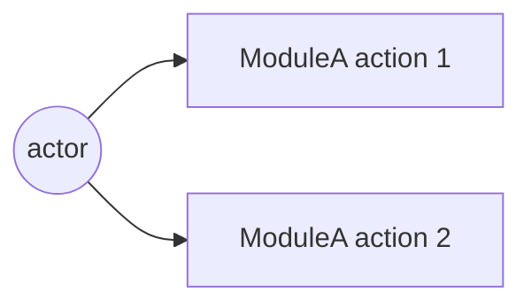
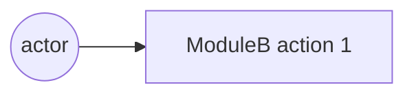

# Phase 06 — 계획 (TODO 형)

## 한 줄 요약
**TODO 단위의 평탄한 구현 계획을 만든다.** 각 TODO 는 한 번의 서브에이전트 호출로 끝낼 수 있을 만큼 작고, 명확한 "완료 조건" 을 갖는다.

## 입력
- `intent/01-intent.md`, `intent/04-answers.md`, `intent/05-critique.md`, `intent/05-decisions.md`
- `naming/00-naming.md` (모듈명 확정본)

## 서브에이전트
[`../agents/planner.md`](../agents/planner.md) 로 `Agent(subagent_type="Plan")`.

## 산출물
`plan/06-plan.md` — [`../templates/plan.template.md`](../templates/plan.template.md) 의 7개 필드를 모든 TODO 에 채움:

| 필드 | 의미 |
| ---- | ---- |
| `ID` | `T-001`, `T-002`, … |
| `제목` | 명령형 한 줄 |
| `모듈` | 명명 페이즈에서 정해진 모듈명 (`be4fe/auth`, `fe/login` 등) |
| `레이어` | `domain` / `application` / `adapter` / `ui` / `infra` / `test` |
| `의존` | 다른 TODO ID 목록 |
| `완료 조건` | 외부 관찰·테스트 가능 |
| `테스트` | 단위·통합·E2E 어느 것을 같이 출하 |
| `목 표면` | 노출하는 포트/페이크 |

## 시퀀스 다이어그램 동봉 (필수)

[`../conventions/diagrams.md`](../conventions/diagrams.md) §3 에 따라 `plan/06-plan.md` 에 두 종류의 Mermaid 시퀀스 다이어그램을 코드 펜스로 동봉:

a- **모듈 내부 시퀀스** — 도메인 ↔ 어댑터 ↔ 포트 호출 흐름.
b- **모듈 외부 시퀀스** — FE ↔ BE ↔ DB ↔ 외부 API.

각 화살표에 호출 함수명·요청/응답 페이로드 키 표기. PlantUML 도 허용하지만 프로젝트 시작 시 형식 하나로 고정.

## 플랜 트리 (디폴트, G3+) — AIDE 멀티버스

[`../conventions/plan-tree.md`](../conventions/plan-tree.md) 가 본 페이즈의 *디폴트 동작*. G3 이상이면 단일 플랜 대신 2~5 우주의 트리:

a- 폭 (root 우주 수) 와 깊이 cap 은 [`../conventions/grades.md`](../conventions/grades.md) 의 그레이드 매트릭스 + plan-tree 매트릭스 병합 결정.
b- 시드 카탈로그 5 종 (domain-first / adapter-first / minimal-subtraction / tdd-topology / strict-layering) 중 그레이드별 필수 + 옵션 시드 선택.
c- 형제 우주는 격리 + 병렬 디스패치 ([`../conventions/competition.md`](../conventions/competition.md) 재사용).
d- 자식 우주는 부모 우주 완료 후 깊이 layer 단위 디스패치 (자원 가드).
e- 토너먼트는 plan-reviewer (페이즈 07) 가 우주별 fresh 콜드 리딩 (4 답) → 5 차원 점수 → auto_resolve.
f- 결과는 `plan/tournament.md` (사용자 대면) + `plan/06-plan.md` (우승 우주 사본, 다음 페이즈 입력).

G1·G2 는 트리 비활성 — 단일 플랜 그대로.

옛 트리거 진입 ([`../conventions/competition.md`](../conventions/competition.md) 의 트리거 b "모듈 분할 길항") 은 *G3+ 에서는 항상 참* 으로 의미 변경 — 디폴트 진입.

## 필수 섹션

a- **스캐폴딩** — 모듈 경계, 포트 인터페이스, 패키지 레이아웃. 로직 전.
b- **테스트 인프라** — 단위·통합·E2E 하네스 셋업. 첫 기능 TODO 전.
c- **백엔드 기능 TODO** — 의존에 따라 프론트와 교차 배치.
d- **프론트엔드 기능 TODO** — 동일.
e- **연결 TODO** — 모듈 간 e2e 연결.
f- **하드닝 TODO** — 에러 경로, 엣지, 옵저버빌리티.

## 기본 스택

사용자가 다른 스택을 명시하지 않으면:

a- **백엔드 / API / 엔진** — Go (`net/http`, `chi` 또는 `echo`, 표준 라이브러리 우선).
b- **프론트엔드** — bun + React (Phase 12 의 웹뷰와 같은 런타임 패밀리, 빌드 도구 통일).
c- **테스트 — Go** — 표준 `testing` + `testify`. 통합은 `httptest`.
d- **테스트 — FE** — `bun test` + `playwright` (E2E).

다른 스택 결정이 있다면 `intent/05-decisions.md` 또는 `intent/04-answers.md` 에 명시되어 있어야 한다.

## TODO 사이즈 룰

a- 한 서브에이전트 호출에 끝낼 수 있을 것 (대략 < 200 LOC 변경).
b- 단일 외부 관찰 가능한 "완료 조건".
c- 테스트 같은 줄에 명시 — "테스트는 T-099 에서" 금지.

## 성공 기준

a- `의존` 그래프가 acyclic — 본인이 검증.
b- 모든 leaf TODO 아래에 테스트 TODO 가 최소 하나.
c- 모든 TODO 제목에 "and" 없음 — 있으면 분할 신호.

## 흔한 실패

> **공통 안티 패턴** (A1~A10) 은 [`../SKILL.md`](../SKILL.md) "안티 패턴 통합 카탈로그" 참조. 본 페이즈 고유 실패는 (현재 발견 없음 — 후속 회차에서 추가).

## implementation guidance — plan 본문 의무 (sprint-05-e Q3)

plan 이 *what to build* 에 그치지 않고 *how to build* 의 핵심 디자인 결정도 본문에 박는다 — 별도 impl-design.md 신규 산출물 만들지 않고 plan 본문 흡수가 정공 (메모리 보수화 정합).

### 본문 의무 추가 (HARD-RULE 9.a 강화)

기존 본문 의무 :
- 모듈 분할 + 파일 배치 (≥ 5 파일 경로)
- Mermaid 시퀀스 ≥ 1 OR 인터페이스 정의 ≥ 3
- TODO DAG (T-001, ...)

**추가 (sprint-05-e)** :
- **데이터 구조** ≥ 2 — 핵심 entity / state object 의 dataclass 또는 schema 정의 (필드 타입 명시)
- **의사코드** ≥ 1 — 핵심 알고리즘 (디스패치 / 라우팅 / 머지 등) 의 의사코드 또는 단계별 설명
- **클래스 시그니처** ≥ 3 — 주요 클래스의 `__init__` + 핵심 메서드 시그니처 (Python 형식 또는 의사 형식)

### 왜 신규 산출물 (impl-design.md) 안 만드나

a- plan 이 충분히 상세하면 *중복* — sprint-05-c universe 별 plan 569~699 lines 에 이미 implementation guidance 일부 포함
b- 산출물 1 추가 = sub-agent 호출 + 시간 비용
c- plan + impl-log 의 관계 = 디자인 + 결과. 그 사이 *implementation guidance 디자인* 분리 = 응집 약화
d- HARD-RULE 9.a 본문 의무 강화로 *plan 안에서* implementation guidance 박는 것이 정공

### 산출물 매핑

| 본문 의무 | 페이즈 11 회귀 분류 (sprint-05-e Q1) 와의 연결 |
|----|----|
| 모듈 분할 + 파일 배치 | impl 이 plan 따랐는지 = 디렉터리 일치 |
| Mermaid / 인터페이스 | impl 의 인터페이스 시그니처 = plan 일치 |
| TODO DAG | impl-log 의 TODO 매핑 = plan ID 일치 |
| **데이터 구조** | impl 의 dataclass 필드 = plan schema 일치 → impl defect 검출 |
| **의사코드** | impl 의 알고리즘 동작 = plan 의사코드 일치 → plan defect vs impl defect 판별 |
| **클래스 시그니처** | impl 의 메서드 시그니처 = plan 일치 → drift 검출 |

페이즈 11 회귀 분류가 본 implementation guidance 와 *대응* — plan 의 데이터 구조/의사코드/클래스 시그니처가 명시되어 있어야 회귀 시 *plan defect vs impl defect* 자동 판별 가능.

### sprint-05-c 회고

sprint-05-c 의 universe-3 plan 569 lines 에 데이터 구조 (TruckPool dict, Truck dataclass, EventQueue heap), 의사코드 (`_dispatch_event(ev)` switch), 클래스 시그니처 (`SchedulerLoop.run(env)`, `EventQueue.push/pop`) 모두 박혀있었음. 본 sprint-05-e 룰은 그 패턴을 *명시 의무* 로 격상.

## v0.9.19 sprint-13 갱신 — 폭 default 5/7/9 + per-module use-case + plan sprint loop

### 폭 default 격상 ([`../conventions/multiverse-width-default-bump.md`](../conventions/multiverse-width-default-bump.md), bc)

| Grade | 폭 default | 옵션 default (사용자 ack) | 비고 |
|---|:-:|:-:|---|
| G2 | 2 | n/a | single 또는 2 후보 |
| G3 | **5** (← 3) | 10 | axis 카탈로그 상위 5 활용 |
| G4 | **7** (← 4) | 12 | 5 시드 + 2 axis (FE+BE × stance) |
| G5 | **9** (← 6) | 16 | depth 2 자식 분기 + 4 axis 추가 |

budget tight 시 fallback 폭 + `fallback_reason` frontmatter 의무 ([`../conventions/budget-aware-fallback.md`](../conventions/budget-aware-fallback.md)). self_lint C-MWDB 가 검증.

### per-module use-case / sequence 다이어그램 default ([`../conventions/per-module-diagram-fan-out.md`](../conventions/per-module-diagram-fan-out.md), bb)

페이즈 06 plan/06-plan.md 의 모듈 수 ≥ 4 OR consumer-producer 페어 ≥ 6 → per-module 다이어그램 ≥ 모듈 수 의무. 모듈 ≤ 3 시 단일 통합 OK.

```markdown
### Templated per-module section (bb 의무)

## per-module use-case 다이어그램 (모듈 ≥ 4 trigger)

### use-case: ModuleA


### use-case: ModuleB


(모듈 ≥ 4 만큼 반복)
```

self_lint C-PMDF 가 검증.

### plan sprint loop ([`../conventions/intent-plan-impl-sprint-trinity.md`](../conventions/intent-plan-impl-sprint-trinity.md), bd)

페이즈 10 sprint trinity 의 *plan axis* 가 본 페이즈 산출물을 polishing 대상. axis 별 ≥ 2 sprint 강제. 첫 sprint = baseline measure, 두 번째 sprint 의 axis lesson 후보 :
- 모듈 분할 보강 (per-module use-case 추가)
- 인터페이스 정의 ≥ 5 추가 (dataclass / pseudocode / 클래스 시그니처)
- TODO DAG 의존 보강 (leaf TODO 별 테스트 TODO 추가)
