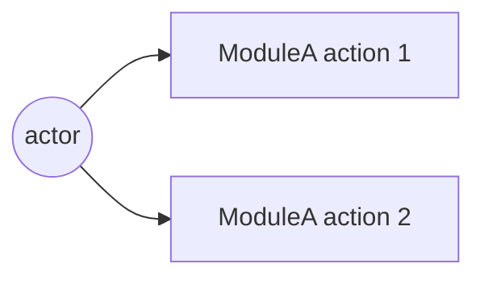
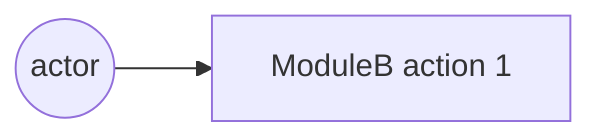

# Phase 06 — 계획 (TODO 형)

## 한 줄 요약
**TODO 단위의 평탄한 구현 계획을 만든다.** 각 TODO 는 한 번의 서브에이전트 호출로 끝낼 수 있을 만큼 작고, 명확한 "완료 조건" 을 갖는다.

## 입력
- `intent/01-intent.md`, `intent/04-answers.md`, `intent/05-critique.md`, `intent/05-decisions.md`
- `naming/00-naming.md` (모듈명 확정본)

## 서브에이전트
[`../agents/planner.md`](../agents/planner.md) 로 `Agent(subagent_type="Plan")`.

## 산출물
`plan/06-plan.md` — [`../templates/plan.template.md`](../templates/plan.template.md) 의 7개 필드를 모든 TODO 에 채움:

| 필드 | 의미 |
| ---- | ---- |
| `ID` | `T-001`, `T-002`, … |
| `제목` | 명령형 한 줄 |
| `모듈` | 명명 페이즈에서 정해진 모듈명 (`be4fe/auth`, `fe/login` 등) |
| `레이어` | `domain` / `application` / `adapter` / `ui` / `infra` / `test` |
| `의존` | 다른 TODO ID 목록 |
| `완료 조건` | 외부 관찰·테스트 가능 |
| `테스트` | 단위·통합·E2E 어느 것을 같이 출하 |
| `목 표면` | 노출하는 포트/페이크 |

## 시퀀스 다이어그램 동봉 (필수)

[`../conventions/diagrams.md`](../conventions/diagrams.md) §3 에 따라 `plan/06-plan.md` 에 두 종류의 Mermaid 시퀀스 다이어그램을 코드 펜스로 동봉:

a- **모듈 내부 시퀀스** — 도메인 ↔ 어댑터 ↔ 포트 호출 흐름.
b- **모듈 외부 시퀀스** — FE ↔ BE ↔ DB ↔ 외부 API.

각 화살표에 호출 함수명·요청/응답 페이로드 키 표기. PlantUML 도 허용하지만 프로젝트 시작 시 형식 하나로 고정.

## 플랜 트리 (디폴트, G3+) — AIDE 멀티버스

[`../conventions/plan-tree.md`](../conventions/plan-tree.md) 가 본 페이즈의 *디폴트 동작*. G3 이상이면 단일 플랜 대신 2~5 우주의 트리:

a- 폭 (root 우주 수) 와 깊이 cap 은 [`../conventions/grades.md`](../conventions/grades.md) 의 그레이드 매트릭스 + plan-tree 매트릭스 병합 결정.
b- 시드 카탈로그 5 종 (domain-first / adapter-first / minimal-subtraction / tdd-topology / strict-layering) 중 그레이드별 필수 + 옵션 시드 선택.
c- 형제 우주는 격리 + 병렬 디스패치 ([`../conventions/competition.md`](../conventions/competition.md) 재사용).
d- 자식 우주는 부모 우주 완료 후 깊이 layer 단위 디스패치 (자원 가드).
e- 토너먼트는 plan-reviewer (페이즈 07) 가 우주별 fresh 콜드 리딩 (4 답) → 5 차원 점수 → auto_resolve.
f- 결과는 `plan/tournament.md` (사용자 대면) + `plan/06-plan.md` (우승 우주 사본, 다음 페이즈 입력).

G1·G2 는 트리 비활성 — 단일 플랜 그대로.

옛 트리거 진입 ([`../conventions/competition.md`](../conventions/competition.md) 의 트리거 b "모듈 분할 길항") 은 *G3+ 에서는 항상 참* 으로 의미 변경 — 디폴트 진입.

## 필수 섹션

a- **스캐폴딩** — 모듈 경계, 포트 인터페이스, 패키지 레이아웃. 로직 전.
b- **테스트 인프라** — 단위·통합·E2E 하네스 셋업. 첫 기능 TODO 전.
c- **백엔드 기능 TODO** — 의존에 따라 프론트와 교차 배치.
d- **프론트엔드 기능 TODO** — 동일.
e- **연결 TODO** — 모듈 간 e2e 연결.
f- **하드닝 TODO** — 에러 경로, 엣지, 옵저버빌리티.

## 기본 스택

사용자가 다른 스택을 명시하지 않으면:

a- **백엔드 / API / 엔진** — Go (`net/http`, `chi` 또는 `echo`, 표준 라이브러리 우선).
b- **프론트엔드** — bun + React (Phase 12 의 웹뷰와 같은 런타임 패밀리, 빌드 도구 통일).
c- **테스트 — Go** — 표준 `testing` + `testify`. 통합은 `httptest`.
d- **테스트 — FE** — `bun test` + `playwright` (E2E).

다른 스택 결정이 있다면 `intent/05-decisions.md` 또는 `intent/04-answers.md` 에 명시되어 있어야 한다.

## TODO 사이즈 룰

a- 한 서브에이전트 호출에 끝낼 수 있을 것 (대략 < 200 LOC 변경).
b- 단일 외부 관찰 가능한 "완료 조건".
c- 테스트 같은 줄에 명시 — "테스트는 T-099 에서" 금지.

## 성공 기준

a- `의존` 그래프가 acyclic — 본인이 검증.
b- 모든 leaf TODO 아래에 테스트 TODO 가 최소 하나.
c- 모든 TODO 제목에 "and" 없음 — 있으면 분할 신호.

## 흔한 실패

> **공통 안티 패턴** (A1~A10) 은 [`../SKILL.md`](../SKILL.md) "안티 패턴 통합 카탈로그" 참조. 본 페이즈 고유 실패는 (현재 발견 없음 — 후속 회차에서 추가).

## implementation guidance — plan 본문 의무 (sprint-05-e Q3)

plan 이 *what to build* 에 그치지 않고 *how to build* 의 핵심 디자인 결정도 본문에 박는다 — 별도 impl-design.md 신규 산출물 만들지 않고 plan 본문 흡수가 정공 (메모리 보수화 정합).

### 본문 의무 추가 (HARD-RULE 9.a 강화)

기존 본문 의무 :
- 모듈 분할 + 파일 배치 (≥ 5 파일 경로)
- Mermaid 시퀀스 ≥ 1 OR 인터페이스 정의 ≥ 3
- TODO DAG (T-001, ...)

**추가 (sprint-05-e)** :
- **데이터 구조** ≥ 2 — 핵심 entity / state object 의 dataclass 또는 schema 정의 (필드 타입 명시)
- **의사코드** ≥ 1 — 핵심 알고리즘 (디스패치 / 라우팅 / 머지 등) 의 의사코드 또는 단계별 설명
- **클래스 시그니처** ≥ 3 — 주요 클래스의 `__init__` + 핵심 메서드 시그니처 (Python 형식 또는 의사 형식)

### 왜 신규 산출물 (impl-design.md) 안 만드나

a- plan 이 충분히 상세하면 *중복* — sprint-05-c universe 별 plan 569~699 lines 에 이미 implementation guidance 일부 포함
b- 산출물 1 추가 = sub-agent 호출 + 시간 비용
c- plan + impl-log 의 관계 = 디자인 + 결과. 그 사이 *implementation guidance 디자인* 분리 = 응집 약화
d- HARD-RULE 9.a 본문 의무 강화로 *plan 안에서* implementation guidance 박는 것이 정공

### 산출물 매핑

| 본문 의무 | 페이즈 11 회귀 분류 (sprint-05-e Q1) 와의 연결 |
|----|----|
| 모듈 분할 + 파일 배치 | impl 이 plan 따랐는지 = 디렉터리 일치 |
| Mermaid / 인터페이스 | impl 의 인터페이스 시그니처 = plan 일치 |
| TODO DAG | impl-log 의 TODO 매핑 = plan ID 일치 |
| **데이터 구조** | impl 의 dataclass 필드 = plan schema 일치 → impl defect 검출 |
| **의사코드** | impl 의 알고리즘 동작 = plan 의사코드 일치 → plan defect vs impl defect 판별 |
| **클래스 시그니처** | impl 의 메서드 시그니처 = plan 일치 → drift 검출 |

페이즈 11 회귀 분류가 본 implementation guidance 와 *대응* — plan 의 데이터 구조/의사코드/클래스 시그니처가 명시되어 있어야 회귀 시 *plan defect vs impl defect* 자동 판별 가능.

### sprint-05-c 회고

sprint-05-c 의 universe-3 plan 569 lines 에 데이터 구조 (TruckPool dict, Truck dataclass, EventQueue heap), 의사코드 (`_dispatch_event(ev)` switch), 클래스 시그니처 (`SchedulerLoop.run(env)`, `EventQueue.push/pop`) 모두 박혀있었음. 본 sprint-05-e 룰은 그 패턴을 *명시 의무* 로 격상.

## v0.9.19 sprint-13 갱신 — 폭 default 5/7/9 + per-module use-case + plan sprint loop

### 폭 default 격상 ([`../conventions/multiverse-width-default-bump.md`](../conventions/multiverse-width-default-bump.md), bc)

| Grade | 폭 default | 옵션 default (사용자 명시 ack) | 비고 |
|---|:-:|:-:|---|
| G2 | 2 | n/a | single 또는 2 후보 |
| G3 | **5** (← 3) | 10 | axis 카탈로그 상위 5 활용 |
| G4 | **7** (← 4) | 12 | 5 시드 + 2 axis (FE+BE × stance) |
| G5 | **9** (← 6) | 16 | depth 2 자식 분기 + 4 axis 추가 |

budget tight 시 fallback 폭 + `fallback_reason` frontmatter 의무 ([`../conventions/budget-aware-fallback.md`](../conventions/budget-aware-fallback.md)). self_lint C-MWDB 가 검증.

### per-module use-case / sequence 다이어그램 default ([`../conventions/per-module-diagram-fan-out.md`](../conventions/per-module-diagram-fan-out.md), bb)

페이즈 06 plan/06-plan.md 의 모듈 수 ≥ 4 OR consumer-producer 페어 ≥ 6 → per-module 다이어그램 ≥ 모듈 수 의무. 모듈 ≤ 3 시 단일 통합 OK.

```markdown
### Templated per-module section (bb 의무)

## per-module use-case 다이어그램 (모듈 ≥ 4 trigger)

### use-case: ModuleA


### use-case: ModuleB


(모듈 ≥ 4 만큼 반복)
```

self_lint C-PMDF 가 검증.

### plan sprint loop ([`../conventions/intent-plan-impl-sprint-trinity.md`](../conventions/intent-plan-impl-sprint-trinity.md), bd)

페이즈 10 sprint trinity 의 *plan axis* 가 본 페이즈 산출물을 polishing 대상. axis 별 ≥ 2 sprint 강제. 첫 sprint = baseline measure, 두 번째 sprint 의 axis lesson 후보 :
- 모듈 분할 보강 (per-module use-case 추가)
- 인터페이스 정의 ≥ 5 추가 (dataclass / pseudocode / 클래스 시그니처)
- TODO DAG 의존 보강 (leaf TODO 별 테스트 TODO 추가)

## v0.9.20 sprint-14 — Contested Decisions + Measurement Contract

### Contested Decisions 추출 + universe axis 회전 ([`../conventions/contested-decision-multiverse.md`](../conventions/contested-decision-multiverse.md), bf)

본 페이즈 진입 시 plan-tree 분기 *전에* sub-procedure :

1- **추출** — `prompt + intent/03-comprehension.md + intent/05-critique.md` 에서 *contested decisions* 자동 파싱 (3 source : prompt explicit hedge / cold-read implicit 자신없음 / critique potential ⚠).
2- **`plan/contested-decisions.md` 신규 산출물** — 표 + frontmatter (id / source / kind / branch_a / branch_b / impact_dim).
3- **universe axis 결정** :
   - decisions ≥ width → 상위 width decisions 의 *branch_a/branch_b* 양 가지를 universe seed
   - decisions < width → decisions + paradigm seed (5 시드 카탈로그) 보충
   - decisions = 0 → paradigm seed fallback (v0.9.13 default)
4- **각 universe `meta.md` 에 code spike (≤ 50 LOC)** — 같은 인터페이스 다른 구현. prose 비교 0.

### Tournament 채점 갱신 — `decision_coverage` 차원 (bf)

[`../conventions/plan-tree.md`](../conventions/plan-tree.md) 5 차원 → 6 차원 (가중 재분배) :

| 차원 | 가중 |
|---|---:|
| cold_recall | 0.25 (← 0.30) |
| dip_strictness | 0.20 (← 0.25) |
| simplicity | 0.15 (← 0.20) |
| test_topology | 0.10 (← 0.15) |
| fe_be_parity | 0.10 |
| **decision_coverage** (신규) | **0.20** |

`decision_coverage < 0.6` universe 즉시 탈락. self_lint C-CDM 검증.

### Measurement Contract — 본문 의무 섹션 ([`../conventions/measurement-contract.md`](../conventions/measurement-contract.md), bi)

`plan/06-plan.md` 신규 의무 섹션 — 모든 정량 metric 에 method 명시 :

```markdown
## Measurement Contract (measurement-contract.md bi 의무)

| metric | 정의 | 측정 방법 | (reconstruct 시) 정당화 |
|---|---|---|---|
| (예시) loader_utilisation | D_LOAD busy_time / shift | accumulate (Resource hook) | n/a |
| (예시) crusher_busy_proxy | cycles × mean_dump_time | reconstruct | "secondary control metric, primary uses accumulate" |
```

method 3 옵션 : **sample** (snapshot) / **accumulate** (event hook 누적) / **reconstruct** (다른 metric 으로 유도). reconstruct row 는 *정당화 column 의무* (1 줄 mechanism — 왜 direct 측정 불가).

frontmatter sync :

```yaml
---
metrics: [{name: ..., method: ..., justification: ...}]
metric_count: <N>
direct_measurement_ratio: <0.0-1.0>
reconstruct_justified_ratio: <0.0-1.0>
---
```

작업이 non-metric (pure refactor / UI 변경) 시 표 빈 + reason (no-op). self_lint C-MC 검증. 페이즈 09 게이트 6 강화 (direct_ratio < 0.7 시 cap 0.85). 페이즈 11 회귀 분류에 plan_method vs impl 비교가 입력.

### plan 본문 의무 (HARD-RULE 9.a 강화 — sprint-14 추가)

기존 (sprint-05-e) :
- 모듈 분할 + 파일 배치 (≥ 5 파일 경로)
- Mermaid 시퀀스 ≥ 1 OR 인터페이스 정의 ≥ 3
- TODO DAG
- 데이터 구조 ≥ 2 / 의사코드 ≥ 1 / 클래스 시그니처 ≥ 3

**추가 (sprint-14)** :
- **Measurement Contract 표 ≥ 1 row** (또는 빈 표 + reason for non-metric)
- **per-universe code spike** (각 universe meta.md, ≤ 50 LOC, contested decisions 매핑 시)
- **plan frontmatter `audience` field** ([`../conventions/commentary-policy.md`](../conventions/commentary-policy.md) bh) — `internal-self | external-reviewer | mixed`

## v0.9.21 sprint-15 — Da Capo Loop (의사코드)

[`../conventions/intra-phase-dacapo-loop.md`](../conventions/intra-phase-dacapo-loop.md) (bl) — multiverse fan-out + tournament + shadow grade + threshold AND + lesson + 처음으로 돌아감. **다카포 방식**.

본 phase 의 *home* loop. tournament 결과 winner_score 가 grade threshold 미달 시 *재경합 0 회* 회귀 (cold session `2026-05-05__001_synthetic_mine_throughput__...g4` 의 winner=0.853 회귀) 차단.

```python
# Phase 06 Da Capo Loop — 본 phase 본문에 *그대로 박힌 의사코드*. agent 가 이 step 순서대로 실행.

def phase_06(grade, prompt, intent_artifacts):
    threshold     = {G3: 0.97, G4: 0.999, G5: 0.99999}[grade]
    shadow_target = {G3: 90,   G4: 95,    G5: 98     }[grade]
    width         = {G3: 5,    G4: 7,     G5: 9      }[grade]   # bc multiverse-width-default-bump
    max_rerun     = {G3: 2,    G4: 3,     G5: 5      }[grade]
    artifact_dir  = '.ShipofTheseus/<프로젝트>/plan/'

    # ── Step A. Initial multiverse fan-out (Da Capo *처음* 지점) ───────
    contested = extract_contested_decisions(prompt, intent_artifacts)  # bf 3 source 파싱
    seeds = pick_axis_priority(
        contested,
        priority = ['contested_decisions', 'paradigm_5_seeds'],         # bf v0.9.20
        count    = width,
    )
    universes = [
        spawn_planner_universe(seed=seeds[n], universe_id=n)             # u, ag, ae
        for n in range(1, width + 1)
    ]
    # 산출: plan/candidates/universe-N/{meta.md, 06-plan.md, code-spike.py(≤50 LOC)}
    rerun = 0

    while True:

        # ── Step B. Tournament — 6 차원 weighted score (bf decision_coverage 0.20) ─
        for u in universes:
            u.tournament_score = score_6dim(u, weights={
                'cold_recall':       0.25,
                'dip_strictness':    0.20,
                'simplicity':        0.15,
                'test_topology':     0.10,
                'fe_be_parity':      0.10,
                'decision_coverage': 0.20,    # bf v0.9.20 신규 차원
            })
        winner = argmax(universes, key='tournament_score')
        write(f'{artifact_dir}tournament-{rerun:02d}.md', universes, winner)

        # ── Step C. Shadow grader (be v0.9.20) — zero-context Sonnet ──
        shadow = call_shadow_grader(
            rubric       = load_generic_rubric(),                # cold-bench 정합 (bench rubric 차단)
            artifacts    = [winner.dir / '06-plan.md',
                            winner.dir / 'meta.md',
                            winner.dir / 'code-spike.py'],
            model        = 'Sonnet',
            context_mode = 'zero-context',
        )
        write(f'{artifact_dir}shadow-grade-{rerun:02d}.json', shadow)

        # ── Step D. 4 conjunction AND threshold (be 의 phase-내 변형) ──
        tournament_pass = (winner.tournament_score >= threshold)
        shadow_pass     = (shadow.predicted_score   >= shadow_target)
        if tournament_pass AND shadow_pass:
            promote_to_phase_artifact(winner, target=f'{artifact_dir}06-plan.md')
            return CONVERGED(winner, rerun_count=rerun)         # → phase 07 진입

        # ── Step E. Cap (max_rerun OR budget 95%) ─────────────────────
        rerun += 1
        if rerun >= max_rerun OR budget_used_total() >= 0.95:
            promote_to_phase_artifact(winner, target=f'{artifact_dir}06-plan.md')
            write_fallback_reason(
                f'{artifact_dir}fallback-reason.md',
                reason = f'rerun={rerun}/{max_rerun}, '
                         f'budget={budget_used_total():.2f}, '
                         f'winner={winner.tournament_score} < {threshold}, '
                         f'shadow={shadow.predicted_score} < {shadow_target}',
            )   # ah budget-aware-fallback 의무
            return BUDGET_BOUND(winner, rerun_count=rerun)

        # ── Step F. Lesson 도출 + winner 갱신 ─────────────────────────
        weakest = pick_weakest_dim(
            tournament    = winner.sub_scores,                  # 6 dim 중 최저
            shadow        = shadow.weakest_category,             # be
            evidence_gaps = winner.evidence_missing,             # ar v0.9.16
        )
        lesson = build_lesson(weakest, candidates=[
            'bg directional-simplification 표 row 추가 (limitations 방향성 ↑/↓/?)',
            'bi measurement-contract reconstruct 정당화',
            'bb per-module-diagram 분리 (모듈 ≥ 4 시)',
            'aa mindmap-centrality concept 보강',
            'bf contested-decision spike 양 가지 코드 (≤50 LOC) 추가',
            'ae interface-first 인터페이스 정의 ≥ 5 추가',
        ])
        winner_v2 = apply_lesson(winner, lesson)                # winner artifact 갱신
        write(f'{artifact_dir}dacapo-rerun-{rerun:02d}.md', lesson, winner_v2)

        # ── Step G. Da Capo — *처음* (Step A) 으로 돌아감 ──────────────
        anon_prev = anonymize_winner(winner_v2)                 # ad v0.9.10 룰 (frontmatter scrub + ID 익명화)
        fresh_seeds = pick_seeds_excluding(prev_seed=winner.seed, count=width - 1)
        fresh = [spawn_planner_universe(seed=s, universe_id=f'rerun-{rerun}-{i}')
                 for i, s in enumerate(fresh_seeds, 1)]
        universes = [anon_prev] + fresh                          # blind — fresh agent 모름
        continue                                                  # ↑ Step B 로 자동 재진입
```

self_lint 검증 (sprint-15 신규) :

- **C-DCL-WIN-THRESHOLD** — `winner.tournament_score < threshold AND rerun_count == 0` 인데 `phase 07 산출물 존재` 시 fail
- **C-DCL-RERUN-LOG** — `rerun_count >= 1` 시 `dacapo-rerun-NN.md` 갯수 == rerun_count + 각 frontmatter `lesson_applied` 본문 ≥ 1 줄
- **C-DCL-ANON** — `rerun >= 1` 시 universe 1 개가 anonymized previous winner (ad C-TBR-ANON 정합)
